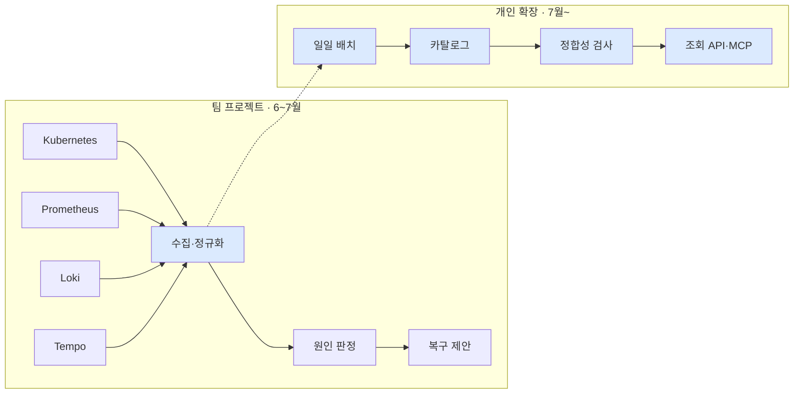

# Kyro

Kubernetes 운영 데이터를 수집·정규화하고, 매일 카탈로그와 실제 데이터의 정합성을 검사합니다.

5인 팀 프로젝트에서 **이민정이 맡은 코드**와, 프로젝트 종료 후 개인으로 확장한 데이터 계층만 남긴 저장소입니다. 팀 전체 저장소는 `[팀 저장소 링크]`에 있습니다.

크래프톤 정글 12기 최종 프로젝트 · 2026.06.22–07.25

---

## 담당 범위



파란 칸이 제 담당입니다. 원인 판정과 복구 제안, 프론트엔드는 팀원이 맡았고 제품 아키텍처도 팀 설계입니다.

네 곳에서 오는 데이터는 형식도, 시간 기준도, 실패하는 방식도 다릅니다. 이걸 하나로 모으고 **각 데이터를 어디까지 믿어도 되는지 함께 넘기는 것**이 팀 프로젝트에서 제 일이었습니다. 프로젝트가 끝난 뒤에는 수집된 데이터를 매일 다시 검사하는 계층을 개인 작업으로 붙였습니다.

---

## 만든 것

### 정합성 검사 8종
`SQL` `PostgreSQL` — 개인

매일 저장된 데이터를 등록해 둔 계약과 대조합니다.

검사 하나가 유일 제약과 같은 키로 묶여 있어서 [어떤 데이터에서도 0행이었습니다](docs/portfolio/06-sql-quality-checks.md#08-중복-적재-후보). 그런데 전체 검사 시간의 절반을 쓰고 있었습니다.

고치고 커버링 인덱스를 붙여 [424.5ms → 150.0ms](docs/portfolio/06-sql-quality-checks.md#측정)가 됐습니다. `make demo-duplicate` 로 확인합니다.

### 일일 배치
`Airflow` `멱등 재실행` — 개인

소스 넷을 각각 수집해 카탈로그에 넣습니다. 하나가 실패해도 나머지는 저장됩니다.

처음에는 [`trigger_rule` 이름을 잘못 읽어](docs/portfolio/05-airflow-pipeline.md#실행-단위를-먼저-정해야-했다) 소스 하나만 실패해도 아무것도 저장되지 않았습니다.

지금은 재수집 대상이 4개에서 1개로 줄고, 같은 날짜를 다섯 번 다시 돌려도 행 수가 그대로입니다. `make demo-fail-source` 로 확인합니다.

### 메타데이터 모델
`카탈로그 설계` `스키마 드리프트` — 개인

자산·필드 계약·스키마 이력·리니지·품질 결과를 [13개 테이블](docs/portfolio/04-metadata-catalog.md#데이터-모델)로 저장합니다.

계약을 덮어쓰면 [스키마가 바뀐 걸 영원히 못 잡습니다](docs/portfolio/04-metadata-catalog.md#계약-이력이-없으면-바뀌었다를-판정할-수-없다). 관측한 계약을 지우지 않고 쌓는 테이블을 따로 뒀습니다.

버전을 올리지 않은 변경도 검출됩니다. `make demo-drift` 로 확인합니다.

### 카탈로그 조회 API와 MCP 서버
`FastAPI` `MCP` — 개인

자산·스키마 이력·리니지·품질 이슈를 조회하는 엔드포인트 7개와, 같은 API 를 읽기 전용 도구로 노출하는 MCP 서버입니다.

목록이 잘렸을 때 [모델은 사람과 다르게 행동합니다](docs/portfolio/07-catalog-api-mcp.md#응답-경계). 잘린 사실과 원본 개수를 함께 보냅니다.

`make catalog-mcp` 로 도구 6종과 인자 스키마를 출력합니다.

### 설정 참조 조회 API
`FastAPI` `Secret 비노출` — 팀 + 종료 후 보완

어떤 서비스가 어떤 설정과 비밀키를 쓰는지 알려줍니다. 값은 응답에 넣지 않습니다.

테스트가 통과하고 있었는데 [검증 방식 자체가 틀렸습니다](docs/portfolio/03-config-reference-api.md#지우는-대신-새로-만듭니다). 바꾸자마자 평문 환경변수가 남아 있는 경로 하나가 걸렸습니다.

경계 조건 16종을 `pytest tests/test_config_references.py` 로 확인합니다.

### 수집 완전성 계약
`3-state` `사유 코드` — 팀

수집 결과가 빈 목록으로 오는 경우가 [다섯 가지였습니다](docs/portfolio/01-collection-contract.md). 받는 쪽은 구분할 수 없었고, 저장소는 빈 목록을 삭제로 처리했습니다.

수집 결과에 상태와 이유를 붙였습니다. 삭제 판정은 `completed` 일 때만 합니다.

### 근거 번들 귀속 범위
`데이터 정합성` — 팀

장애 리포트의 근거 로그에 [다른 네임스페이스 것이 섞여 있었습니다](docs/portfolio/11-evidence-scope.md).

사건 범위로 거르고 요약 숫자를 다시 계산했습니다. 근거 로그 1,180줄 → 240줄(fixture 기준). 어디 것인지 판단할 수 없는 로그는 [버리지 않고 남깁니다](docs/portfolio/11-evidence-scope.md#2-라벨이-없으면-어떻게-하는가).

### 리니지 기록과 역추적
`리니지` — 개인

정규화된 행에서 [원본 파일까지 거슬러 갑니다](docs/portfolio/04-metadata-catalog.md#리니지). 간선에 언제 확인한 관계인지를 함께 저장해서, 7일이 지나면 오래된 관계로 잡습니다.

### 수집 응답 한도
`파이프라인` — 팀

앞에서부터 자르면 [뒤쪽 그룹이 통째로 사라집니다](docs/portfolio/02-collection-limits.md). 그룹별로 나눠 자르고 원래 개수와 잘림 이유를 함께 보냅니다. 네 수집기에 흩어져 있던 로직을 공통 모듈로 뺐습니다.

### API 한도 계약
`API 설계` — 팀

목록 상한, 문자열 길이, 사유 코드 개수를 [한 파일에 모았습니다](src/packages/contracts/gateway/limits.py). 라우터와 클라이언트가 각자 상수를 들면 한쪽만 고쳐도 아무도 모릅니다.

### 도구 선택 근거
`기술 리서치` — 개인

외부 카탈로그 도구를 쓰지 않은 이유와, 자연어를 SQL 로 바꾸는 기능을 넣지 않은 이유를 [정리했습니다](docs/portfolio/08-tech-research.md).

---

## 확인하기

AWS 계정도 실제 클러스터도 필요 없습니다. Docker 만 있으면 됩니다.

**1단계 — 카탈로그** (Docker 필요, 약 3분)

```bash
make catalog-up        # PostgreSQL · MinIO · Airflow 기동
make catalog-run       # 배치 1회 실행
make catalog-verify    # 검증 15항목      → 15/15 통과
make catalog-test      # 단위 테스트       → 15 passed
make catalog-bench     # 인덱스 전후 비교   → 424.5ms → 150.0ms
```

**2단계 — 고장 시연** (약 2분)

```bash
make demo-fail-source  # Loki 를 끊고 배치     → PARTIAL 기록, 나머지 3개 적재
make demo-drift        # 원천 필드 타입 변경   → 스키마 드리프트 검출
make demo-duplicate    # 같은 날짜 두 번 적재  → 중복 적재 후보 검출
```

정상 데이터로만 시험하면 무엇이든 통과한다고 답하는 검사도 통과합니다. 그래서 일부러 고장 내는 명령을 함께 뒀습니다.

---

## 한계

- 조회 API 가 Secret 값을 반환하지 않을 뿐, 스냅샷 저장소와 S3 원본에는 값이 남습니다
- 부하 한계를 재지 않았습니다. 응답 상한은 상한 계약이지 처리량 근거가 아닙니다
- 실제로 반복 사용한 사용자가 없습니다. 시연에 성공한 것과 쓰인 것은 다릅니다
- 카탈로그가 다루는 것은 이 프로젝트가 만드는 운영 데이터 6종입니다. 외부 업무 시스템 연동은 조사까지만 했습니다
- 배치와 카탈로그는 프로젝트 종료 후 개인 작업이며 AI 코딩 도구를 함께 썼습니다. 설계 판단과 검증은 직접 했습니다
- 팀 저장소는 이력 정리를 여러 차례 거쳤습니다. 커밋 수는 기여의 근거가 아닙니다. 파일 단위 blame 과 코드로 확인하는 편이 정확합니다

---

## 문서

| | |
|---|---|
| [수집 완전성 계약](docs/portfolio/01-collection-contract.md) | 빈 목록 다섯 가지를 어떻게 나눴나 |
| [수집 한도 설계](docs/portfolio/02-collection-limits.md) | 어떤 순서로 잘랐나 |
| [설정 참조 조회 API](docs/portfolio/03-config-reference-api.md) | 열거에서 카나리로 |
| [메타데이터 카탈로그](docs/portfolio/04-metadata-catalog.md) | 13개 테이블과 검사 6종 |
| [배치 파이프라인](docs/portfolio/05-airflow-pipeline.md) | 부분 실패를 어떻게 보존하나 |
| [검사 SQL 열 개](docs/portfolio/06-sql-quality-checks.md) | 질의별 설계와 측정 |
| [조회 API 와 MCP](docs/portfolio/07-catalog-api-mcp.md) | 응답 경계와 권한 |
| [기술 리서치](docs/portfolio/08-tech-research.md) | 쓰지 않기로 한 것들 |
| [범위 판단](docs/portfolio/09-scope-decisions.md) | 만들었지만 걷어낸 것 |
| [엔지니어링 로그](docs/portfolio/10-engineering-log.md) | 판단이 바뀐 지점 |
| [근거의 귀속 범위](docs/portfolio/11-evidence-scope.md) | 로그를 무엇으로 걸렀나 |

크래프톤 정글 SW-AI Lab 22주 과정을 수료했습니다.
