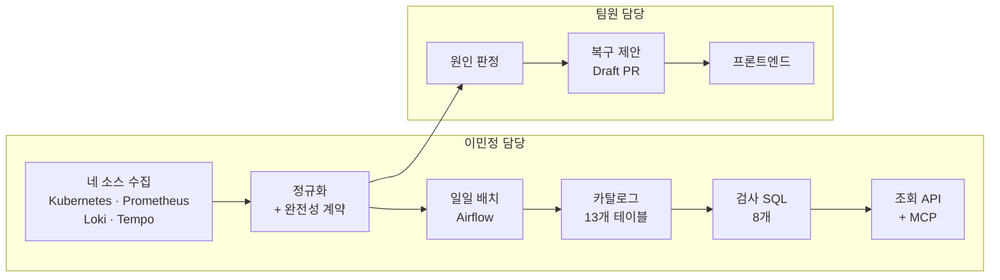

# Kyro

Kubernetes 운영 데이터를 수집·정규화하고, 매일 카탈로그와 실제 데이터의 정합성을 검사합니다.

5인 팀 프로젝트에서 **이민정이 맡은 코드**와, 프로젝트 종료 후 개인으로 확장한 데이터 계층만 남긴 저장소입니다. 팀 전체 저장소는 `[팀 저장소 링크]`에 있습니다.

크래프톤 정글 12기 최종 프로젝트 · 2026.06.22–07.25

---

## 담당 범위



팀 프로젝트(6~7월)에서 수집과 정규화를, 종료 후 개인 작업으로 배치부터 조회 API까지를 맡았습니다. 제품 아키텍처와 원인 판정 규칙은 팀 설계입니다.

네 소스는 응답 형식도 시간 기준도 실패하는 방식도 다릅니다. 하나로 모으면서 **각 데이터를 어디까지 믿어도 되는지 함께 넘기는 것**이 제 일이었습니다.

---

## 만든 것

항목마다 **무엇을 보장하는가**를 먼저 적고, 그 아래에 문제·해결·결과를 뒀습니다. 자세한 근거는 링크에 있습니다.

### 정합성 검사 SQL 8개
`SQL` `PostgreSQL` — 개인

**수집이 성공해도 데이터가 어긋나는 6가지를 배치에서 자동 검출합니다.**

- 문제 — 검사 하나가 DB 유일 제약과 같은 키로 묶여 어떤 데이터에서도 0행이면서, 전체 검사 시간의 절반을 썼습니다
- 해결 — 제약이 못 막는 중복(관측 시각이 몇 초 다른 재적재)을 잡도록 날짜 단위 그룹으로 교체하고 커버링 인덱스 추가
- 결과 — 검사 8종 **424.5ms → 150.0ms**, 드리프트 검사 **110.9ms → 2.5ms** · 주입 중복 5건 검출, 정상 데이터 0건

[상세](docs/portfolio/06-sql-quality-checks.md) · 확인 `make demo-duplicate`

### Airflow 일일 배치
`Airflow` `멱등 재실행` — 개인

**소스 하나가 실패해도 나머지는 적재하고, 다음 날 실패한 소스만 다시 돌립니다.**

- 문제 — `trigger_rule` 을 이름만 보고 골랐는데 실제 뜻이 "상류에 실패가 없으면"이라, 소스 하나만 실패해도 아무것도 저장되지 않았습니다
- 해결 — `all_done` 으로 바꾸고 "최소 하나 성공" 조건을 task 본문에서 직접 확인
- 결과 — 재수집 대상 **4개 → 1개** · 같은 날짜 5회 재실행에 적재 행 수 불변

[상세](docs/portfolio/05-airflow-pipeline.md) · 확인 `make demo-fail-source`

### 메타데이터 테이블 13개
`카탈로그 설계` `스키마 드리프트` — 개인

**등록한 계약과 실제 데이터를 기계가 대조할 수 있게 만들었습니다.**

- 문제 — 필드 계약을 한 테이블에 두고 덮어쓰면, 적재가 끝나는 순간 이전 값이 사라져 스키마 변경을 판정할 근거가 없어집니다
- 해결 — 관측한 계약을 지우지 않고 쌓는 테이블을 분리. 계약이 바뀔 때만 행이 하나 생깁니다
- 결과 — 버전을 올리지 않은 스키마 변경까지 검출

[상세](docs/portfolio/04-metadata-catalog.md) · 확인 `make demo-drift`

### 카탈로그 조회 API 7개와 MCP 도구 6개
`FastAPI` `MCP` — 개인

**조회 결과가 완전한지 부분인지를 응답이 스스로 밝힙니다.**

- 문제 — 목록이 상한에 걸려 잘리면 사람은 다음 페이지를 누르지만 모델은 그걸 전부로 믿고 "이슈 3건뿐"이라고 답합니다
- 해결 — 절단 사실·원본 개수·다음 커서를 함께 반환. 모든 응답에 마지막 배치 실행 상태를 부착
- 결과 — 응답 상한 50건 / 64KB, 경계 테스트 9종

[상세](docs/portfolio/07-catalog-api-mcp.md) · 확인 `make catalog-mcp`

### 설정 참조 조회 API
`FastAPI` — 팀 + 종료 후 보완

**비밀키 값을 노출하지 않고 서비스와 설정의 참조 관계만 조회합니다.**

- 문제 — 지울 필드를 열거하는 방식은 제가 아는 자리만 검사합니다. 테스트는 통과하는데 검증 방식 자체가 틀렸습니다
- 해결 — 원본 모든 문자열에 고유 토큰을 심고 허용 경로 밖에서 나오면 실패. 이후 projection 을 열거에서 허용 목록으로 재설계
- 결과 — 기존 테스트를 통과하던 상태에서 평문 환경변수 노출 경로 **1건 검출** · 경계 조건 16종

[상세](docs/portfolio/03-config-reference-api.md) · 확인 `pytest tests/test_config_references.py`

### 수집 완전성 계약
`3-state` `사유 코드` — 팀

**수집 실패가 "데이터 없음"으로 읽히는 경로를 코드에서 막았습니다.**

- 문제 — 실제 부재·권한 없음·타임아웃·상한 절단·원천 무응답이 전부 빈 목록으로 왔고, 저장소가 그걸 삭제로 처리했습니다
- 해결 — 수집 결과에 `completed`·`partial`·`unavailable` 상태와 사유 코드를 부착. 삭제 판정은 `completed` 일 때만
- 결과 — 불완전한 수집 결과의 삭제 권한 차단

[상세](docs/portfolio/01-collection-contract.md)

### 장애 근거 로그의 귀속 필터
`데이터 정합성` — 팀

**장애 판정이 다른 사건의 로그를 근거로 쓰지 못하게 했습니다.**

- 문제 — 로그를 네임스페이스별로 나눠 질의하는데 결과를 합치면서 출처가 사라져, 장애 리포트에 로그 수집기 자신의 에러가 근거로 들어갔습니다
- 해결 — 사건 범위로 스트림을 거르고 요약 집계를 다시 계산. 귀속을 판단할 수 없는 스트림은 버리지 않고 유지
- 결과 — 근거 로그 **1,180줄 → 240줄** (fixture 기준)

[상세](docs/portfolio/11-evidence-scope.md)

### 리니지 기록과 역추적
`리니지` — 개인

**정규화된 행에서 원본 객체까지 거슬러 갑니다.**

- 문제 — 관계를 저장만 하고 확인 시각을 안 남기면 오래된 관계를 최신으로 오인합니다
- 해결 — 간선에 확인 시각을 함께 저장하고 조회할 때 조인
- 결과 — 7일이 지난 간선은 `STALE_EDGE` 로 검출

[상세](docs/portfolio/04-metadata-catalog.md#리니지) · 확인 `make catalog-sql`

### 수집 응답 한도 공통 모듈
`파이프라인` — 팀

**응답을 잘라도 어느 그룹이 얼마나 빠졌는지 받는 쪽이 압니다.**

- 문제 — 앞에서부터 자르면 특정 namespace 가 통째로 사라지고, 받는 쪽은 그게 전부인 줄 압니다
- 해결 — 그룹별로 예산을 나눠 자르고 원본 개수와 잘림 사유를 함께 전달. 수집기 넷에 흩어진 로직을 하나로 추출
- 결과 — 개수와 직렬화 바이트를 동시에 제한

[상세](docs/portfolio/02-collection-limits.md)

### API 한도 상수 단일 출처
`API 설계` — 팀

**라우터와 클라이언트가 서로 다른 경계값을 갖는 상황을 없앴습니다.**

- 문제 — 목록 상한·문자열 길이·사유 코드 개수를 각자 들고 있으면 한쪽만 고쳐도 아무도 모릅니다
- 해결 — 전 도메인 경계값을 [91줄 한 파일](src/packages/contracts/gateway/limits.py)로 통합 (단독 작성)

### 도구 선택 근거
`기술 리서치` — 개인

**규모에 맞지 않는 도구를 도입하지 않은 이유를 남겼습니다.**

외부 카탈로그 도구를 쓰지 않은 이유, 자연어를 SQL 로 바꾸는 기능을 넣지 않은 이유.

[상세](docs/portfolio/08-tech-research.md)

---

## 확인하기

AWS 계정도 실제 클러스터도 필요 없습니다. Docker 만 있으면 됩니다.

**1단계 — 카탈로그** (Docker 필요, 약 3분)

```bash
make catalog-up        # PostgreSQL · MinIO · Airflow 기동
make catalog-run       # 배치 1회 실행
make catalog-verify    # 검증 15항목      → 15/15 통과
make catalog-test      # 단위 테스트       → 15 passed
make catalog-bench     # 인덱스 전후 비교   → 424.5ms → 150.0ms
```

**2단계 — 고장 시연** (약 2분)

```bash
make demo-fail-source  # Loki 를 끊고 배치     → PARTIAL 기록, 나머지 3개 적재
make demo-drift        # 원천 필드 타입 변경   → 스키마 드리프트 검출
make demo-duplicate    # 같은 날짜 두 번 적재  → 중복 적재 후보 검출
```

정상 데이터로만 시험하면 무엇이든 통과한다고 답하는 검사도 통과합니다. 그래서 일부러 고장 내는 명령을 함께 뒀습니다.

---

## 한계

- 조회 API 가 Secret 값을 반환하지 않을 뿐, 스냅샷 저장소와 S3 원본에는 값이 남습니다
- 부하 한계를 재지 않았습니다. 응답 상한은 상한 계약이지 처리량 근거가 아닙니다
- 실제로 반복 사용한 사용자가 없습니다. 시연에 성공한 것과 쓰인 것은 다릅니다
- 카탈로그가 다루는 것은 이 프로젝트가 만드는 운영 데이터 6종입니다. 외부 업무 시스템 연동은 조사까지만 했습니다
- 배치와 카탈로그는 프로젝트 종료 후 개인 작업이며 AI 코딩 도구를 함께 썼습니다. 설계 판단과 검증은 직접 했습니다
- 팀 저장소는 이력 정리를 여러 차례 거쳤습니다. 커밋 수는 기여의 근거가 아닙니다. 파일 단위 blame 과 코드로 확인하는 편이 정확합니다

---

## 문서

| | |
|---|---|
| [수집 완전성 계약](docs/portfolio/01-collection-contract.md) | 빈 목록 다섯 가지를 어떻게 나눴나 |
| [수집 한도 설계](docs/portfolio/02-collection-limits.md) | 어떤 순서로 잘랐나 |
| [설정 참조 조회 API](docs/portfolio/03-config-reference-api.md) | 열거에서 카나리로 |
| [메타데이터 카탈로그](docs/portfolio/04-metadata-catalog.md) | 13개 테이블과 검사 6종 |
| [배치 파이프라인](docs/portfolio/05-airflow-pipeline.md) | 부분 실패를 어떻게 보존하나 |
| [검사 SQL 열 개](docs/portfolio/06-sql-quality-checks.md) | 질의별 설계와 측정 |
| [조회 API 와 MCP](docs/portfolio/07-catalog-api-mcp.md) | 응답 경계와 권한 |
| [기술 리서치](docs/portfolio/08-tech-research.md) | 쓰지 않기로 한 것들 |
| [범위 판단](docs/portfolio/09-scope-decisions.md) | 만들었지만 걷어낸 것 |
| [엔지니어링 로그](docs/portfolio/10-engineering-log.md) | 판단이 바뀐 지점 |
| [근거의 귀속 범위](docs/portfolio/11-evidence-scope.md) | 로그를 무엇으로 걸렀나 |
| [카탈로그 구현 계획과 진행 상태](docs/portfolio/12a-catalog-implementation-plan.md) | 무엇이 완료·부분·계획인가 |
| [AWS 청구 원장 재확인](docs/evidence/aws-bill-2026-07/) | 7월 청구서 콘솔 캡처와 대조 |

크래프톤 정글 SW-AI Lab 22주 과정을 수료했습니다.
