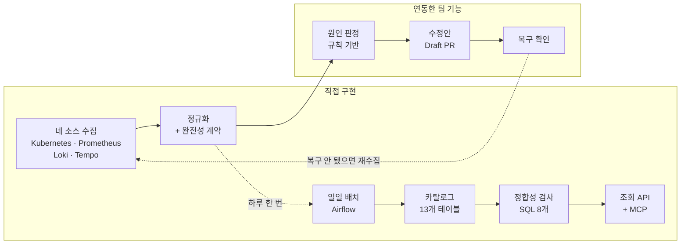

# Kyro

쿠버네티스에 익숙하지 않은 사용자가 GitOps 기반으로 장애를 스스로 복구할 수 있게 돕는 서비스입니다. 장애가 나면 운영 데이터를 모아 규칙으로 원인을 판정하고, 수정안을 Draft PR로 올린 뒤, 실제로 복구됐는지 확인합니다.

저는 이 서비스가 쓰는 운영 데이터를 맡았습니다. 네 원천에서 데이터를 모아 하나의 형식으로 맞추고, 무엇을 가져오지 못했는지 함께 넘기는 계약을 만들었습니다.

프로젝트가 끝난 뒤에는 그 데이터를 검증하는 계층을 얹었습니다. **수집이 성공해도 데이터는 어긋납니다** — 원천이 필드 타입을 바꾸거나, 같은 날짜가 두 번 적재되거나, 어제부터 아무것도 안 들어오는데 아무도 모르는 경우입니다. 메타데이터 카탈로그에 "무엇이 어떻게 생겼어야 하는가"를 등록해 두고, 매일 실제 데이터와 대조합니다.

크래프톤 정글 12기 최종 프로젝트 · 5인 팀 · 2026.06.22–07.25

---

## 담당 범위

아래는 제가 설계하고 구현한 것입니다. 어느 파일의 몇 줄을 제가 썼는지는 [기여와 근거](docs/source-and-ownership.md)에 파일별로 정리했습니다.



오른쪽은 제가 만든 데이터를 받아 쓰는 팀 기능입니다. 원인 판정·복구 제안·프론트엔드는 팀원이 구현했고, 제품 아키텍처는 팀 설계입니다.

**위쪽은 장애가 나면 도는 실시간 경로**입니다. 네 원천은 응답 형식도 시간 기준도 실패하는 방식도 다릅니다. 하나로 모으면서 각 데이터를 어디까지 믿어도 되는지 함께 넘기는 것이 제 일이었습니다. 원인 판정은 제가 준 데이터로 돌아가기 때문에, 절반만 왔다는 사실을 알리지 않으면 판정도 절반짜리 근거로 결론을 냅니다.

**아래쪽은 하루 한 번 도는 배치 경로**입니다. 실시간 경로는 수집하는 순간의 완전성만 봅니다. 수집이 성공한 뒤에 데이터가 어긋나는 것은 아무도 보지 않고 있었습니다.

이 저장소는 팀 저장소([minmings111/Kyro-jungle-final](https://github.com/minmings111/Kyro-jungle-final))의 사본입니다. 프론트엔드·GitOps 상태·배포 차트까지 전체 코드가 그대로 들어 있습니다. 제 담당 범위는 위 그림과 같습니다.

---

## 만든 것

### 운영 데이터 수집 파이프라인

- Kubernetes API / Prometheus / Loki / Tempo 4개 원천 수집기 개발 및 공통 evidence 구조 정규화
- 수집 결과 3-state 완전성 계약 설계 (completed / partial / unavailable + 사유 코드)
- 빈 응답 5가지 원인 구분 (부재 / 권한 없음 / 타임아웃 / 상한 잘림 / 원천 무응답)
- provider 4종 공통 응답 한도 모듈 추출 (개수 + 직렬화 바이트 이중 상한, 그룹별 예산 배분)
- 잘림 시 원본 개수와 사유 코드 동반 반환
- 장애 근거 로그 네임스페이스 연결 필터 및 집계 재계산 (근거 1,180줄 → 240줄, 66.8KB → 13.3KB)
- 노드 지표 수집기(node-collector) 개발

→ [수집 완전성 계약](docs/collection-contract.md) · [수집 한도 설계](docs/collection-limits.md) · [근거의 적용 범위](docs/source-and-ownership.md)

### 배치 파이프라인 및 재처리

- Airflow DAG 원천별 독립 수집 / 재시도 / 부분 실패 보존 (1개 실패 시 나머지 3개 적재 + PARTIAL 기록)
- 실행 단위를 DAG 실행과 원천별 수집으로 분리 (부분 실패를 스키마에서 표현 가능하게)
- 멱등 재실행 (같은 논리 날짜 5회 반복에 적재 행 수 불변)
- backfill 시 원천 재조회 없이 보관 원본 재생 (과거 날짜에 현재 값이 적재되는 문제 차단)
- 입력을 수집 결과 소비로 분리 (CollectedSource / FixtureSource 어댑터)
- 재수집 범위 4개 원천 → 실패한 1개
- 고장 주입 시연 3종 (원천 실패 / 스키마 드리프트 / 중복 적재)

→ [배치 설계](docs/airflow-pipeline.md) · [검사는 어디서 돌아야 하는가](docs/where-checks-run.md) · 확인 `make demo-fail-source`

### 메타데이터 카탈로그 설계

- PostgreSQL 13개 테이블 메타데이터 모델 설계
  (자산 / 필드 계약 / 스키마 관측 이력 / 리니지 / 실행 이력 / 품질 결과 / 원본 스냅샷)
- 등록 계약과 관측 이력 분리 (버전을 올리지 않은 스키마 변경까지 검출)
- 유일 제약 11종으로 멱등 적재 보장 (재시도 · backfill 중복 차단)
- 데이터 계보(리니지) 기록 — 어느 원천에서 와서 무엇을 거쳤는지. 간선마다 확인 시각을 남기고 정규화된 행에서 S3 원본까지 거슬러 올라갑니다
- 실시간 3-state와 배치 4-state 상태 어휘 매핑 정의
- 외부 데이터 카탈로그 도구 미도입 결정 (자산 6종 규모에서 운영 비용이 이득을 초과. 자체 카탈로그 구축과의 구분은 [범위 결정](docs/scope-decisions.md) 참조)

→ [메타데이터 카탈로그](docs/metadata-catalog.md) · [기술 리서치](docs/tech-research.md) · 확인 `make demo-drift`

### 데이터 품질 검증

- 정합성 검사 SQL 8본 + 조회 SQL 2본 (재귀 CTE / 윈도 함수 / FULL OUTER JOIN / IS DISTINCT FROM)
- 검사 8종 (원천 커버리지 / 필수 필드 누락 / 스키마 드리프트 / 버전 미갱신 변경 / 최신성 SLA / 리니지 단절 / 실행 정합성 / 중복 적재 후보) + 조회 질의 2종
- 통과 · 실패 결과 모두 적재 (검사하지 않은 것과 검사해서 통과한 것을 구분)
- 관측 60만 행 기준 검사 질의 인덱스 설계 (검사 전체 424.5ms → 150.0ms, 드리프트 110.9ms → 2.5ms)
- 관측 470만 행 / 3.4GB 까지 부하 특성 측정 (합성 데이터 기준. 합계 2,590ms, 병목 질의 1종이 80% 차지, 개선안 1.76배 검증)
- 오탐 검증 포함 15항목 자동 검증 (정상 데이터에서 모든 검사 0행 확인)
- 카탈로그 계층 테스트 124종 (MCP 신뢰 경계 20 · 문서·코드 대조 18 · 검사 분기 도달 17 · 조회 API 17 · 적재 키 13 · 응답 경계 11 · 원천 수집 9 · 프로토콜 8 · 스키마 계약 6 · DAG 계약 3 · 보관 결과 2)

→ [검사 SQL 열 개](docs/sql-quality-checks.md) · [측정과 한계](docs/load-and-design-limits.md) · 확인 `make catalog-sql` `make catalog-bench`

### 조회 API 및 MCP

- FastAPI 카탈로그 조회 엔드포인트 8종 작성 / 커서 페이지네이션 / 모든 응답에 마지막 실행 상태 부착 (앱 배선 `app.py` · API 테스트 17종 포함)
- ConfigMap · Secret 참조 조회 API (allowlist projection / 카나리 검증 / 경계 조건 16종)
- MCP 읽기 전용 서버 (stdio JSON-RPC · 도구 7종 · 응답 상한 50건 64KB · RFC 8693 토큰 교환과 교환 결과 검증 · 세션 예산 · `principal_sub` 감사 로그)
- MCP 인자 스키마 검증 및 신뢰할 수 없는 입력 표시 (응답·인자 경계 테스트 11종)
- Gateway API 상한값 상수 단일 출처 (91줄, 단독 작성)
- 자연어 → SQL 생성 기능 제외 결정 (생성 질의의 정확성 검증 수단 부재)

→ [조회 API와 MCP](docs/catalog-api-mcp.md) · [설정 참조 조회 API](docs/config-reference-api.md) · 확인 `make catalog-mcp`

---

## 확인하기

이 시스템은 EKS, 일반 Kubernetes 클러스터, Docker Compose 세 환경에서 돕니다. **아래 검증은 Docker Compose 기준입니다** — AWS 계정이나 실제 클러스터 없이 로컬에서 전부 재현됩니다.

**1단계 — 카탈로그** (Docker 필요, 약 3분)

```bash
make catalog-up        # PostgreSQL · MinIO · Airflow 기동
make catalog-reset     # 테이블 재생성. 낡은 스키마가 남아 있으면 결과가 달라집니다
make catalog-run       # 배치 1회 실행
make catalog-verify    # 검증 15항목      → 15/15 통과
make catalog-test      # 카탈로그 테스트   → 124 passed
make catalog-bench     # 인덱스 전후 비교   → 424.5ms → 150.0ms
```

**2단계 — 고장 시연** (약 2분)

```bash
make demo-fail-source  # Loki 를 끊고 배치     → PARTIAL 기록, 나머지 3개 적재
make demo-drift        # 원천 필드 타입 변경   → 스키마 드리프트 검출
make demo-duplicate    # 같은 날짜 두 번 적재  → 중복 적재 후보 검출
```

정상 데이터로만 시험하면 무엇이든 통과한다고 답하는 검사도 통과합니다. 그래서 일부러 고장 내는 명령을 함께 뒀습니다.

같은 이유로 검사 질의는 **판정마다 그 판정이 나오는 입력을 만들어** 확인합니다. 이걸로 두 번 잡았습니다 — 중복 적재 검사가 유일 제약과 같은 키로 묶여 0행이던 것, 원천 커버리지의 상시 잘림 판정이 다른 분기 뒤에 있어 도달할 수 없던 것.

**테스트도 틀립니다.** 빈 DB 에 스키마를 새로 만들고 돌렸더니 검사 분기 테스트 다섯이 깨졌습니다. 한 배치 실행 아래에 같은 원천의 수집을 열 건 넣고 있었는데, `(dag_run_id, source_id)` 가 유일 제약이라 애초에 만들 수 없는 데이터였습니다. **제약이 없는 낡은 테이블에서만 통과하던 테스트**였습니다. 그래서 위 명령을 `make catalog-reset` 다음에 돌리기를 권합니다 — 처음 클론한 사람과 같은 상태에서 시작해야 이런 것이 보입니다.

---

## 한계

- 조회 API 가 Secret 값을 반환하지 않을 뿐, 스냅샷 저장소와 S3 원본에는 값이 남습니다
- 관측 470만 행 / 3.4GB 까지 측정했습니다. 그 지점에서 검사 8종 합계 2,590ms 이고 그중 80% 를 중복 적재 검사 하나가 씁니다. 2단계 질의로 1.76배 줄었고 적용했습니다. **대신 최근 2일 적재분에서 후보를 뽑으므로 원본과 복제본이 둘 다 그보다 오래전에 적재된 중복은 놓칩니다** — 사각지대까지 테스트로 고정해 뒀습니다. 위 2,590ms 는 적용 전 값이고 수억 행 규모는 외삽할 수 없습니다 — [측정과 한계](docs/load-and-design-limits.md)
- 관측 데이터에 보존 정책이 없습니다. 상한이 없어 계속 쌓입니다. 계층형 보존과 롤업 설계는 문서에 있으나 구현하지 않았습니다
- 실제로 반복 사용한 사용자가 없습니다. 시연에 성공한 것과 쓰인 것은 다릅니다. 다만 [7월 AWS 청구서](docs/evidence/aws-bill-2026-07/README.md)에 로그 64.35GB, LoadBalancer 2,150시간, 공인 IPv4 8,179시간이 남아 한 달 가까이 가동된 것은 확인됩니다
- 카탈로그가 다루는 것은 이 프로젝트가 만드는 운영 데이터 6종입니다. 외부 업무 시스템 연동은 조사까지만 했습니다
- 테스트가 확인하는 것은 파이프라인 함수와 질의까지입니다. **Airflow 스케줄러 위에서 실제로 돌려 본 것은 자동 검증에 없습니다.** DAG 가 파이프라인을 올바른 타입으로 부르는지는 호출부를 파싱해 확인합니다(`test_dag_contract.py` 3종). 스케줄러가 그 함수를 실제로 부르는지는 여기서 알 수 없습니다
- MCP 는 가짜 인증 서버와 가짜 전송으로만 검증했습니다. 실제 STS 나 MCP 클라이언트에 붙여 본 적이 없습니다
- 배치와 카탈로그는 프로젝트 종료 후 개인 작업입니다. 각 선택의 대안과 배제 사유를 문서에 남겼습니다
- 팀 저장소는 이력 정리를 여러 차례 거쳤습니다. 커밋 수는 기여의 근거가 아닙니다. 파일별로 누가 몇 줄을 썼는지와 실제 코드를 보는 편이 정확합니다

---

## 문서

하나만 고른다면 [검사 SQL 열 개](docs/sql-quality-checks.md)입니다. 질의마다 왜 그 모양인지와, 아무것도 못 잡던 검사를 찾아 고친 기록이 있습니다.

**만든 것**

- [빈 목록 5가지 원인 구분과 3-state 수집 완전성 계약](docs/collection-contract.md)
- [개수·바이트 이중 상한과 잘림 사유 동반 반환](docs/collection-limits.md)
- [Secret 값 비노출 참조 관계 조회 API](docs/config-reference-api.md)
- [테이블 13종 메타데이터 모델과 등록 계약·관측 이력 분리](docs/metadata-catalog.md)
- [소스별 독립 수집과 부분 실패 보존 배치 파이프라인](docs/airflow-pipeline.md)
- [응답 경계·권한 축소 전달·감사 로그를 갖춘 조회 API 와 MCP](docs/catalog-api-mcp.md)

**검증한 것**

- [정합성 검사 질의 10본의 설계 근거와 폐기·수정 기록](docs/sql-quality-checks.md)
- [관측 470만 행 부하 측정과 병목 질의 개선안 검증](docs/load-and-design-limits.md)
- [7월 AWS 청구 내역과 문서 수치 대조](docs/evidence/aws-bill-2026-07/README.md)
- [네 운영 source의 payload 변환·신호 보존·claim-check 30분 실험](docs/evidence/payload-experiment/README.md)

**측정할 것**

- [40개 logical source·Outbox·멱등·DLQ 지속 부하와 자원 민감도 실험 계획](docs/event-pipeline-load-test-plan.md)
- [네 provider payload 계측의 질문·변수·증거 기준](docs/evidence-payload-experiment-plan.md)
- [AWS·Git 기록으로 과거 payload 경로를 추론할 수 있는 범위](docs/evidence-payload-traffic-forensics.md)

**안 만든 것**

- [OpenMetadata·DataHub 미도입 근거와 자체 카탈로그와의 구분](docs/tech-research.md)
- [만들었다가 걷어낸 것과 결론이 먼저였던 판단](docs/scope-decisions.md)
- [배치에 두면 안 되는 검사를 가려낸 기준](docs/where-checks-run.md)

**바뀐 판단**

- [처음 생각과 달라진 지점](docs/engineering-log.md)
- [서비스를 47개로 쪼갠 결정이 청구서에 어떻게 나타났나](docs/architecture-cost-postmortem.md)
- [파일별로 누가 몇 줄을 썼는지와 팀 코드·개인 작업의 경계](docs/source-and-ownership.md)
