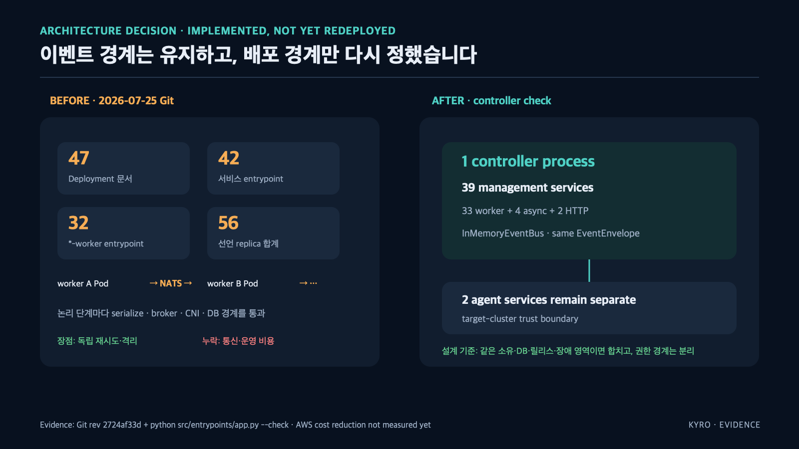

# Kyro — 불완전한 수집 결과가 삭제 근거가 되지 않게 만들었습니다

Kubernetes 장애가 나면 증거를 모으고, 규칙으로 원인을 판정하고, 허용된 범위의 수정안을 GitHub Draft PR로 올린 뒤, 배포 결과를 다시 확인합니다.

크래프톤 정글 12기 최종 프로젝트 · 5인 팀 · 2026.06–07

원본 팀 저장소는 [`minmings111/Kyro-jungle-final`](https://github.com/minmings111/Kyro-jungle-final)입니다. 이 저장소는 그중 **이민정이 맡은 범위**와 채용 준비용 확장을 분리해 검증하기 위한 작업본입니다.

무엇을 직접 구현했고 무엇이 후속 확장인지는 [원본·기여·주장 경계](docs/portfolio/00-source-and-ownership.md)에 공개했습니다.

```
증거 수집 ──▶ 원인 판정 ──▶ 수정안 Draft PR ──▶ 배포 후 재확인
  담당            팀원            팀원              팀원
```

증거는 Kubernetes API, Prometheus, Loki, Tempo 네 곳에서 옵니다. 응답 형식도, 시간 기준도, 실패하는 방식도 다릅니다. 이걸 하나로 모으고 **각 증거를 어디까지 믿어도 되는지 함께 넘기는 것**이 제 일이었습니다.

원인 판정은 제가 준 증거로 돌아갑니다. 증거가 절반만 왔다는 걸 알리지 않으면 판정도 절반짜리 근거로 결론을 냅니다. 아래는 그 지점에서 발견한 문제와 차단한 위험입니다.

## 비용 원장이 바꾼 실행 설계

논리적 책임을 나누기 위해 만든 이벤트 워커가 Git에서는 최대 47개 Deployment 문서와 56개 선언 replica로 늘었습니다. AWS 원장을 대조하니 7월 4~27일 Regional Data Transfer Usage는 **29.68TB / $296.83**, 편도 상당량은 **14.84TB**였습니다. CloudWatch에서는 management의 5.17TiB out/5.33TiB in과 game→infra의 4.90TiB out/5.23TiB in이 함께 확인됐습니다.

그래서 “워커 수를 줄인다”가 아니라 통신의 성격을 나눴습니다. 같은 DB·릴리스·장애 영역을 공유하는 39개 관리 서비스는 typed event 계약을 유지한 채 한 controller와 프로세스 내부 이벤트 버스로 조립하고, target cluster의 agent는 권한 경계가 달라 별도 프로세스로 남겼습니다. game→infra 데이터면은 같은 AZ 우선 배치와 집계 전송으로 별도 개선해야 합니다.



동일한 1,393B 이벤트 1,000건의 로컬 전송 실험에서는 NATS JetStream 373.955ms가 프로세스 내부 전달 12.182ms로 줄었습니다. 이는 전송 계층 실험이며, 아직 AWS 재배포 전이므로 비용 절감 실적으로 표현하지 않습니다.

→ [29.68TB를 관리면·데이터면으로 나눠 본 전체 회고](docs/portfolio/13-architecture-cost-postmortem.md) · [원본 CSV와 증거판](docs/evidence/network-cost/README.md)

이 분석과 controller 통합은 팀 프로젝트 종료 후 우용님이 수행한 후속 작업입니다. 민정의 직접 구현 성과로 계산하지 않습니다.

## 다룬 문제

무슨 일이 있었는지까지만 적었습니다. 어떻게 풀었는지는 링크에 있습니다.

**잘린 목록이 멀쩡한 리소스의 삭제 근거로 쓰일 수 있었습니다.**
자료가 없는 경우, 볼 권한이 없는 경우, 시간 초과로 못 가져온 경우가 모두 불완전한 목록으로 수렴했고, 저장소의 부재 판정이 이를 실제 삭제와 구분하지 못하는 경로가 있었습니다. `partial` 또는 잘림 상태인 스냅샷은 삭제 판단에서 제외하도록 막았습니다.
→ [무엇을 어떻게 막았는지](docs/portfolio/01-collection-contract.md)

**앞에서부터 자르면 뒤쪽 namespace가 통째로 빠집니다.**
자르지 않으면 응답 상한을 넘고, 순서대로 자르면 특정 그룹만 통째로 빠질 수 있습니다. 그래서 그룹별 배분과 잘림 메타데이터를 함께 적용했습니다.
→ [어떤 순서로 잘랐는지](docs/portfolio/02-collection-limits.md)

**Secret 원문 대신 참조 관계만 새 응답 모델로 만들었습니다.**
저장된 manifest를 그대로 반환한 뒤 위험 필드를 지우지 않고, Deployment가 참조하는 ConfigMap·Secret의 식별자와 사용 위치만 새 Pydantic 응답으로 투영했습니다. 원본에 새 필드가 생겨도 자동으로 응답에 포함되지 않습니다.
→ [실제 응답 계약과 남은 위험](docs/portfolio/03-config-reference-api.md)

**장애 리포트가 로그 수집기 자신의 에러를 근거로 쓰고 있었습니다.**
sandbox 워크로드 장애인데 target 네임스페이스 Loki의 ERROR 로그가 근거에 섞였습니다. 빈 목록보다 조용합니다. 근거가 있고, 개수도 맞고, 심각도도 높습니다. 다만 다른 사건의 것입니다.
→ [무엇을 기준으로 걸렀는지](docs/portfolio/11-evidence-scope.md)

**수집 성공과 데이터 정합성은 다른 문제였습니다.**
원천의 필드 타입이 바뀌거나 새 데이터가 없어도 수집 작업 자체는 성공할 수 있습니다. 이를 재검사하는 Airflow·카탈로그 코드는 채용 준비용 후속 확장으로 구현되어 있으며, 아직 민정의 원본 팀 프로젝트 기여로 세지 않습니다.
→ [매일 무엇을 대조하는지](docs/portfolio/04-metadata-catalog.md) · [배치를 어떻게 돌렸는지](docs/portfolio/05-airflow-pipeline.md) · [검사 SQL](docs/portfolio/06-sql-quality-checks.md) · [조회 API와 MCP](docs/portfolio/07-catalog-api-mcp.md)

**구현했지만 대표 성과에서 제외한 기능도 있습니다.**
AI가 운영 데이터를 조회하는 도구 계층 75개, 약 6,300줄을 구현하고 런타임에 연결했습니다. 다만 최종 시연의 Golden Path와 사용성 검증 범위에서는 빠졌기 때문에, 코드 규모를 완성된 사용자 성과로 내세우지 않습니다.
→ [기준과 예외](docs/portfolio/09-scope-decisions.md)

## 실행

배치와 카탈로그는 AWS 계정이나 실제 클러스터 없이 로컬에서 돕니다. Python 3.13, [uv](https://docs.astral.sh/uv/), Docker가 필요합니다.

```bash
uv sync --all-groups
make catalog-up
make catalog-schema
make catalog-run DATE=2026-07-31
make catalog-verify
```

`catalog-verify`는 15가지를 확인하도록 작성했습니다. 그중 하나는 **정상 fixture에서 모든 검사가 0행을 반환하는지**입니다. 문제 있는 데이터로만 시험하면 항상 문제라고 답하는 검사도 통과하기 때문입니다. PostgreSQL 기반 15/15 검증과 실제 Airflow `dags test` 정상 실행을 통과했습니다. 실패 task 재시도와 MinIO 객체 저장은 아직 완료 조건으로 남겨 두었습니다.
→ [검증 항목 전체](docs/portfolio/04-metadata-catalog.md#검증)

테스트는 `make test`, 담당 범위 전체 명령은 `make help`입니다.

## 코드 범위

현재 작업 트리는 원본 팀 저장소의 모든 파일 경로를 보존하고 후속 확장을 더한 상태입니다. 따라서 아래 표의 `직접`은 원본 저장소의 파일별 blame과 대표 커밋으로 확인한 범위이고, `후속 확장`은 별도 학습·검증 대상입니다. 비교 방법과 시점별 개수는 [원본·기여·주장 경계](docs/portfolio/00-source-and-ownership.md)에 고정했습니다.

```
src/services/target/cluster-agent/   네 소스 수집·정규화·응답 한도           직접
src/domains/inventory/               스냅샷 커버리지·설정 참조 API           직접
src/packages/contracts/gateway/      API 한도와 응답 계약                    직접·공동
src/services/mcp/internal_control/   AI 조회 도구 계층                       직접, 대표 성과 제외
src/services/ai/agent/pipeline/      근거 번들 일부                          공동
src/domains/datacatalog/             자산·계약 이력·리니지·품질              후속 확장
dags/  sql/quality/  fixtures/       Airflow DAG·검사 SQL·재현 fixture       후속 확장
src/services/catalog_mcp/            카탈로그 읽기 전용 MCP                  후속 확장
그 외 src/  frontend/  deploy/       팀 코드 또는 의존 모듈                  팀·공동
```

원인 판정 규칙, 복구 제안과 대부분의 프론트엔드는 팀원 담당입니다. 대표 커밋과 파일별 근거는 [원본·기여·주장 경계](docs/portfolio/00-source-and-ownership.md)에서 바로 확인할 수 있습니다.

직접 사용: Python 3.13 · FastAPI · Pydantic · PostgreSQL · SQLAlchemy · Alembic · Kubernetes API · Prometheus · Loki · Tempo · OpenTelemetry · Docker · Helm · AWS EKS

후속 확장: Airflow · 카탈로그 품질 SQL · 읽기 전용 MCP

팀이 AWS EKS에 배포해 라이브 시연했습니다.

## 한계

- 조회 API가 Secret 값을 반환하지 않을 뿐, 스냅샷 저장소와 S3 원본에는 값이 남아 있습니다
- 인덱스를 설계하지 않아 데이터가 누적되면 검사 질의가 전체 스캔합니다
- 실제로 반복 사용한 사용자가 없습니다. 시연에 성공한 것과 쓰인 것은 다릅니다
- 배치와 카탈로그는 우용님이 준비한 후속 확장 작업입니다. 민정이 직접 실행·수정·설명하기 전에는 이력서의 개인 성과로 쓰지 않습니다
- 팀 저장소는 이력 정리를 여러 차례 거쳤습니다. 커밋 수는 기여의 근거가 아닙니다. 파일 단위 blame과 코드로 확인하는 편이 정확합니다

## 더 읽을 것

- [판단이 바뀐 지점](docs/portfolio/10-engineering-log.md) — 커밋과 diff로 확인한 작업 기준의 변화
- [기술 리서치](docs/portfolio/08-tech-research.md) — 외부 카탈로그 도구를 쓰지 않은 이유, 자연어 → SQL을 넣지 않은 이유
- [Data Foundation 연결](docs/portfolio/12-data-foundation-fit.md) — JD별 직접 근거, 인접 경험, 아직 남은 공백
- [아키텍처 비용 회고](docs/portfolio/13-architecture-cost-postmortem.md) — 47개 Deployment 문서와 AWS 29.68TB 사용량을 대조해 실행 경계를 바꾼 과정

크래프톤 정글 SW-AI Lab 22주 과정을 수료했습니다. PintOS에서 page fault를 다루며 **관측된 상태가 실제 상태와 다를 수 있다**는 것을 처음 의식했습니다. 수집 결과에 신뢰 범위를 함께 담기로 한 것은 그 질문의 연장선입니다.
