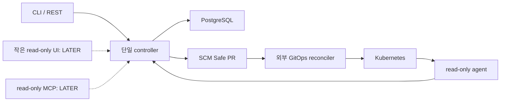

# Cleanup Matrix

> 기준 시점: 2026-07-27
> 목표: 기능을 더 붙이는 것이 아니라, 이미지 장애 → Safe GitOps PR → 복구 검증이라는 한 경로만 기본 제품으로 남긴다.
> 주의: 이 표는 **삭제 승인 목록이 아니다.** 각 항목은 아래 삭제 gate를 통과한 뒤 별도 변경으로 제거한다.

## 1. 정리 후 목표 형태

정리 후 기본 배포는 다음 정도여야 한다.

- controller 한 프로세스
- PostgreSQL 한 개
- target에 read-only cluster agent
- in-process event bus; NATS와 Redis는 기본 설치에서 제외
- SCM PR 생성과 signed webhook
- 외부 GitOps reconciler와 명확한 책임 분리
- image pull 장애 한 종류의 검증된 Golden Path
- 사용자 인터페이스는 먼저 CLI + REST API
- 작은 read-only Web UI와 read-only MCP는 core 안정화 뒤 선택 사항
- cluster 직접 명령, 자동 merge, 자동 revert는 기본 제품에서 제거

정리 후에도 “이벤트 기반”은 남는다. 다만 41개 기능을 모두 자동 합성하는 구조는 남기지 않는다. 핵심 상태 전이를 나타내는 event와 outbox/ledger만 유지하고, 기본 composition은 allowlist로 고정한다.



## 2. 분류 기준

| 분류 | 의미 | 현재 해야 할 일 |
|---|---|---|
| **KEEP** | Golden Path 또는 그 안전성에 직접 필요 | 기본 composition에 남기되 공개 API와 내부 의존성을 줄인다. “현재 코드 전체를 그대로 보존”한다는 뜻은 아니다. |
| **LATER** | 일관된 기능이지만 첫 공개 버전에 불필요 | 기본 composition/배포/문서에서 제외하고, core 의존성을 끊을 때까지 보관한다. 추후 별도 plugin/버전으로 재평가한다. |
| **EXPERIMENT** | 연구·데모·선택적 AI 기능 | production path와 DB schema에서 분리하고 실험 명칭을 붙인다. 유지비가 생기면 삭제한다. |
| **DELETE** | 생성물, 개인 환경, 중복, 깨진 기능, 핵심 방향과 충돌 | 삭제 gate를 통과한 뒤 source와 deploy/schema/reference를 함께 제거한다. |

판단 우선순위는 다음과 같다.

1. 이미지 Golden Path에 실제로 호출되는가?
2. 잘못된 PR/권한/재처리를 막는 안전 장치인가?
3. core에서 제거해도 외부 SCM provider와 GitOps reconciler가 그 책임을 수행하는가?
4. 개인 환경이나 과거 UI 이식 때문에 존재하는가?
5. 자동화된 테스트로 사용자 결과를 증명하는가?

## 3. 저장소 최상위 구성

| 대상 | 분류 | 판단 | 정리 작업 |
|---|---|---|---|
| `src/entrypoints` | KEEP | 단일 OSS composition root | default service allowlist를 코드로 고정하고 bootstrap을 최소화 |
| `src/packages` | KEEP | 공통 runtime/contract의 위치 | 아래 package별 분류대로 축소 |
| `src/domains` | KEEP | API와 도메인 로직의 위치 | 아래 domain별로 삭제/격리 |
| `src/services` | KEEP | event handler와 agent 위치 | 아래 service별로 default composition 축소 |
| `tests` | KEEP | 안전한 삭제와 Golden Path의 근거 | fixture 중심으로 재구성하고 Golden Path integration test 추가 |
| `alembic` | KEEP | 현재 DB를 읽기 위한 migration | 제거 대상 table 정리 후 공개 v1에서 baseline squash 검토 |
| `charts/opsia` | KEEP | OSS 설치 경로 | RBAC와 values를 최소 profile에 맞게 수정하고 `helm lint/template` gate 추가 |
| `frontend` 전체 | LATER | 현재 UI는 core가 아니며 정리 비용이 큼 | 기본 배포에서 제거하고 필요한 계약만 추출; 하위 분류 참고 |
| `scripts` | KEEP | 일부 catalog/test 도구는 유용 | 개인 배포·깨진 데모·UI 이식 script 제거 |
| `src/samples/scenarios/faults/imagepull.yaml` | KEEP | Golden Path fixture 후보 | 독립 Kind integration fixture로 승격 |
| 나머지 `src/samples` | EXPERIMENT | 여러 장애 데모가 core보다 넓음 | imagepull 외 fixture는 기본 test에서 제외 |
| `.gitops` | DELETE | runtime에서 생성된 rollback/Safe PR 산출물 307개 | 필요한 재현 fixture만 tests로 옮기고 전체 untrack + ignore |
| `_to_delete` | DELETE | 과거 archive/lock/snapshot | 참조 0건 확인 후 제거 |
| `infra` | DELETE | 개인 AWS EKS/ECR/VPC Terraform | 별도 개인 infra 저장소로 이동; 공개 core에서 제거 |
| `deploy/management` | DELETE | 개인 dev/AWS 중심 legacy manifest | Helm chart와 test fixture로 대체 후 제거 |
| `deploy/target` | LATER | Prometheus/Loki/Tempo 전체 설치 예시 | optional observability example로 분리; core 설치에 강제하지 않음 |
| `deploy/kind` | KEEP | 로컬 Golden Path test 기반 후보 | management/target 최소 fixture로 다시 작성 |
| `deploy/demo` | EXPERIMENT | 개발 demo API | production 문서·배포에서 제외 |
| `deploy/oss` | EXPERIMENT | 외부 GitOps 학습 lab, 과거 제품명 manifest 혼재 | Golden fixture만 추출 후 나머지 제거 |
| `deploy/k8s/base` | DELETE | legacy 단일 base 파일 | chart/Kind fixture 중복 제거 |
| `config/env` | KEEP | 설정 예시 필요 | 개인 domain과 외부-console variant를 없애고 `.env.example` 하나로 축소 |
| `.github/CODEOWNERS` | LATER | 현재 handle과 경로가 예시/과거 구조 | 실제 maintainer가 생기면 다시 작성 |
| `.github/workflows/dev-deploy.yml` | DELETE | 개인 AWS dev 배포 workflow | 일반 PR CI로 대체 |
| 개인 edge/tunnel workflow | DELETE | 개인 domain/tunnel 자동화 | 개인 운영 저장소로 이동 |
| 새 PR CI workflow | KEEP | 공개 품질 gate에 필수 | Ruff, pytest, frontend 제거 전 검사, Helm lint/template 실행 |
| `Makefile` | KEEP | 개발자 진입점 | 삭제 경로 target 제거, `make test`가 실제 pytest를 실행하도록 수정 |
| `pyproject.toml`, `uv.lock`, `.python-version` | KEEP | 재현 가능한 backend build | 누락 `README.md`를 만들고 불필요 dependency 제거 |
| `.gitignore`, `.dockerignore`, `.gitattributes` | KEEP | 산출물 경계 | `.gitops`, IDE, Playwright, dist/cache가 재추적되지 않게 보강 |
| `LICENSE-APACHE-2.0.txt` | KEEP | 공개 라이선스 | 표준 `LICENSE` 이름 검토 |
| `NOTICE` | KEEP | attribution은 필요 | Opsia 이름과 실제 보존 asset/source만 기준으로 전면 재작성 |
| `README.md` | KEEP | 현재 누락된 패키지·제품 진입점 | 가치, 한계, 10분 demo, security model을 새로 작성 |
| `start-kyro-frontend.command` | DELETE | 개인 절대 경로 launcher | 제거 |
| `com.kyro.frontend.plist` | DELETE | 개인 macOS launcher | 제거 |
| `secrets/.sops.yaml` | DELETE | 현재 공개 core에 연결된 secret workflow가 없음 | 실제 secret은 저장소 밖에서 관리; 필요 시 chart 문서로 대체 |
| `.idea`, `.playwright-cli`, `output`, caches, `frontend/dist` | DELETE | local/generated artifact | tracked 여부 확인 후 제거하고 ignore |

## 4. 공통 package 분류

모든 `src/packages/*` 1차 모듈을 포함한다.

| package | 분류 | 유지/정리 범위 |
|---|---|---|
| `packages/config` | KEEP | OSS 최소 profile만 남기고 개인 AWS/console 설정 제거 |
| `packages/contracts` | KEEP | Golden event/API/source 계약 유지; UI parity·직접 command 계약은 소비자 제거 후 축소 |
| `packages/events` | KEEP | envelope, correlation/causation, serialization 유지 |
| `packages/runtime` | KEEP | in-process bus, outbox, ledger, retry, DLQ 유지; NATS는 LATER adapter로 격리; 자동 전체 발견 대신 allowlist |
| `packages/security` | KEEP | user/agent 인증, webhook 서명, authorization 유지 |
| `packages/storage` | KEEP | core repository와 transaction/outbox 유지; projection/삭제 기능 table 정리 |
| `packages/ai` | EXPERIMENT | LLM provider는 core decision에서 분리하고 설명/fallback plugin으로만 사용 |

## 5. 도메인 모듈 분류

모든 `src/domains/*` 1차 모듈을 포함한다. KEEP인 대형 모듈도 Golden Path에 닿지 않는 router와 query는 제거 대상이다.

| domain | 분류 | 판단과 처리 |
|---|---|---|
| `activity` | LATER | 일반 활동 feed; core event ledger로 대체 가능 |
| `ai` | EXPERIMENT | 채팅/LLM surface; core RCA 판단에서 분리 |
| `alert` | LATER | incident lifecycle에 유용하지만 첫 CLI 버전은 상태 조회로 충분 |
| `application_filter` | DELETE | 대형 console 전용 filter |
| `applications` | KEEP | repository/application/binding/target authority에 필요; CRUD를 최소화 |
| `audit` | LATER | 공개 운영에는 가치가 있으나 all-event projection을 기본 경로에서 제외 |
| `catalog` | DELETE | 클러스터 탐색 UI 확장 기능 |
| `changes` | LATER | 일반 change correlation; recovery PR link에 필요한 최소 필드만 core에 추출 |
| `checks` | LATER | 사용자 check 정책; 이미지 Golden Path 밖 |
| `command` | DELETE | PR-only 방향과 충돌하는 직접 cluster command domain |
| `compare` | DELETE | 대형 console 비교 기능 |
| `cost` | DELETE | 별도 제품 영역이며 증거→PR 경로와 무관 |
| `dashboard` | DELETE | all-event dashboard projection; 현재 UI 복잡도의 중심 |
| `demo_workspace` | DELETE | 제품 코드에 포함된 demo seed/query |
| `diagnose` | EXPERIMENT | 범용 진단 API; 규칙 기반 core와 분리 |
| `diagnostics` | KEEP | 실패 이유와 다음 행동을 구조화하는 최소 계약 유지 |
| `evidence` | KEEP | evidence 조회·정규화·identity의 core |
| `gitops` | KEEP | source authority, structured patch, repository discovery의 core만 유지 |
| `gitops_filter` | DELETE | console filter |
| `helm` | LATER | chart catalog UI는 제외; `helm-values` source contract/patch는 `gitops` core에 유지 |
| `identity` | KEEP | network API와 agent 인증에 필요; multi-tenant 확장은 축소 가능 |
| `integrations` | LATER | Prometheus 등 provider 설정 surface; 첫 버전은 정적 config로 단순화 |
| `inventory` | LATER | 광범위한 K8s explorer; RCA에 필요한 snapshot subset만 `target/evidence`에 유지 |
| `inventory_filter` | DELETE | explorer 전용 filter |
| `issue_filter` | DELETE | console issue filter |
| `log_stream` | EXPERIMENT | 실시간 log viewer; RCA evidence provider와 분리 |
| `mail` | DELETE | 개인 도구의 핵심 인증에 불필요 |
| `manifest_editor` | LATER | interactive editor는 제외; exact source resolver만 `gitops`에 추출 |
| `parity` | DELETE | 과거 upstream UI 이식 추적 |
| `providers` | LATER | provider marketplace/연결 UI; agent의 실제 evidence provider와 분리 |
| `rca` | KEEP | incident, RCA, recovery plan/selection/verification의 core; API를 좁힘 |
| `rca_bundle` | KEEP | 사람이 검토할 evidence/RCA bundle의 최소 read model |
| `rca_changes` | LATER | 일반 change context 분석; image Golden Path 이후 재평가 |
| `release_flow` | LATER | 전체 CI/CD workflow 모델; 외부 GitOps와 책임 중복 |
| `resource_access` | KEEP | 사용자가 볼 수 있는 cluster/repository 범위 제한 |
| `retention` | LATER | 장기 운영 정책; 기본 TTL 하나로 시작 가능 |
| `scm` | KEEP | SCM connection, commit 고정 source, PR/webhook의 core |
| `service_access` | KEEP | API service authorization의 최소 경계 |
| `shell_state` | DELETE | web shell/terminal UI 상태 |
| `target` | KEEP | agent 등록, evidence job, cluster identity; direct command/reconcile route 제거 |
| `timeline` | LATER | 풍부한 UI timeline; core event 조회 한 개로 시작 |
| `traffic` | DELETE | network traffic 시각화는 별도 제품 영역 |
| `workload_detail` | LATER | explorer 상세 화면; RCA bundle에 필요한 필드만 추출 |

## 6. 서비스 모듈 분류

자동 발견되는 41개 서비스와, service tree에 있으나 독립 app으로 발견되지 않는 `ai/agent`, `mcp/internal_control`을 모두 포함한다.

### RCA/AI

| service module | 분류 | 판단과 처리 |
|---|---|---|
| `ai/agent` | KEEP | cause/recovery rule engine; 첫 공개 버전에서는 image pull 규칙만 기본 활성화 |
| `ai/evidence-worker` | KEEP | Golden Path 입구 |
| `ai/incident-worker` | KEEP | incident claim/dedup |
| `ai/plan-worker` | KEEP | 원인 후보 계획 |
| `ai/analyze-worker` | KEEP | 증거 기반 후보 평가 |
| `ai/rca-worker` | KEEP | 결정적 RCA/blocked 판정 |
| `ai/recovery-worker` | KEEP | recovery candidate 생성 |
| `ai/select-worker` | KEEP | 자동 단일 선택 또는 사용자 선택 요청 |
| `ai/dispatch-worker` | KEEP | 선택 결과를 PR route로 제한해 전달 |
| `ai/diff-worker` | KEEP | structured patch diff policy; 이름을 `safe-pr-policy-worker`로 변경 검토 |
| `ai/rca-feedback-worker` | KEEP | PR/deploy/evidence verification lifecycle |
| `ai/approval-worker` | LATER | advisory recommendation; 사용자 선택에 필수 아님 |
| `ai/backlog-worker` | LATER | rule authoring backlog; 첫 개인 도구에 불필요 |
| `ai/chat-worker` | EXPERIMENT | LLM chat을 core 밖 plugin으로 격리 |
| `ai/ai-fallback-worker` | EXPERIMENT | 규칙 실패 시 LLM fallback; mutation과 연결 금지 |
| `ai/rollout-worker` | DELETE | direct command/rollout 경로와 결합 |

### GitOps, gateway, target, projection

| service module | 분류 | 판단과 처리 |
|---|---|---|
| `gateway/api-gateway` | KEEP | core REST/auth/agent route만 남기고 도메인 router 축소 |
| `gateway/outbox-relay` | KEEP | transaction→event 전달 보장; 단일 runtime에 접을 수 있음 |
| `realtime/realtime-gateway` | KEEP | agent evidence job/connection에 필요한 최소 WebSocket만 유지 |
| `gitops/safe-pr-worker` | KEEP | patch preflight |
| `gitops/scm-worker` | KEEP | SCM PR 생성. 현재 adapter는 `github_provider.py`다. |
| `gitops/git-pull-worker` | LATER | 일반 CD webhook pipeline; recovery merge webhook만 SCM/core에 추출 |
| `gitops/manifest-render-worker` | LATER | 전체 CD render worker; Safe PR source resolution과 분리 |
| `gitops/diff-worker` | LATER | 일반 desired-state diff pipeline |
| `gitops/diff-analyze-worker` | LATER | 일반 CD risk 분석 |
| `gitops/workflow-controller` | LATER | 외부 GitOps reconciler와 중복되는 전체 orchestration; verification binding만 core에 추출 |
| `gitops/github-poll-worker` | LATER | signed webhook 우선, polling은 optional fallback |
| `gitops/auto-revert-worker` | DELETE | 사람 검토 PR-only 계약과 충돌 |
| `target/cluster-agent` | KEEP | read-only evidence 수집만 남기고 command/reconcile capability 제거 |
| `target/node-collector` | LATER | chart에서 이미 비활성; node 장애를 지원할 때 재평가 |
| `target/drift-worker` | DELETE | target desired-state 관리가 core 밖 |
| `target/reconcile-worker` | DELETE | cluster 직접 reconcile 경로가 core 밖 |
| `command/command-worker` | DELETE | 직접 command 실행 경로 제거 |
| `command/command-janitor` | DELETE | command domain 제거 후 불필요 |
| `projection/dead-letter-monitor` | KEEP | 실패 가시성은 필요; 별도 worker 대신 controller status에 통합 가능 |
| `projection/audit-worker` | LATER | all-event projection 비용; event ledger export로 시작 |
| `projection/change-correlation-worker` | LATER | recovery에 필요한 PR/deploy binding만 feedback worker에 유지 |
| `projection/release-flow-worker` | LATER | 전체 release UI projection |
| `projection/rca-timeline-janitor` | LATER | 단순 TTL job으로 대체 가능 |
| `projection/dashboard-worker` | DELETE | all-event dashboard projection |
| `alert/alert-worker` | LATER | 첫 버전은 CLI/status로 incident close 확인 |
| `mail/mail-worker` | DELETE | email verification 경로 제거 |
| `mcp/internal_control` | EXPERIMENT | 공개 MCP가 아니며 mutation surface가 큼; 기본 build/runtime에서 제외 |

### 목표 default composition

독립 프로세스 수를 늘리라는 뜻이 아니다. 아래 논리 handler만 controller의 명시적 allowlist에 넣는다.

```text
api-gateway, realtime-gateway, outbox-relay,
evidence-worker, incident-worker, plan-worker, analyze-worker, rca-worker,
recovery-worker, select-worker, dispatch-worker,
ai-diff-worker, safe-pr-worker, scm-worker, rca-feedback-worker,
dead-letter-monitor
```

`cluster-agent`는 target 측 별도 실행 단위다. 목록 외 서비스는 파일이 남아 있더라도 default controller에 자동 등록하지 않는다.

## 7. Frontend 분류

현재 frontend는 약 60K LOC이고 그중 `devpreview` 계열이 약 36K LOC다. production root가 `devpreview-unified.tsx`를 lazy-load하며, design guard 위반과 큰 bundle이 있다. 따라서 “화면을 조금 정리”하는 방식보다 기본 배포에서 먼저 분리하는 편이 안전하다.

| frontend area | 분류 | 처리 |
|---|---|---|
| `src/devpreview`, `src/devpreview-unified.tsx` | DELETE | production shell에서 제거; 필요한 화면 요구사항은 screenshot/spec로만 보존 |
| `src/app`, `src/app/composition` | DELETE | 현재 거대 UI composition 제거 |
| `src/pages`, `src/pages/clusters` | DELETE | 현재 page 구현 제거 |
| `src/api`, `src/api/barrels` | DELETE | backend API 확정 후 CLI/작은 UI용 client 재생성 |
| `src/features/ai-assistant` | EXPERIMENT | core UI에서 제거 |
| `src/features/auth` | LATER | 작은 UI를 다시 만들 때 최소 로그인만 재사용 여부 검토 |
| `src/features/cluster-scope` | LATER | read-only 작은 UI 후보 |
| `src/features/clusters` | LATER | incident에 필요한 cluster selector만 추출 가능 |
| `src/features/home` | DELETE | 현재 dashboard 홈 제거 |
| `src/features/filters` | DELETE | 대형 탐색 UI 의존 |
| `src/shared/streaming` | LATER | verification status stream에 필요한 최소 hook만 재평가 |
| `src/shared/lib`, `src/shared/ui`, `src/shared/i18n` | LATER | 새 UI가 확정되기 전 default build에서 제외 |
| `src/shared/brand`, `src/shared/data`, `src/shared/parity` | DELETE | 이전 제품/fixture/parity 자산 제거 |
| `src/motion`, `src/styles` | DELETE | 현재 디자인 시스템 제거 |
| `src/test` | LATER | 새 UI acceptance test로 다시 작성 |
| `public` | LATER | 법적 license/font 파일만 유지하고 제품 asset 제거 |
| Vite/Nginx/Docker build | LATER | core를 API/CLI로 먼저 출하한 뒤 optional console chart로 분리 |

작은 UI를 다시 만든다면 화면은 네 개면 충분하다.

1. 연결 상태: cluster, agent, SCM provider, GitOps reconciler
2. 열린 incident 목록
3. incident detail: 증거, RCA, 복구 후보, Safe PR diff/link
4. verification 상태: pending/resolved/failed와 이유

terminal, topology, cost, traffic, 전체 resource explorer, 범용 chat은 넣지 않는다.

## 8. Script와 개발 도구 분류

61개 script를 파일 하나씩 제품 API로 취급할 필요는 없지만, 다음 묶음별 책임은 명확히 한다.

| script 묶음 | 분류 | 포함 예와 처리 |
|---|---|---|
| 인벤토리 | KEEP | `events.py`, `services.py`; default allowlist와 문서 drift 검사에 사용 |
| 품질 gate | KEEP | `test.sh`, `manifest-check.sh`, `test-event-bus-equivalence.sh`, `doctor.sh`; 실제 pytest/Helm 검사로 고침 |
| Golden Path 검증 | KEEP | `verify-recovery-patches.py`, `strict_api_smoke.py`; imagepull 독립 fixture 중심으로 축소 |
| container/local Kind | KEEP | `build-image.sh`, `up.sh`, `down.sh`, `smoke.sh`; 개인 AWS 전제 제거 후 한 command demo로 통합 |
| release-flow/일반 CD | LATER | `release_flow_*`, `rollout_image_digest.py`, `capture_image_digests.py`, `revert_image_digests.py` |
| 외부 console/cluster 운영 | LATER | `external-console-*`, `cluster-interactions.sh`, telemetry installer; optional docs로 이동 |
| 장애 시나리오 | EXPERIMENT | `rca_scenario.py`, `scenario-inject.sh`, `e2e_test.py`; imagepull만 CI fixture로 승격 |
| `oss-demo.sh` | EXPERIMENT | 현재 삭제된 `references/ui-layer-lab/Dockerfile` 참조를 제거하기 전까지 공식 demo로 표기 금지 |
| frontend/live smoke | DELETE | `dev-live-frontend.sh`, console smoke와 UI gate script; current frontend 제거와 함께 정리 |
| 개인 AWS | DELETE | `aws-up.sh`, `aws-down.sh`, `status.sh`, `restore-pgbouncer.sh` 등 개인 cluster 운영 script |
| 개인 edge | DELETE | 개인 edge/tunnel script와 `lib/public-edge.sh`; 개인 domain 운영 저장소로 이동 |
| reference UI parity | DELETE | `reference-*`, `verify-product-brand-boundary.mjs`, 과거 upstream ledger/gate |
| manual scaling/crash demo | EXPERIMENT | `scale.sh`, `kill-pod.sh`, `crash_test.sh`; event runtime test fixture와 분리 |

## 9. 삭제 전에 반드시 통과할 gate

어떤 모듈도 표만 보고 바로 지우지 않는다. 삭제 PR마다 다음을 확인한다.

1. `rg`로 import, dynamic module path, Make target, Helm/deploy reference가 0건인지 확인한다.
2. `scripts/events.py`에서 제거할 event의 producer/consumer가 남지 않았는지 확인한다.
3. default composition allowlist에서 먼저 제외한 뒤 Golden Path test를 통과시킨다.
4. 해당 module이 소유한 table/column/index를 확인하고 Alembic migration 또는 v1 baseline 계획을 포함한다.
5. API route 제거는 명시적 404/410 또는 major version 경계로 처리한다.
6. background job, outbox row, dead letter가 해당 consumer를 기다리지 않는지 확인한다.
7. 문서, sample, environment variable, container manifest를 함께 제거한다.
8. Ruff, 전체 pytest, event-bus equivalence, Helm lint/template를 통과한다.
9. imagepull Golden Path 성공/실패 fixture를 모두 통과한다.
10. 삭제 후 repository를 새 directory에 clone해 문서의 설치 절차를 재현한다.

## 10. 권장 정리 순서

### 0단계 — 외부 노출과 권한부터 막기

- 공개 dev URL을 일시 중지하거나 정상 인증을 강제한다.
- chart의 read-only ClusterRole에서 `pods/exec create`를 제거한다.
- PR-only profile에서 GitOps patch 권한 binding을 agent에 주지 않는다.
- 실제 secret이 Git history나 배포 manifest에 없는지 검사한다.

이 단계는 코드 미관과 무관한 P0 안전 조치다.

### 1단계 — 현재 상태를 보존하고 하나의 합격선 만들기

- 정리 전 tag/branch를 남긴다.
- `make test`가 Ruff + pytest를 실제 실행하게 한다.
- imagepull Golden Path integration test를 frontend와 분리해 만든다.
- 성공뿐 아니라 ambiguous source, stale SHA, duplicate evidence, verification timeout을 검사한다.

### 2단계 — 삭제보다 먼저 default composition 축소

- service discovery는 inventory 용도로 유지하되 실행은 명시적 allowlist만 허용한다.
- NATS, Redis, node collector, command execution을 기본 profile에서 끈다.
- KEEP handler만으로 controller check와 Golden Path를 통과시킨다.

이렇게 하면 삭제 PR의 문제가 core 문제인지 쉽게 구분할 수 있다.

### 3단계 — 가장 확실한 DELETE 제거

- `.gitops`, `_to_delete`, local artifact, 개인 launcher
- 개인 AWS/edge workflow와 domain
- reference parity와 과거 UI 이식 도구
- mail, cost, traffic, shell, dashboard, command/reconcile path
- current production frontend

각 묶음을 별도 PR로 제거한다. DB migration과 event subscriber 변경을 같은 PR에 포함한다.

### 4단계 — KEEP 모듈 내부 축소

- `target`: evidence job/identity만 유지
- `gitops`: source authority/structured patch/PR만 유지
- `rca`: incident→plan→selection→verification만 유지
- `api-gateway`: 해당 route만 mount
- `contracts`: 소비자가 사라진 event body 제거
- `storage`: projection table과 repository 제거

### 5단계 — 공개 패키지 완성

- README, 표준 LICENSE, 정확한 NOTICE, SECURITY, CONTRIBUTING 작성
- 일반 PR CI 추가
- 고정된 container image와 Helm chart release
- 최소 RBAC와 upgrade/uninstall 문서
- 개인 domain/credential/organization 이름 0건
- 독립 Kind demo 한 개

### 6단계 — 인터페이스를 작은 순서로 추가

1. CLI: 상태 조회, incident 조회, 후보 선택, PR 열기, 검증 상태
2. 작은 read-only Web UI: 위 네 화면
3. read-only MCP: incident/evidence/plan/status resource와 tool
4. mutation MCP는 만들더라도 “선택 저장”이나 “PR 요청”까지만 허용하고 cluster 직접 실행은 금지

## 11. 공개 가능 판정표

다음 조건이 모두 참일 때 첫 오픈소스 release를 만든다.

| 판정 항목 | 합격 기준 |
|---|---|
| 가치 | README 첫 화면에서 image pull 장애→Safe PR→검증을 3문장 안에 설명 |
| 설치 | 깨끗한 Kind 환경에서 문서 한 경로로 설치 가능 |
| 기본 구성 | controller + PostgreSQL + read-only agent만 필수 |
| 권한 | agent에 workload mutation, `pods/exec`, GitOps patch 권한 없음 |
| 복구 | imagepull 성공 경로가 자동 test로 통과 |
| 실패 안전성 | ambiguous source/stale SHA/out-of-scope diff에서 PR 0개 |
| 중복 안전성 | 같은 evidence 재전송 시 incident/PR 하나 |
| 검증 | PR merge가 아니라 후속 evidence 뒤에만 resolved |
| 품질 | Ruff, pytest, Helm lint/template, install smoke가 PR CI에서 실행 |
| 저장소 위생 | tracked runtime artifact, 개인 절대 경로, 개인 domain 0건 |
| 문서 | PROJECT-MAP, GOLDEN-PATH, README, SECURITY, CONTRIBUTING이 실제 코드와 일치 |
| 인터페이스 | CLI 또는 REST로 UI 없이 Golden Path를 끝까지 수행 가능 |

## 12. 이 분류의 핵심 결론

- 경쟁력은 대형 dashboard나 자유 형식 AI chat이 아니라 **틀린 변경을 만들지 않는 source authority + exact patch + 검증 lifecycle**에 있다.
- event architecture는 KEEP이지만, 모든 과거 기능을 한 controller에 자동 등록하는 방식은 제거한다.
- Helm은 제거 대상이 아니다. Opsia 설치 chart와 명시적 `helm-values` patch는 KEEP이고, 광범위한 Helm catalog UI만 LATER다.
- CLI가 첫 사용자 표면으로 가장 적합하다. MCP는 그 CLI/API 계약이 안정된 뒤 read-only부터 제공한다.
- 현재 frontend를 고치는 작업을 정리의 선행 조건으로 두지 않는다. core가 독립적으로 증명된 뒤 작은 UI를 새로 결정한다.
