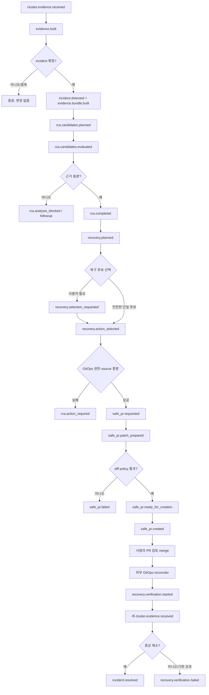

# Golden Path: 이미지 장애에서 검증된 복구까지

> 기준 시점: 2026-07-27
> 범위: `ImagePullBackOff` 또는 `ErrImagePull` → 안전한 GitOps PR → 외부 배포 → 새 증거로 복구 확인
> 이 문서는 현재 코드에서 연결되는 경로와 아직 운영 계약이 필요한 경계를 함께 표시한다.

## 1. 이 경로가 사용자에게 주는 가치

사용자가 얻는 결과는 “AI가 장애를 설명했다”가 아니다.

> 잘못된 container image 때문에 Pod가 올라오지 않을 때, 현재 배포와 Git source의 관계를 증명하고, 허용된 image 필드 하나만 수정한 검토 가능한 PR을 만든 뒤, 배포 후 같은 증상이 사라졌는지 확인한다.

이 범위를 벗어나는 장애는 자동으로 해결하려 하지 않는다. 정보가 부족하거나 source가 모호하면 PR을 만들지 않고 사람이 해야 할 다음 행동을 반환한다.

## 2. 명시적인 범위

### 포함

- Kubernetes evidence에서 `ImagePullBackOff`/`ErrImagePull` 감지
- 알려진 규칙으로 image 관련 원인 후보 평가
- `image_rollback` 또는 `image_tag_fix` 후보 생성
- 사용자 선택 또는 안전한 단일 후보 선택
- raw YAML, 명시된 Helm values, 해석 가능한 Kustomize source의 정확한 필드 patch
- base commit에 고정된 SCM PR 생성
- signed webhook/정확한 workflow binding으로 merge 또는 배포 완료 연계
- 후속 evidence로 incident 해결 또는 검증 실패 판정

### 제외

- 임의 장애에 대한 범용 AI 추론
- cluster workload 직접 patch
- PR 자동 merge
- CI/CD runner 또는 외부 GitOps reconciler 대체
- source ownership을 증명할 수 없는 Helm/Kustomize 자동 수정
- node-level 자동 복구

OSS Helm profile은 `AGENT_ACCESS_MODE=read_only`, `AGENT_DIRECT_COMMANDS_ENABLED=false`, `REMEDIATION_DELIVERY_MODE=pull_request`, `PRODUCTION_AUTO_MERGE_ENABLED=false`를 사용한다. 이 문서의 Golden Path도 그 계약만 다룬다.

## 3. 시작 전 조건

| 조건 | 왜 필요한가 | 없을 때의 결과 |
|---|---|---|
| target cluster와 agent가 등록·연결됨 | 장애 증거와 후속 검증 증거를 수집 | 분석 시작 불가 |
| agent 권한이 실제 read-only policy와 일치 | 개인 도구라도 cluster mutation을 차단 | 설치 차단 |
| Kubernetes snapshot provider 사용 가능 | Pod 상태, event, workload/image 확인 | evidence 불충분 |
| repository, application, binding, manifest path 등록 | runtime resource와 Git source를 연결 | `rca.action_required` |
| base branch와 immutable commit SHA 확인 | stale source에 PR을 만드는 것을 방지 | Safe PR 실패 |
| source 편집 위치가 유일함 | 정확한 scalar만 수정 | 모호하면 실패 |
| raw/Helm source는 `.remediation.yaml` 계약 제공 | image/replica/probe 경로를 명시 | 자동 patch 금지 |
| Kustomize는 local resource와 field ownership 해석 가능 | render 결과가 아니라 실제 source 수정 | 모호/remote reference면 실패 |
| SCM credential과 signed webhook 설정 | PR 생성·merge 신뢰 | 추적/검증 시작 불가 |
| 외부 GitOps reconciler가 repository를 reconcile | PR merge를 cluster에 적용 | 배포되지 않음 |
| evidence 수집 주기와 target identity 유지 | 전후 상태를 같은 대상에서 비교 | 검증 불가 |

## 4. 전체 이벤트 흐름

## 5. 단계별 코드 경로

| # | event/행동 | 담당 | 핵심 처리와 안전 경계 |
|---:|---|---|---|
| 1 | 증거 job 수행 | `cluster-agent` | Kubernetes snapshot, Prometheus metrics, Loki logs, Tempo traces, metadata provider를 호출하고 결과를 관리면으로 전달한다. 이미지 경로의 최소 필수 증거는 Kubernetes 상태다. |
| 2 | `cluster.evidence.received` | target router → `evidence-worker` | target/agent identity를 포함한 evidence를 저장하고 RCA용 compact evidence를 만든다. |
| 3 | `evidence.built` | `incident-worker` | 관리 cluster evidence를 제외하고, incident signal을 claim해 중복 처리를 막는다. 확인되면 `incident.detected`와 `evidence.bundle.built`를 낸다. |
| 4 | `evidence.bundle.built` | `plan-worker` | cause catalog에서 증상과 맞는 원인 후보를 계획한다. image cause catalog는 `ImagePullBackOff`와 `ErrImagePull`을 다룬다. |
| 5 | `rca.candidates.planned` | `analyze-worker` | 각 후보가 요구하는 증거와 실제 evidence를 대조하고 평가한다. |
| 6 | `rca.candidates.evaluated` | `rca-worker` | 충분한 증거가 있으면 결정적 RCA를 저장하고 `rca.completed`를 낸다. LLM은 설명을 보강할 수 있지만 core decision을 대신하지 않는다. |
| 7 | `rca.completed` | `recovery-worker` | `image_rollback`, `image_tag_fix` 등 허용된 복구 후보를 `recovery.planned`로 만든다. |
| 8 | `recovery.planned` | `select-worker` | 안전한 단일 후보면 선택하고, 여러 후보거나 판단이 필요하면 `recovery.selection_requested`를 낸다. |
| 9 | 선택 UI/API | RCA domain router | 사용자의 선택을 저장한 뒤 `recovery.action_selected`를 낸다. `approval-worker`의 권고는 보조 정보일 뿐 자동 승인권이 아니다. |
| 10 | `recovery.action_selected` | `dispatch-worker` | image action이고 delivery route가 `draft_pr`인지 확인한다. 직접 command 대신 GitOps authority를 검증하고 `safe_pr.requested`를 만든다. |
| 11 | source authority 검사 | recovery dispatcher / GitOps domain | repository, binding, target resource, manifest source, commit SHA, 수정 field를 검증한다. 누락·모호·stale이면 `rca.action_required`로 종료한다. |
| 12 | `safe_pr.requested` | `safe-pr-worker` | provider와 patch preflight를 검사해 구조화된 `safe_pr.patch_prepared`를 만든다. |
| 13 | `safe_pr.patch_prepared` | `ai-diff-worker` | 허용 field, 변경 범위, 위험을 결정적 policy로 검사해 `diff.explained`를 만든다. 허용되면 `safe_pr.ready_for_creation`, 아니면 `safe_pr.failed`다. |
| 14 | `safe_pr.ready_for_creation` | `scm-worker` | SCM base SHA를 다시 확인하고 branch/commit/PR을 만든다. 현재 adapter는 `github_provider.py`다. 성공하면 `safe_pr.created`다. |
| 15 | `safe_pr.created` | `rca-feedback-worker` | PR과 recovery plan/incident를 연결해 `recovery.pr.tracked`를 기록한다. 이 시점은 “제안 완료”이지 “복구 완료”가 아니다. |
| 16 | 사람의 review/merge | SCM provider | 사용자가 실제 diff와 근거를 검토한다. production auto merge는 금지한다. |
| 17 | 배포 | 외부 GitOps reconciler | merge commit을 cluster에 reconcile한다. CI/CD의 책임 영역이다. Opsia는 이 시스템을 대체하지 않는다. |
| 18 | merge/deploy 신뢰 | signed SCM webhook 또는 exact workflow binding | `recovery.pr.merged`나 신뢰 가능한 `workflow.run.completed`를 받아 `recovery.verification.started`를 만든다. 단순 URL/이름 일치만으로 신뢰하지 않는다. |
| 19 | 후속 evidence | `rca-feedback-worker` | 같은 cluster/workload의 새 window를 before 상태와 비교해 `recovery.verification.updated`를 낸다. |
| 20 | 해결 또는 실패 | `rca-feedback-worker` → `alert-worker` | image 증상이 사라지고 기대 상태가 충족되면 `incident.resolved`; 회귀, 증거 누락, 기한 초과면 `recovery.verification.failed`다. |

## 6. 이미지 source를 실제로 어떻게 바꾸는가

### Raw YAML

`.remediation.yaml`이 workload file과 정확한 image scalar 경로를 선언해야 한다. source digest와 base SHA를 확인한 뒤 그 scalar만 바꾼다.

### Helm values

Helm chart 전체를 임의로 해석하지 않는다. `.remediation.yaml`에 다음 정보가 있어야 한다.

- `sourceType: helm-values`
- 편집할 values file
- `imageTagPath` 또는 허용된 다른 scalar 경로
- 대상 repository/application/binding과 일치하는 source identity

즉 Helm은 지원하지만 **명시적 source mapping이 있을 때만 자동 수정**한다.

### Kustomize

Kustomize root에서 local resource reference를 따라 실제 편집 파일을 하나로 좁힌다. remote reference, 순환/범위 초과, 여러 field owner, 불완전 provenance는 거절한다. render 결과를 그대로 source file이라고 가정하지 않는다.

## 7. 반드시 실패해야 하는 경우

| 상황 | 기대 결과 | 잘못된 행동 |
|---|---|---|
| incident가 아니거나 중복 evidence | 조용히 종료/기존 incident 연결 | 새 PR 생성 |
| RCA 규칙 또는 증거 부족 | `rca.analysis_blocked`, follow-up 제시 | LLM 추측으로 patch |
| 안전한 후보가 여러 개 | 사용자 선택 요청 | 임의 자동 선택 |
| repository/binding/target authority 없음 | `rca.action_required` | cluster 상태만 보고 repo 추측 |
| image field source가 여러 곳 | 실패 및 후보 위치 표시 | 첫 번째 검색 결과 수정 |
| base SHA가 변경됨 | stale-base 실패 후 재분석 | 이전 commit 기준 patch push |
| 허용 field 외 diff 발생 | `safe_pr.failed` | 넓은 YAML 재직렬화 PR |
| SCM provider/credential 실패 | `safe_pr.failed` | local 성공으로 위장 |
| merge 신호 서명/identity 불일치 | 검증 시작 금지 | 이름이 비슷한 workflow 수용 |
| 배포 후 evidence 없음 | 검증 pending 후 timeout 실패 | 성공 처리 |
| 같은 image 증상 지속/회귀 | `recovery.verification.failed` | incident close |

## 8. 이벤트 처리 보장

Golden Path는 단순 message chain이 아니라 다음 제약에 의존한다.

- incident claim과 idempotency key로 같은 evidence의 중복 incident/PR을 억제한다.
- 상태 저장과 후속 event는 DB transaction/outbox 경계를 사용한다.
- consumer 처리 ledger가 재전달을 견딘다.
- retry 한계를 넘은 event는 dead letter로 보내야 한다.
- 각 event는 correlation/causation 정보를 유지해야 한다.
- in-process와 NATS mode에서 동일한 domain result가 나와야 한다.

이 보장 때문에 event-driven core는 정리 후에도 남길 가치가 있다. 반대로 dashboard와 과거 CD 기능까지 모든 event를 한 runtime에 넣을 이유는 없다.

## 9. Golden Path 완료 기준

아래가 자동화된 integration test로 모두 증명될 때에만 이 경로를 “작동한다”고 부른다.

1. Kind target에 존재하지 않는 image tag를 배포해 `ImagePullBackOff`를 만든다.
2. 동일 evidence를 두 번 보내도 incident와 Safe PR은 하나만 생긴다.
3. 생성된 PR은 허용된 image scalar 한 곳만 바꾸고 base SHA/source digest를 포함한다.
4. 모호한 source, stale SHA, 허용 범위 밖 diff는 PR을 만들지 않는다.
5. 사용자가 PR을 merge하기 전 cluster에는 mutation이 없다.
6. 외부 GitOps reconciler가 merge commit을 반영한다.
7. 새 evidence에서 정상 image pull과 workload ready를 확인한다.
8. 그 후에만 `incident.resolved`가 기록된다.
9. 후속 evidence가 없거나 증상이 계속되면 명시적으로 검증 실패가 된다.
10. 전체 흐름을 하나의 correlation ID로 조회할 수 있다.

현재 `scripts/oss-demo.sh`는 삭제된 `references/ui-layer-lab/Dockerfile`을 참조하므로 이 완료 기준의 증거로 사용할 수 없다. 정리 과정에서 frontend와 무관한 독립 fixture로 다시 만들어야 한다.

## 10. 이 경로 이후에만 확장할 것

Golden Path가 안정되기 전에는 다음을 기본 제품 경로에 추가하지 않는다.

- 범용 AI chat/diagnose
- 직접 cluster command와 자동 revert
- 전체 CD workflow orchestration
- node collector
- 비용/traffic/topology/terminal
- 대형 dashboard
- MCP를 통한 mutation

향후 CLI나 MCP를 제공하더라도 먼저 이 좁은 상태 기계를 감싸야 한다. 예를 들어 `incident list`, `incident explain`, `recovery plan`, `recovery select`, `pr show`, `verification status`는 적절하지만, 자유 형식 “클러스터를 고쳐줘”를 바로 mutation으로 연결하면 이 문서의 안전 경계를 깨뜨린다.
