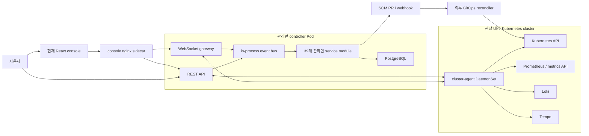

# Project Map

> 기준 시점: 2026-07-27
> 기준 소스: 현재 저장소의 실행 진입점, 서비스 자동 발견 결과, 이벤트 카탈로그, Helm chart
> 관련 문서: [Docs](./README.md), [Golden Path](./GOLDEN-PATH.md), [Cleanup Matrix](./CLEANUP-MATRIX.md)

## 1. 이 프로젝트를 한 문장으로 설명하면

Opsia는 Kubernetes에서 수집한 증거를 알려진 장애 규칙과 대조하고, 사람이 검토할 수 있는 GitOps 복구 PR을 만들며, 이후 증거로 복구 여부를 검증하려는 운영 제어면(control plane)이다.

현재 저장소에는 이 핵심보다 훨씬 넓은 기능이 함께 들어 있다. 웹 콘솔, 클러스터 탐색, 릴리스 워크플로, 명령 실행, 비용, Helm 카탈로그, AI 채팅 등이 한 제품 안에 겹쳐 있어 실제 핵심이 잘 보이지 않는다.

중요한 경계는 다음과 같다.

- Opsia의 핵심 후보는 **CI/CD 시스템 자체가 아니다.** 장애 증거를 안전한 소스 변경 제안으로 바꾸는 계층이다.
- SCM provider가 PR과 병합을 담당하고, 외부 GitOps reconciler가 실제 배포를 담당한다.
- PR 생성이나 병합만으로 복구가 끝난 것이 아니다. 새 클러스터 증거로 증상 해소를 확인해야 한다.
- 외부 기준 저장소나 벤치마크 최소선처럼 모든 장애를 자유롭게 설명하는 범용 AI가 아니다. 좁은 장애 규칙에 대해 재현 가능한 복구 변경을 만드는 쪽이 현재 코드의 강점이다.

## 2. 현재 런타임의 실제 모습

코드에는 41개의 서비스 디렉터리가 있지만, OSS Helm profile이 41개 마이크로서비스를 각각 배포하는 것은 아니다.

- 관리면 서비스 39개는 `src/entrypoints/app.py`의 한 `ControllerRuntime` 프로세스 안에 로드된다.
- 그중 `api-gateway`와 `realtime-gateway`가 HTTP/WebSocket 서버이고, 나머지는 논리적 이벤트 handler다.
- `cluster-agent`와 `node-collector` 두 서비스는 관리면 프로세스에서 제외된다.
- 현재 Helm chart는 controller + console sidecar 한 Pod, PostgreSQL 한 StatefulSet, `cluster-agent` 한 DaemonSet을 만든다.
- Helm OSS profile의 이벤트 버스는 `inprocess`다. NATS/Redis 관련 코드는 남아 있지만 기본 chart 구성요소는 아니다.
- Helm chart에서는 `node-collector`가 비활성화되어 있다.



### 현재 배포 단위

| 배포 단위 | 구현 | 역할 | 현재 비고 |
|---|---|---|---|
| Controller | `src/entrypoints/app.py` | 관리면 39개 서비스의 단일 composition root | 서비스별 프로세스가 아니라 단일 프로세스 |
| Console | `frontend/`, Nginx sidecar | 웹 UI와 `/api`, `/live` proxy | UI가 매우 크고 현재 정리 대상 |
| PostgreSQL | `charts/opsia/templates/postgresql.yaml` | 업무 상태, 이벤트 ledger/outbox, projection 저장 | OSS chart의 유일한 필수 영속 저장소 |
| Cluster agent | `src/services/target/cluster-agent` | K8s/metric/log/trace 증거 수집, 관리면과 통신 | Helm chart에서 read-only profile로 실행 |
| Node collector | `src/services/target/node-collector` | 노드 수준 추가 정보 수집 | chart에서 비활성화, 핵심 경로에 불필요 |
| NATS | runtime/deploy legacy 구성 | 분산 이벤트 전송 | OSS chart에서는 사용하지 않음 |
| Redis | 일부 rate-limit/legacy 설정 | 보조 상태 | OSS chart에서는 필수 구성요소가 아님 |

### 설치용 Helm과 복구 대상 Helm의 차이

이 저장소는 Helm을 전혀 지원하지 않는 것이 아니다. 서로 다른 세 가지 의미가 섞여 있었다.

| 구분 | 현재 상태 |
|---|---|
| Opsia 자체 설치 | `charts/opsia`로 지원 |
| Git 저장소의 Helm chart 탐색·렌더 | `domains/gitops/repository_discovery.py`에 구현 |
| 장애 복구 시 Helm values 수정 | `.remediation.yaml`에서 `sourceType: helm-values`와 정확한 값 경로를 선언한 경우 지원 |

단, 임의의 chart를 보고 “아마 이 값이 image tag일 것”이라고 자동 추측해 수정하지는 않는다. 안전한 PR을 만들려면 어떤 values 파일의 어떤 scalar 경로를 바꿀지 명시해야 한다. 이 제한은 기능 누락이기도 하지만, 잘못된 운영 변경을 막는 안전 경계이기도 하다.

## 3. 저장소 디렉터리 지도

| 경로 | 현재 역할 | 주 사용자 |
|---|---|---|
| `src/entrypoints` | OSS controller/bootstrap composition root | 운영자, 패키징 |
| `src/packages/contracts` | event body, API/도메인 공통 계약 | 모든 backend module |
| `src/packages/events` | 이벤트 직렬화·전달 보조 | runtime, worker |
| `src/packages/runtime` | service discovery, in-process/NATS 실행, retry/DLQ | controller |
| `src/packages/storage` | PostgreSQL 접근과 저장 계층 | domain, worker |
| `src/packages/security` | 인증·권한·서명 관련 공통 코드 | gateway, webhook, agent |
| `src/packages/config` | 환경 설정·profile | 전체 backend |
| `src/packages/ai` | LLM provider 공통 코드 | 선택적 AI 기능 |
| `src/domains` | REST router와 도메인 service/repository | API gateway |
| `src/services` | 이벤트 handler와 agent 실행 단위 | controller, agent |
| `frontend` | React/Vite 웹 콘솔 | 사용자 |
| `charts/opsia` | 단일-cluster OSS 설치 chart | Helm 사용자 |
| `deploy` | 과거/개발/AWS/Kind/데모 manifest | 개발·운영 실험 |
| `alembic` | DB schema migration과 baseline | PostgreSQL 운영 |
| `tests` | backend 단위·계약·통합 성격의 pytest | 개발자 |
| `scripts` | catalog, 검사, 배포, 데모, 개인 환경 자동화 | 개발자/운영자 |
| `.gitops` | 실행 중 생성된 rollback/Safe PR 자료 | 제품 소스가 아닌 runtime 산출물 |
| `infra` | 개인 AWS EKS/ECR/VPC Terraform | 개발 환경 |
| `config/env` | 로컬/외부 console 환경 예시 | 개발자 |
| `_to_delete` | 보관 중인 과거 archive/snapshot | 제품에서 사용하지 않음 |

현재 tracked file은 약 1,630개이며, 그중 `src` 647개, `frontend` 416개, `.gitops` 307개다. 생성 산출물과 제품 소스가 한 저장소에 섞인 것이 복잡도의 큰 원인이다.

## 4. 도메인 모듈 지도

도메인 46개를 사용자 문제 기준으로 묶으면 다음과 같다. 정리 판단은 [Cleanup Matrix](./CLEANUP-MATRIX.md)에 별도로 기록한다.

| 영역 | 모듈 | 역할 |
|---|---|---|
| 핵심 RCA | `evidence`, `rca`, `rca_bundle`, `diagnostics`, `target` | 증거 수신, RCA 상태, 후속 진단, target 연결 |
| GitOps/SCM | `applications`, `gitops`, `manifest_editor`, `scm`, `release_flow`, `rca_changes` | 저장소/애플리케이션 binding, 렌더, source patch, PR, 배포 흐름 |
| 접근 제어 | `identity`, `resource_access`, `service_access` | 사용자/agent 인증과 resource 권한 |
| 관찰·이력 | `activity`, `alert`, `audit`, `changes`, `timeline`, `retention` | 활동, 알림, 감사, 변경 상관관계, timeline |
| 클러스터 탐색 | `catalog`, `inventory`, `workload_detail`, `compare`, `traffic`, `log_stream` | resource inventory와 상세 관찰 |
| 설정/필터 | `application_filter`, `gitops_filter`, `inventory_filter`, `issue_filter`, `checks`, `providers`, `integrations` | console용 검색·필터·연결 설정 |
| 확장 기능 | `ai`, `diagnose`, `helm`, `cost`, `mail` | AI 대화/진단, Helm catalog, 비용, 메일 |
| UI 지원 | `dashboard`, `shell_state`, `demo_workspace`, `parity` | dashboard projection, shell 상태, 데모, UI 이식 추적 |

## 5. 서비스 명부와 역할

`scripts/services.py` 기준으로 41개 서비스가 자동 발견된다. `kind`는 배포 단위가 아니라 runtime handler 형태다.

### AI/RCA 서비스

| 서비스 | kind | 입력 → 출력/역할 |
|---|---:|---|
| `ai-chat-worker` | worker | `ai.message.received`를 선택적 LLM 대화 응답으로 변환 |
| `ai-diff-worker` | worker | Safe PR patch를 결정적 정책으로 검사·설명하고 생성 허용 여부 결정; 이름과 달리 핵심 판단은 LLM이 아님 |
| `ai-fallback-worker` | worker | 규칙 기반 RCA가 막힌 경우 선택적 AI fallback 처리 |
| `analyze-worker` | worker | 계획된 원인 후보를 증거와 대조해 평가 |
| `approval-worker` | worker | 복구 후보 선택에 대한 승인 권고 생성; 집행 권한은 없음 |
| `backlog-worker` | worker | 누락된 RCA 규칙/후속 작업을 backlog로 기록 |
| `dispatch-worker` | worker | 선택된 복구 action을 Safe PR 또는 command 경로로 라우팅 |
| `evidence-worker` | worker | 원시 cluster evidence를 RCA 입력 형태로 정규화·축약 |
| `incident-worker` | worker | 증거에서 incident를 확정하고 중복을 억제 |
| `plan-worker` | worker | incident/evidence에 적용 가능한 원인 후보 계획 |
| `rca-feedback-worker` | worker | PR·배포·검증을 원 incident와 연결하고 해결/실패 판정 |
| `rca-worker` | worker | 후보 평가에서 결정적 RCA 결과 또는 분석 차단 결과 생성 |
| `recovery-worker` | worker | RCA 결과에서 복구 후보 계획 생성 |
| `rollout-worker` | worker | 직접 command 완료 결과를 rollout diagnosis로 변환 |
| `select-worker` | worker | 단일 안전 후보 자동 선택 또는 사용자 선택 요청 |

### GitOps 서비스

| 서비스 | kind | 입력 → 출력/역할 |
|---|---:|---|
| `safe-pr-worker` | worker | GitOps 권한·patch preflight 후 구조화된 patch 준비 |
| `scm-worker` | worker | 검증된 patch로 SCM PR 생성. 현재 adapter는 `src/services/gitops/scm-worker/github_provider.py`다. |
| `git-pull-worker` | worker | Git webhook을 정규화해 변경 이벤트 생성 |
| `manifest-render-worker` | worker | commit에 고정된 manifest source 렌더 |
| `diff-worker` | worker | 렌더 결과와 desired state 차이 계산 |
| `diff-analyze-worker` | worker | 일반 배포 diff의 위험도 분석 |
| `workflow-controller` | worker | Git 변경→검증→승인→배포 workflow orchestration |
| `github-poll-worker` | async | webhook을 보완하는 GitHub 상태 polling |
| `auto-revert-worker` | worker | rollout 진단에서 자동 revert PR 경로 처리 |

### Gateway, 운영 보조, target 서비스

| 서비스 | kind | 역할 |
|---|---:|---|
| `api-gateway` | http | 인증, REST router 조합, agent endpoint |
| `outbox-relay` | async | DB outbox의 이벤트 전달 |
| `realtime-gateway` | http | browser/agent WebSocket 연결 |
| `alert-worker` | worker | incident open/close 및 channel alert 처리 |
| `command-worker` | worker | 직접 cluster command 검증·queue |
| `command-janitor` | async | command timeout/lease 정리 |
| `mail-worker` | worker | 이메일 인증 메일 처리 |
| `audit-worker` | worker | 모든 이벤트를 감사 projection으로 저장 |
| `change-correlation-worker` | worker | PR/배포 완료를 change와 연결 |
| `dashboard-worker` | worker | 모든 이벤트를 dashboard projection에 반영 |
| `dead-letter-monitor` | worker | 처리 실패 이벤트 가시화 |
| `rca-timeline-janitor` | async | RCA timeline 보존 기간 정리 |
| `release-flow-worker` | worker | 광범위한 event를 release workflow projection에 반영 |
| `cluster-agent` | async | K8s/metrics/logs/traces 증거 수집 및 job 수행 |
| `node-collector` | async | 노드 수준 자료 수집 |
| `target-drift-worker` | worker | 선언된 target 구성과 실제 구성 drift 감지 |
| `target-reconcile-worker` | worker | target 구성 reconcile 요청 처리 |

## 6. 이벤트 아키텍처

### 유지할 만한 구조

- event body가 Python type으로 정의되고 subject가 중앙 registry에 있다.
- `correlation_id`와 causation 관계로 한 장애 흐름을 추적할 수 있다.
- DB outbox, 처리 ledger, retry, dead letter 경로가 있다.
- 같은 handler가 in-process와 NATS transport에서 동작하도록 분리되어 있다.
- 위험한 복구 변경은 모호한 입력을 추측하지 않고 실패하도록 설계되어 있다.

### 현재 복잡도를 키우는 구조

- 제품 기능을 자동 발견하므로 `src/services` 아래에 존재하는 서비스가 기본 controller에 모두 들어간다.
- 핵심 RCA 이벤트, 전체 CD workflow 이벤트, dashboard projection 이벤트가 같은 catalog에 섞여 있다.
- 논리적 worker 수가 41개지만 OSS에서는 대부분 한 프로세스이므로 운영상 이득보다 인지 비용이 크다.
- `audit-worker`와 `dashboard-worker`는 모든 이벤트(`>`)를 구독하고, `release-flow-worker`도 매우 넓은 이벤트 집합을 구독한다.

따라서 정리 방향은 event-driven core를 버리는 것이 아니라, **핵심 subject를 유지하면서 기본 composition에 들어오는 handler 수를 명시적으로 제한하는 것**이다.

## 7. 외부 시스템과 책임 경계

| 시스템 | Opsia가 하는 일 | Opsia가 하지 않는 일 |
|---|---|---|
| Kubernetes API | read 중심 증거 수집 | PR-only profile에서는 workload 직접 수정 금지 |
| Prometheus/Loki/Tempo | 설정된 provider를 통해 증거 수집 | 관측 스택 자체 운영 보장 |
| SCM provider | commit 고정 source 조회, branch/PR 생성, signed webhook 수신 | CI job 실행 자체 |
| 외부 GitOps reconciler | 상태와 binding을 관찰하고 완료 신호 연계 | 실제 reconcile 엔진 대체 |
| LLM provider | 선택적 설명·fallback | 핵심 원인/patch 안전성의 유일한 결정자 역할 |

## 8. 사용 표면

현재 구현된 표면은 다음과 같다.

- React 웹 콘솔
- REST API
- WebSocket 기반 realtime/agent 통신
- 개발·운영 shell scripts

현재 **사용자용 정식 CLI와 공개 MCP server는 없다.** 코드 안의 `src/services/ai/mcp/internal_control`은 내부 제어 구현이며, 설치 후 바로 쓸 수 있는 공개 제품 인터페이스와 동일하지 않다. CLI/MCP를 제품 핵심으로 삼으려면 별도의 좁은 계약과 인증 경계를 정의해야 한다.

## 9. 실행과 검사 기준

```bash
# 서비스 자동 발견과 composition 검사
uv run python scripts/services.py
uv run python src/entrypoints/app.py --check

# 이벤트와 subscriber 확인
uv run python scripts/events.py

# 현재 유효한 backend 검사
uv run ruff check .
uv run pytest

# frontend 검사
npm --prefix frontend run typecheck
npm --prefix frontend run lint
npm --prefix frontend test -- --run
npm --prefix frontend run build
```

반복 자동 점검에서는 `make manifest-check`와 `make check`를 확인했다. 현재 `make check`는 `scripts/test.sh`의 compileall, manifest check, frontend typecheck/build를 실행한다. Ruff, 전체 pytest, frontend lint, Vitest는 별도 gate로 남아 있으며 이 문서에서 통과했다고 주장하지 않는다.

- `make test`의 실제 내용은 현재 `compileall`뿐이므로 설명과 다르다.
- production design guard는 53개 위반을 보고했다.
- production shell인 `frontend/src/devpreview-unified.tsx`는 약 3,600줄의 단일 파일이다.
- frontend main chunk는 약 1.23 MB(minified), 약 338 KB(gzip)다.
- `pyproject.toml`이 선언한 `README.md`가 없다.
- broken reference migration target과 삭제된 경로를 가리키는 Make target이 남아 있다.

## 10. 즉시 확인할 위험

| 우선순위 | 위험 | 근거/영향 |
|---|---|---|
| P0 | 공개 dev console의 인증 경계 | 조사 중 외부 URL에서 인증 없이 cluster/API 정보가 노출되는 상태가 관찰되었다. 외부 공개 중지와 인증 확인이 코드 정리보다 먼저다. |
| P0 | agent RBAC가 read-only 설명보다 넓음 | chart의 read-only role에 `pods/exec create`가 있고, 별도 GitOps control role binding도 항상 생성된다. profile과 실제 권한이 일치해야 한다. |
| P1 | 자동 service discovery | 실험/과거 기능도 기본 controller에 합성되어 attack surface와 이해 비용을 키운다. |
| P1 | 실행 산출물 tracked | `.gitops`의 rollback/Safe PR 산출물이 source history에 누적되어 있다. |
| P1 | CI 부재/불완전 gate | `.github` workflow가 개인 dev 배포 중심이고 일반 PR CI가 없으며 `make test`가 pytest를 실행하지 않는다. |
| P2 | 제품 정체성 혼합 | Opsia/Kyro/이전 제품명과 개인 domain/launcher가 함께 남아 있다. |
| P2 | NOTICE/문서 불일치 | 삭제된 upstream과 이전 제품을 참조하며 공개 패키지 메타데이터가 불완전하다. |

## 11. 이 지도를 읽는 순서

1. [README.md](./README.md)에서 역할별·키워드별 진입점을 고른다.
2. 이 문서로 현재 구성과 경계를 파악한다.
3. [GOLDEN-PATH.md](./GOLDEN-PATH.md)에서 단 하나의 실제 가치 흐름이 코드에서 어떻게 이어지는지 확인한다.
4. [CLEANUP-MATRIX.md](./CLEANUP-MATRIX.md)의 분류와 삭제 gate를 따라 기본 실행 경로에서 나머지를 걷어낸다.
