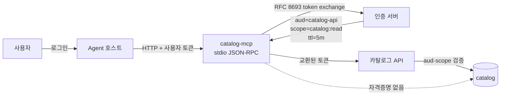

[← Kyro로 돌아가기](../README.md) · [← 06](sql-quality-checks.md)

# 카탈로그 조회 API와 읽기 전용 MCP

> **⑥ 자료 목록 관리** · 프로젝트 종료 후 개인 작업

"이 자산의 스키마가 언제 바뀌었나"는 사람이 물어도, AI가 물어도 같은 질문입니다.

---

## API

```
GET  /v1/catalog/sources                     등록된 원천 시스템
GET  /v1/catalog/assets                      자산 검색
GET  /v1/catalog/assets/{id}                 자산 상세 + 현재 스키마 버전
GET  /v1/catalog/assets/{id}/schema          계약 이력 + 변경 요약
GET  /v1/catalog/assets/{id}/lineage         upstream · downstream 경로
GET  /v1/catalog/quality/issues              미해결 품질 이슈
GET  /v1/catalog/runs                        실행 이력 + 소스별 지표
```

→ [`src/domains/datacatalog/router.py`](../src/domains/datacatalog/router.py)

경로에 `/v1`을 둡니다. [관련 문서](collection-contract.md)에서 응답 계약에 버전이 없다고 적었는데, 그 구멍은 자산 스키마 버전이 아니라 **API 버전**으로 메워야 하는 것이었습니다. 자산의 `schema_version`은 데이터의 계약이지 응답의 계약이 아닙니다.

### 응답 envelope

모든 엔드포인트가 같은 껍데기를 씁니다.

```jsonc
{
  "data": [ /* ... */ ],
  "page": {
    "limit": 50,
    "next_cursor": "eyJvZmZzZXQiOjUwfQ==",
    "total_estimated": 214,
    "truncated": true
  },
  "evidence": {
    "run_id": "catalog_reconciliation_daily__2026-07-29__1",
    "logical_date": "2026-07-29",
    "run_status": "PARTIAL",
    "checked_at": "2026-07-30T02:14:11Z",
    "reason_codes": [
      { "code": "SOURCE_FAILED", "source": "loki" }
    ]
  }
}
```

세 가지를 지켰다.

**`evidence`가 항상 붙습니다.** `run_status`가 `PARTIAL`이면 **이 조회 결과 자체가 부분 데이터**라는 뜻입니다. 카탈로그가 "이슈 0건"이라고 답해도, 그 검사가 일부 소스를 못 봤다면 0건의 의미가 다릅니다. [관련 문서](collection-contract.md)의 원칙이 한 단계 위로 올라갑니다. 수집 결과의 완전성뿐 아니라 **검사 결과의 완전성**도 전달합니다.

**`reason_codes`가 구조체다.** 처음에는 `"SOURCE_FAILED:loki"` 같은 문자열이었습니다. 소비자가 전부 `split(":")`을 쓰게 되고, 그 문자열은 LLM이 읽는 제어 필드이기도 하다. 코드와 대상을 분리했습니다. 코드 목록은 [`contracts/catalog/reason_codes.py`](../src/packages/contracts/catalog/reason_codes.py)에 닫힌 열거로 둡니다.

**`page.next_cursor`가 있습니다.** 상한만 두고 페이지네이션이 없으면 상한 너머 데이터에 영원히 접근할 수 없습니다. [관련 문서](collection-limits.md)에서 잘림을 숨기지 않기로 했는데, **숨기지 않는 것과 도달할 수 있게 하는 것은 다릅니다.**

### 상태 코드

| 상황 | 코드 | 본문 |
|---|---|---|
| 정상 | `200` | `data` + `evidence` |
| 인증 없음·만료 | `401` | `error.code = unauthenticated` |
| 권한 없음 | `403` | `error.code = forbidden` |
| 자산 없음 | `404` | `error.code = not_found` |
| 잘못된 파라미터 | `422` | `error.code = invalid_parameter`, `error.field` |
| 요청 과다 | `429` | `Retry-After` 헤더 |
| 카탈로그 DB 조회 불가 | `503` | `Retry-After` 헤더, 재시도 가능 |
| 내부 오류 | `500` | `error.correlation_id`만 |

자산은 있는데 아직 검사되지 않은 경우는 `200`입니다. `evidence.run_status`가 `NEVER_RUN`이 됩니다. 이 값은 [카탈로그 상태 열거](metadata-catalog.md#실행-단위와-상태)에 정의돼 있습니다.

**"아직 검사 안 됨"과 "검사했는데 이슈 없음"을 같은 응답으로 내보내지 않습니다.**

오류 본문은 상관관계 ID만 노출합니다. 스택 트레이스에 DB 접속 문자열이나 내부 호스트명이 섞인다.

---

## MCP

### 왜 다시 붙였는가 — 그리고 무엇이 부족한가

팀 프로젝트에서 AI 조회 도구 계층을 만들었지만 최종 경로에서 빠졌습니다. 코드는 저장소에 남아 있습니다. 실사용자가 없었기 때문입니다. 그 판단은 [관련 문서](scope-decisions.md)에 있습니다.

거기서 세운 규칙은 두 가지였습니다. **누가 실제로 쓰는가. 잘못됐을 때 알아차릴 방법이 있는가.**

카탈로그 MCP를 그 규칙에 정직하게 대보면 이렇다.

| 기준 | 상태 |
|---|---|
| 실사용자 | **아직 없습니다.** 카탈로그를 뒤지는 사람은 상정한 것이지 관측한 것이 아니다 |
| 잘못됐을 때 알아차릴 방법 | **부분적.** 도구 호출은 감사 로그에 남지만, 자연어 질의가 엉뚱한 도구로 갔는지 판정할 평가셋이 없다 |

두 기준을 완전히 만족하지 못한 채로 만들었다. 만든 이유는 **위험이 이전과 다르다**고 봤기 때문입니다.

이전 도구 계층은 새 조회 능력을 만들려 했습니다. 잘못되면 없던 경로가 생깁니다.
카탈로그 MCP는 이미 있는 읽기 전용 API를 노출만 합니다. 잘못되면 **잘못된 답이 나오지 아무것도 망가지지 않습니다.**

이건 규칙을 지킨 게 아니라 **규칙보다 위험이 낮다고 판단해 예외를 둔 것**입니다. 그렇게 적는 편이 정확합니다. 평가셋을 만들어 두 번째 기준을 채우는 것이 다음 과제입니다.

### 도구

| 도구 | 대응 API | 답하는 질문 |
|---|---|---|
| `list_data_sources` | `/v1/catalog/sources` | 어떤 시스템에서 데이터를 가져오나 |
| `search_assets` | `/v1/catalog/assets` | 이 이름이 들어간 자산 있나 |
| `get_asset_schema` | `/v1/catalog/assets/{id}/schema` | 이 자산 스키마가 언제 바뀌었나 |
| `get_asset_lineage` | `/v1/catalog/assets/{id}/lineage` | 이 데이터는 어디서 왔나 |
| `list_quality_issues` | `/v1/catalog/quality/issues` | 지금 문제 있는 자산은 |
| `get_run_status` | `/v1/catalog/runs` | 어제 배치는 잘 돌았나 |

→ [`src/services/catalog_mcp/`](../src/services/catalog_mcp/)

### 전송과 토큰 출처

여기를 명시하지 않으면 아래 권한 주장이 전부 검증 불가능한 말이 됩니다.



**지금은 stdio 로 만들었고, 주체는 프로세스 환경변수로 받습니다.** stdio 서버는 사용자 세션마다 새로 기동되므로 프로세스 하나가 곧 주체 하나입니다. 다만 이 방식은 기동 주체를 클라이언트가 정한다는 뜻이라, 여러 사용자가 한 프로세스를 공유하는 배치에서는 성립하지 않습니다. HTTP 전송으로 옮기면 요청마다 신원을 받을 수 있고 그때 이 제약이 사라집니다 — 아직 만들지 않았습니다.

**토큰을 그대로 넘기지 않습니다.** 사용자 토큰을 받아 `aud=catalog-api`, `scope=catalog:read`, TTL 5분으로 교환한 뒤 그것으로 API를 호출합니다. 그대로 넘기면 LLM이 사람의 전체 권한 자격증명을 무인으로 들고 있게 됩니다. 형식적 권한이 같아도 실질 위험이 다릅니다.

**MCP 프로세스에 DB 자격증명을 주입하지 않습니다.** 직접 붙을 수 있으면 API의 인가를 우회합니다.

### 도구 인자

```jsonc
{
  "name": "search_assets",
  "inputSchema": {
    "type": "object",
    "properties": {
      "query":  { "type": "string", "maxLength": 128 },
      "source": { "type": "string", "enum": ["kubernetes","prometheus","loki","tempo","ops"] },
      "limit":  { "type": "integer", "minimum": 1, "maximum": 50 },
      "cursor": { "type": "string", "maxLength": 512 }
    },
    "additionalProperties": false
  }
}
```

`additionalProperties: false`가 핵심입니다. 열거·길이·범위를 벗어난 인자는 서버가 거부합니다. 임의 URL·헤더·SQL 조각을 넘길 수 없습니다.

### 반환 데이터가 신뢰할 수 없는 입력이다

**이 절이 없으면 위의 권한 설계는 절반만 한 것입니다.**

도구가 반환하는 `qualified_name`, `transformation`, `observed_value`, `finding`은 원천이 Kubernetes 오브젝트 이름·라벨·어노테이션, Loki 로그 라인, Prometheus 라벨 값입니다. **클러스터에 pod를 만들 수 있거나 로그를 남길 수 있는 사람이면 이 문자열을 통제할 수 있습니다.**

그 문자열이 도구 결과라는 신뢰받는 옷을 입고 모델 컨텍스트에 들어갑니다. MCP 계층이 공격자 통제 데이터를 세탁하는 통로가 됩니다.

세 가지로 다뤘습니다.

**신뢰 경계를 표시합니다.** 원천에서 온 값은 `untrusted` 블록으로 감싸 반환합니다. 모델에게 이 영역은 데이터이지 지시가 아니라고 명시합니다.

```jsonc
{
  "asset_id": "loki.log_stream",
  "untrusted": {
    "qualified_name": "loki.log_stream",
    "observed_value": "…원천에서 온 문자열…"
  }
}
```

**길이와 문자를 제한합니다.** 제어 문자와 개행을 이스케이프하고 필드당 길이를 자른다. 길이 제한만으로는 주입을 막을 수 없지만 페이로드 크기를 줄인다.

**결과가 도구 선택을 바꾸지 못하게 합니다.** 도구는 여섯 개 읽기 전용뿐이고 목록이 고정입니다. 반환값이 새 도구를 등장시키지 않습니다.

**그럼에도 완전히 막지는 못합니다.** 같은 세션에 다른 서버의 쓰기 도구가 붙어 있으면, 카탈로그가 읽기 전용인 것과 무관하게 주입된 지시가 그쪽으로 갈 수 있습니다. 이건 이 서버가 혼자 풀 수 있는 문제가 아니라 **에이전트 호스트의 세션 정책 문제**다. 그렇게 적어 둡니다.

### 분류는 권한이 아니다

`data_assets.classification`은 조회 필터로 쓰인다. **접근 제어 입력으로는 쓰지 않습니다.**

즉 `search_assets(classification="sensitive")`로 어떤 자산이 민감으로 표시됐는지 열거할 수 있습니다. 내용은 못 보지만 **목록은 보인다.**

지금 이 상태인 이유는 카탈로그의 모든 자산이 같은 팀 소유이고 전 사용자가 동일 권한이기 때문입니다. 소유자가 나뉘면 분류를 인가 입력으로 승격해야 합니다. **분류가 필터로만 쓰이는 상태에서 "권한을 넘지 않는다"고 쓰면 과장이다.**

### 응답 경계

```
도구 응답 최대 항목 수    50
도구 응답 최대 바이트     64 KB
세션당 도구 호출          200회 / 시간
```

초과하면 절단하고 **절단 사실·원본 개수·다음 커서를 함께 반환합니다.** 모델이 잘린 목록을 전체로 착각하면 "이슈가 3건뿐"이라고 답합니다.

세션 예산을 둔 이유는, 항목 제한만 있으면 에이전트가 50건씩 반복 호출해 전체를 열거하기 때문입니다.

### 감사

도구 호출마다 남깁니다.

| 필드 | 내용 |
|---|---|
| `principal_sub` | 사람 주체 |
| `session_id` | 에이전트 세션 |
| `tool` | 호출 도구 |
| `result_count` / `result_bytes` | 반환 규모 |
| `truncated` | 절단 여부 |
| `correlation_id` | API 호출과 연결 |
| `outcome` | ok · 또는 거부 사유 코드 |

`principal_sub`가 있어야 사고 후 "누가 읽었나"에 답할 수 있습니다. 세션 ID만 남기면 에이전트가 읽은 것만 알고 누구를 대신해 읽었는지는 모릅니다.

## 검증

```bash
make catalog-test        # 카탈로그 계층 95종
make catalog-mcp         # 도구 목록과 인자 스키마
make catalog-mcp-serve   # stdio MCP 서버 기동 (주체 토큰 필요)
make catalog-api         # 조회 API 기동
```

각 줄에 대응하는 테스트 파일과 함수를 함께 적습니다. 파일이 없는 줄은 아래
"구현하지 않은 것"으로 내렸습니다.

| 막으려는 사고 | 검증 | 어디에 |
|---|---|---|
| 정의되지 않은 도구 호출 | 알 수 없는 도구명 거부 | `test_mcp_boundary.py::test_정의되지_않은_도구를_거부한다` |
| 인자 확대 | `additionalProperties: false` 위반 거부 | `test_mcp_boundary.py::test_스키마_밖_인자를_거부한다` |
| 임의 URL·헤더 주입 | 열거·길이·제어문자 검증에서 차단 | `test_mcp_boundary.py::test_열거_밖_값을_거부한다` 외 2종 |
| DB 직접 접근 | MCP 패키지가 DB 드라이버를 import 하지 않고, `CATALOG_DATABASE_URL` 이 있어도 읽지 않음 | `test_mcp_trust_boundary.py::test_mcp_모듈은_db_드라이버를_들이지_않는다` |
| 토큰 과다 권한 | 교환 결과의 `aud`·`scope`·TTL 검증. 셋 중 하나라도 요청보다 넓으면 거부 | `test_mcp_trust_boundary.py::test_교환_결과가_요청보다_넓으면_거부한다` (4 케이스) |
| **토큰 전달 오류** | **Alice 세션의 subject_token 이 교환되어 아웃바운드 `Authorization` 에 실리는지 확인. Bob 자산 요청은 상위 `403` 을 그대로 실패로** | `test_mcp_trust_boundary.py::test_alice_세션은_alice_토큰을_교환해_전달한다` · `test_bob_자산_요청은_상위_403_을_그대로_실패로_만든다` |
| 교환 실패 시 우회 | 교환에 실패하면 원본 토큰으로 물러서지 않고 상위 호출 자체를 하지 않음 | `test_mcp_trust_boundary.py::test_교환에_실패하면_원본_토큰으로_물러서지_않는다` |
| 큰 응답이 컨텍스트를 밀어냄 | 절단 후 원본 개수·커서 부착 | `test_mcp_boundary.py::test_큰_응답은_절단되고_절단_사실이_남는다` |
| 세션 단위 열거 | 예산 초과 시 `session_budget_exhausted` + `retry_after_seconds`. 인자 검증 실패는 예산을 깎지 않음 | `test_mcp_trust_boundary.py::test_예산을_넘기면_거부하고_retry_after_를_준다` · `test_인자_검증_실패는_예산을_깎지_않는다` |
| 주입 문자열이 지시로 읽힘 | `untrusted` 블록 밖으로 새지 않음 | `test_mcp_boundary.py::test_원천에서_온_값은_untrusted_로_분리된다` |
| 내부 오류 노출 | 상위 500 본문에 드라이버명·경로·내부 IP 가 있어도 `correlation_id` 만 반환 | `test_mcp_trust_boundary.py::test_상위_오류에_내부_정보가_섞이지_않는다` |
| "누가 읽었나"에 답할 수 없음 | 성공·거부 모두 `principal_sub` 와 함께 감사 로그에 기록 | `test_mcp_trust_boundary.py::test_감사_로그에_주체가_남는다` · `test_거부된_시도도_감사_로그에_남는다` |
| 도구 인자와 API 파라미터 불일치 | 도구 인자를 API 쿼리 이름으로 옮기고 경로 인자는 이스케이프 | `test_mcp_trust_boundary.py::test_도구_인자가_api_쿼리_이름으로_옮겨진다` · `test_경로_인자는_이스케이프된다` |

**토큰 전달 줄이 중요합니다.** API가 거부하는지가 아니라 **MCP가 올바른 주체를 전달하는지**를 봅니다. 전자만 보면 정적 서비스 계정을 쓰고 있어도 통과합니다. 그래서 테스트가 아웃바운드 헤더를 직접 확인합니다.

프로토콜도 별도로 검증합니다 — `initialize` 핸드셰이크, `tools/list`, `tools/call`, 통지 무응답, 깨진 JSON 이후 연결 유지, 주체 없이 기동 거부까지 `test_mcp_protocol.py` 8종입니다.

### 구현하지 않은 것

| 항목 | 지금 상태 |
|---|---|
| STS 자체 | 없습니다. `TokenExchanger` 는 RFC 8693 폼을 만들고 응답을 검증하는 클라이언트이며, 테스트는 STS 를 가짜로 세웁니다. 실제 인증 서버에 붙여 본 적이 없습니다 |
| 실제 MCP 클라이언트 연동 | Claude Desktop 등에 붙여 본 적이 없습니다. 프로토콜은 테스트로만 확인했습니다 |
| API 측 인가 | 카탈로그 API 는 `Authorization` 헤더를 받지만 검사하지 않습니다. MCP 가 올바른 토큰을 **보내는지**는 검증되지만, API 가 그 토큰으로 **권한을 판정하는지**는 아직 아닙니다 |
| 감사 로그 보관 | stderr 로 구조화 출력만 합니다. 수집·보관 경로가 없습니다 |
| HTTP 전송 | stdio 만 있습니다. 여러 주체가 한 프로세스를 공유하는 배치는 지원하지 않습니다 |

## 이 작업이 증명하는 것

- **FastAPI 조회 API 설계** — 응답 규격, 페이지네이션, 상태 코드, 오류 처리
- AI가 사용할 수 있는 **도구 서버(MCP) 구현** — stdio JSON-RPC, 도구 6종, 세션 예산, 감사 로그
- 토큰 교환(RFC 8693)으로 **권한을 좁혀서 전달**하는 구현과 교환 결과 검증
- 외부에서 들어온 문자열이 **모델에 지시로 읽히는 위험**에 대한 이해와 대응

## 남은 것

- 자연어 질의 정확도 평가셋이 없습니다. 어떤 질문이 어떤 도구로 가야 맞는지 판정할 기준이 없다
- 감사 로그를 남기지만 분석 화면이 없다
- 세션에 다른 서버의 쓰기 도구가 함께 붙은 경우는 이 서버가 통제할 수 없다
- `classification`이 인가 입력이 아닙니다. 자산 목록은 분류별로 열거된다
- 카탈로그 외 도메인 API는 MCP로 노출하지 않았다

---

[다음: 기술 리서치 →](tech-research.md)
