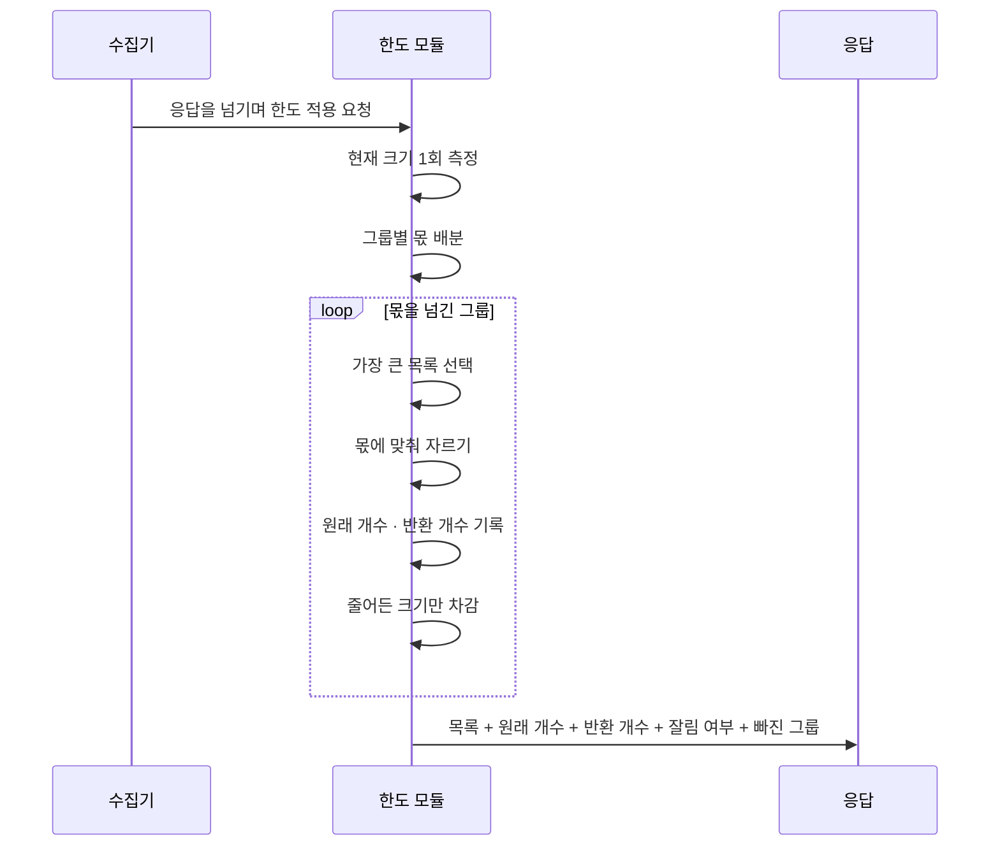

[← Kyro로 돌아가기](../README.md) · [← 01](collection-contract.md)

# 잘라도 되지만 숨기면 안 됩니다

> **수집 계층** · 5인 팀 프로젝트 · 담당: 수집 한도·잘림 계약

자르는 건 어쩔 수 없습니다. 잘랐다는 사실을 안 알려주는 게 문제입니다.

---

## 30초 — 무슨 일이 있었나

서버가 많아지자 한 번 조회에 수천 개 자료가 돌아왔습니다. 응답이 너무 커지면 전송이 실패하고, 저장소가 밀리고, 화면이 멈춥니다. 상한이 필요했습니다.

그런데 **앞에서부터 100개만 자르면** 두 가지 문제가 생깁니다.

**한쪽으로 쏠립니다.** 목록이 그룹 순서로 정렬돼 있으면 뒤쪽 그룹은 한 건도 못 들어옵니다. A팀 서버만 잔뜩 나오고 B팀은 통째로 빠집니다.

**받는 쪽이 전부라고 착각합니다.** 그리고 이게 더 위험합니다. [수집 완전성 계약](collection-contract.md)의 삭제 오인 경로가 여기서 생깁니다.

---

## 3분 — 어떻게 풀었나

### 개수와 크기를 둘 다 막았습니다

**개수만 막으면** 각 항목이 큰 경우를 못 막습니다. 설정 파일 하나가 수십 KB인 경우가 있습니다.
**크기만 막으면** 어느 목록을 줄여야 할지 알 수 없습니다.

둘 다 계약에 넣었습니다.

```python
INVENTORY_RESOURCE_DEFAULT_LIMIT = 200   # 그냥 부르면 200개
INVENTORY_RESOURCE_MAX_LIMIT     = 1000  # 명시적으로 요청해야 최대치
```

기본값과 최대값을 나눈 이유는, **부르는 쪽이 일부러 요청할 때만 큰 응답을 받게** 하기 위해서입니다. 기본 호출이 최대치를 끌고 오면 상한을 둔 의미가 없습니다.

### 줄이는 순서를 하나로 정했습니다

두 가지 규칙이 필요했는데, 처음엔 둘을 같은 반복문에서 섞어 썼습니다. 그러자 **입력 순서에 따라 결과가 달라졌습니다.**

정리한 순서는 이렇습니다.

1. **그룹별 몫을 먼저 나눕니다.** 그룹마다 돌아가며 배분합니다
2. **각 그룹 안에서 몫을 넘는 만큼 자릅니다.** 가장 큰 목록부터 자릅니다

배분이 먼저, 자르기가 나중입니다. 반대로 하면 큰 그룹이 자기 것을 다 자를 때까지 작은 그룹은 손도 못 댑니다.

### 보장할 수 있는 것과 없는 것을 나눠 적었습니다

예산이 그룹 수보다 크면 각 그룹이 최소 1건을 받습니다.
예산이 그룹 수보다 작으면 **일부 그룹은 0건입니다.** 이 경우 "어느 그룹이 빠졌는지"를 이유 코드로 남깁니다.

"모든 그룹이 최소 1건"은 **조건부 성질이지 항상 참인 규칙이 아닙니다.** 그렇게 적었습니다.

### 원래 개수를 끝까지 지켰습니다

여러 번 줄여도 최초 개수는 그대로 남깁니다. 두 번 줄였다고 "원래 200개"가 "원래 50개"로 바뀌면 받는 쪽이 손실 규모를 알 수 없습니다.

---

## 10분 — 코드와 검증

같은 로직이 네 곳에 흩어지는 것을 보고 공통 모듈로 뽑았습니다. 그 과정은 [엔지니어링 로그](engineering-log.md)에 커밋 단위로 있습니다.

→ [`src/services/target/cluster-agent/providers/collection_limits.py`](../src/services/target/cluster-agent/providers/collection_limits.py)

| 함수 | 하는 일 |
|---|---|
| `limit_payload_list` | 항목 수 제한 |
| `limit_payload_size` | 전체 크기 예산 초과 시 축소 |
| `round_robin_groups` | 그룹별 몫 배분 |
| `largest_shrinkable_list` | 몫을 넘긴 목록 중 가장 큰 것 선택 |
| `original_count_for` | 축소 전 원래 개수 조회 |
| `attach_collection_limits` | 제한 사실을 응답에 부착 |



**크기 재측정을 델타 계산으로 바꿨습니다.** 처음에는 자를 때마다 전체를 다시 직렬화했습니다. 큰 자료를 다루는 모듈에서 반복 직렬화를 하는 것이라, 자를 게 많을수록 느려지는 구조였습니다. 잘라낸 만큼만 빼는 방식으로 바꿨습니다.

### 무엇을 시험했나

| 막으려는 사고 | 시험 내용 |
|---|---|
| 안 잘렸는데 잘림 표시가 붙음 | 표시 없음 확인 |
| 여러 번 줄인 뒤 원래 개수가 사라짐 | 최초 값 반환 확인 |
| 특정 그룹만 통째로 빠짐 | 예산 > 그룹 수일 때 각 그룹 최소 1건 |
| 예산이 부족해 그룹이 빠진 게 숨음 | 빠진 그룹 목록 부착 |
| 입력 순서에 따라 결과가 달라짐 | 같은 자료를 섞어 넣어도 동일 결과 |
| 크기 예산을 넘긴 응답이 나감 | 축소 후 크기 ≤ 예산 |
| 이유 목록이 무한정 늘어남 | 상한 초과 시 잘림 |
| 이유 목록이 잘린 게 숨음 | 잘림 표시 부착 |

---

## 이 작업이 증명하는 것

- 응답 크기를 제한하면서 **손실 정보를 보존하는 API 설계**
- 같은 로직이 반복될 때 **공통 모듈로 추출하는 판단**
- 알고리즘의 **보장 조건과 비보장 조건을 구분해 기술**하는 습관
- 성능 문제를 발견하고 **반복 연산을 델타 계산으로 대체**한 개선

---

## 아직 못 한 것

- 상한 값은 실제 측정이 아니라 보수적 추정으로 정했습니다. 서버 규모별 부하 측정은 못 했습니다
- **이 한도는 상한 약속이지 처리 능력의 근거가 아닙니다.** 대용량 처리 경험으로 설명하지 않습니다
- 상한 너머 자료에 도달할 방법이 이 계층에는 없습니다. [설정 참조 조회 API](config-reference-api.md)의 조회 API에서만 붙였습니다

---

[← Kyro로 돌아가기](../README.md) · [다음: 비밀번호를 빼고 관계만 보여주기 →](config-reference-api.md)
