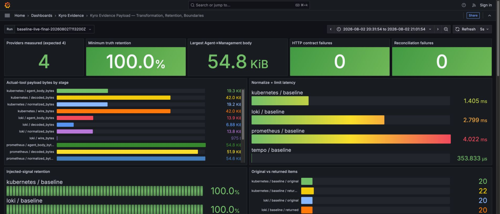
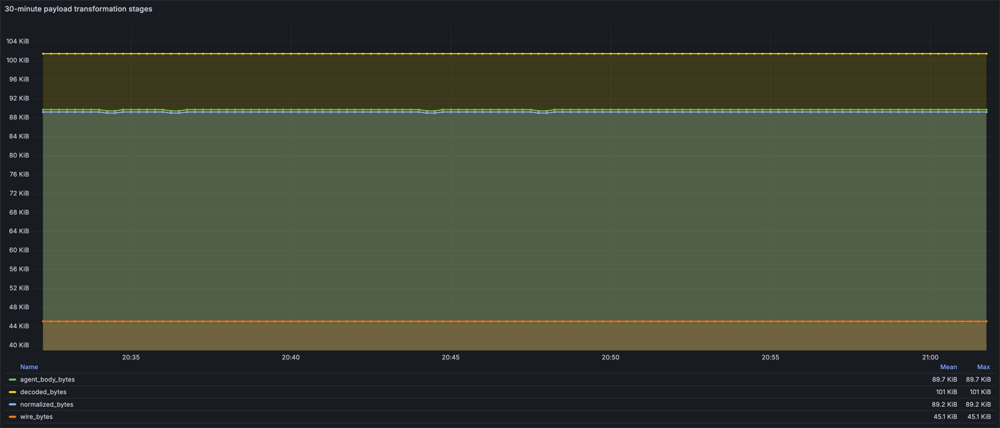
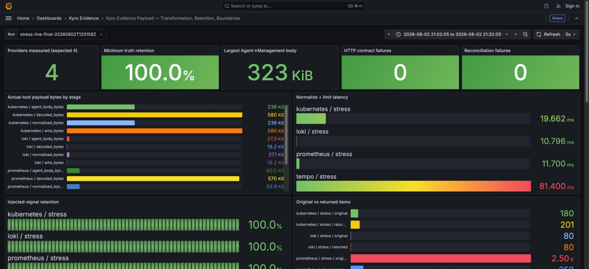
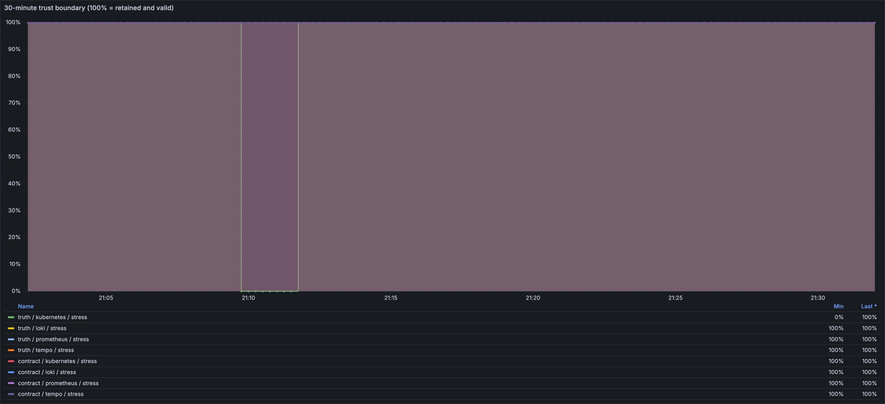

# 네 종류의 운영 데이터는 Evidence가 되기까지 얼마나 달라지는가

Kubernetes 상태, Prometheus 메트릭, Loki 로그, Tempo 트레이스는 형식과 크기, 시간 기준이 다르다. Kyro는 이를 Agent에서 정규화하고 Management에 전달한 뒤 PostgreSQL에 원문을 보관하고, NATS에는 원문 대신 claim-check 참조를 발행한다. 이 실험은 각 경계에서 데이터 크기와 장애 신호가 어떻게 변하는지 같은 조건에서 측정한다.

## 확인할 질문

1. 원천 응답의 전송 크기와 Agent가 실제로 파싱하는 크기는 얼마나 다른가?
2. 정규화와 제한 뒤에도 `FailedScheduling`, OOM, 메트릭 값, 오류 로그·trace ID, error trace가 남는가?
3. 각 provider 결과가 Agent의 1 MiB 계약을 통과하는가?
4. Management가 NATS에 원문을 싣지 않는 claim-check 구조는 이벤트 크기를 얼마나 줄이는가?
5. 기준 부하와 증폭 부하에서 변환 시간과 메모리 사용량이 어떻게 달라지는가?

## 실제 데이터 경로

```text
Kubernetes API / Prometheus / Loki / Tempo
                  ↓
       HTTP wire bytes와 decoded bytes
                  ↓
       Agent 파싱·필터링·정규화
                  ↓
       provider별 Evidence job result
                  ↓  일반 JSON POST, 명시적 압축 없음
              Management
          ┌───────┴────────┐
          ↓                ↓
 PostgreSQL JSONB      NATS claim-check
   원문 Evidence       key·상태·요약만 전달
          └───────┬────────┘
                  ↓
          RCA / 안전한 AI 입력
```

## 실험 설계

| 구분 | Run A | Run B |
|---|---:|---:|
| 목적 | 실제 도구 응답 기준선 | 같은 신호를 보존한 크기 증폭 |
| 지속 시간 | 30분 | 30분 |
| 수집 간격 | 30초 | 30초 |
| 목표 cycle | 60 | 60 |
| 시간창 | 최근 5분 | 최근 5분 |
| 반복 측정 | 변환별 warm-up 1회 후 5회 중앙값 | 동일 |

Run A는 프로젝트 설정과 같은 Loki 20건 상한을 사용한다. 매 cycle에 고유 label을 부여해 이전 cycle의 로그가 다음 cycle에 다시 포함되지 않게 했다. Kubernetes도 고정 fixture를 반복하지 않고 kind API의 14개 endpoint를 매 cycle client certificate로 직접 조회한다. Run B는 Run A의 실제 응답을 출발점으로 Kubernetes 20배, Prometheus 10배, Loki 4배, Tempo 500배로 증폭한다. Run B의 wire 크기는 실제 네트워크 관측값이 아니라 통제된 JSON fixture 크기이며 결과표에서 별도로 표시한다.

## 고정한 신뢰 신호

| provider | 정규화 뒤 반드시 남아야 하는 값 |
|---|---|
| Kubernetes | `FailedScheduling`, OOM 신호 |
| Prometheus | 고정 metric 값 99 |
| Loki | error, `dependency_timeout`, trace ID, secret 제거 |
| Tempo | error trace |

하나라도 사라지면 해당 cycle은 실패다. provider가 빈 결과를 반환한 경우와 수집 자체가 실패한 경우도 같은 성공으로 취급하지 않는다.

## 측정값의 의미

- `wire_bytes`: httpx가 실제로 내려받은 바이트. gzip 응답이면 decoded보다 작다.
- `decoded_bytes`: 자동 압축 해제 뒤 Agent가 파싱하는 응답 크기.
- `normalized_bytes`: 프로젝트 provider 코드가 만든 Evidence JSON 크기.
- `agent_body_bytes`: Agent가 Management에 보내는 job result의 결정적 직렬화 크기.
- `transform_peak_bytes`: Python `tracemalloc`이 본 변환 구간 최대 추가 할당량. 컨테이너 RSS와 다르다.
- `DB physical bytes`: 실제 PostgreSQL `pg_column_size(jsonb)` 결과.
- `claim_check bytes`: 프로젝트의 `compact_cluster_evidence_payload` 결과 크기.

## 재현 환경과 한계

- Apple Silicon, Docker Desktop 10 CPU / 7.75 GiB 할당 환경에서 실행한다.
- PostgreSQL 16.10, NATS 2.11, Prometheus 2.55.1, Loki 3.2.1, Tempo 2.6.1, Grafana 11.3.1을 고정한다.
- Kubernetes API는 Docker Desktop의 `host.docker.internal`을 통해 실제 조회한다. kind 인증서가 loopback 주소용이어서 CA와 client certificate는 검증하되 hostname 검사는 끈 로컬 실험 경로다.
- Run B는 생산 트래픽을 재현한 부하테스트가 아니라 payload 크기 변화에 대한 변환 경계 실험이다.
- `agent_body_bytes`는 실제 요청 계약으로 결정적으로 직렬화하고 1 MiB 검증을 통과한 크기다. 이 harness는 Management HTTP endpoint에 POST하지 않으므로 실제 전송 latency·TLS overhead를 측정하지 않는다.
- benchmark container의 Docker NetIO에는 Kubernetes·Prometheus·Loki·Tempo 조회뿐 아니라 Loki·Tempo 신호 주입 트래픽도 포함된다. Agent→Management 전송량으로 해석하지 않는다.
- Grafana를 5초 refresh로 열고 증거 이미지를 캡처했다. Grafana 자체 CPU spike가 같은 Docker VM에 존재하므로 container CPU·RSS는 환경 관측값이지 처리 용량이나 before/after 성능 개선 수치가 아니다.
- PostgreSQL JSONB insert와 NATS compact event publish는 실제 로컬 서버에서 수행한다. `inline_full_bytes`는 원문을 NATS에 실었을 때의 결정적 직렬화 크기인 반사실이며 실제로 publish하지 않는다.
- 이번 두 run은 네 source가 모두 성공한 payload 경계 실험이다. provider 중단·timeout·no signal과 collection failure 구분은 주입하지 않았으므로 이 결과로 장애 격리나 복구 시간을 주장하지 않는다.
- 처리량·최대 동시 사용자·AWS 비용 개선 수치로 확장해 주장하지 않는다.

<!-- FINAL_RESULTS -->

## Run A — 실제 source 기준선

`baseline-live-final-20260802T113200Z`를 1,800초 동안 30초 간격으로 실행했다. 60 cycle × 4 provider, 총 240개 결과에서 truth signal 손실과 1 MiB 계약 위반은 각각 0건이었다.

### provider별 30분 측정

크기는 60 cycle 중앙값, 변환 시간은 각 cycle에서 warm-up을 제외한 5회 중앙값의 30분 p95다.

| provider | HTTP wire | 압축 해제 | 정규화 | job body | 원본→반환 | 변환 p95 |
|---|---:|---:|---:|---:|---:|---:|
| Kubernetes | 42,976 B | 42,976 B | 19,616 B | 19,746 B | 20→22 | 2.11 ms |
| Prometheus | 1,502 B | 53,178 B | 55,955 B | 56,085 B | 250→250 | 4.97 ms |
| Loki | 976 B | 7,044 B | 14,161 B | 14,279 B | 20→20 | 4.43 ms |
| Tempo | 721 B | 721 B | 1,616 B | 1,736 B | 1→1 | 0.48 ms |

`원본→반환`은 동일한 행 개수의 압축률이 아니다. Kubernetes provider는 원천 객체를 증상·리소스·관계 목록으로 재구성해 20개 입력에서 22개 Evidence 항목을 만들었다. Prometheus와 Loki는 작은 gzip 응답에 query identity, 분석 결과, 제한 metadata를 붙이므로 정규화 JSON이 오히려 커졌다. 공통 schema는 압축 포맷이 아니라 출처와 판단 맥락을 보존하는 계약이다.

### 경계별 중앙값

| 경계 | 60 cycle p50 | 해석 |
|---|---:|---|
| source HTTP wire 합계 | 46,175 B | Prometheus·Loki gzip을 포함한 실제 다운로드 byte |
| Agent가 압축 해제한 합계 | 103,919 B | wire의 2.25배. Agent가 만든 압축 효과가 아님 |
| provider 정규화 합계 | 91,348 B | decoded 대비 12.1% 감소. provider별 증감 방향은 다름 |
| provider job body 합계 | 91,846 B | 네 개의 독립 결과 요청 직렬화 합계 |
| 통합 Evidence | 92,172 B | 같은 시간창과 correlation ID로 묶은 원문 |
| 실제 NATS claim-check | 1,103 B | inline 반사실 대비 98.8% 작음, 83.6배 차이 |
| PostgreSQL full JSONB 물리 크기 | 12,467 B | text 논리 크기 98,551 B의 12.6%. TOAST 효과이며 앱 압축이 아님 |
| 안전한 AI 입력 | 675 B | 통합 Evidence 대비 99.3% 작음. 원문 전체를 LLM에 넣지 않음 |





Run A 원시 행, cycle별 집계, Docker stats, Prometheus range query는 [`artifacts/baseline/`](artifacts/baseline/)에 보존했다. 대시보드의 5초 point 수는 실험 반복 횟수가 아니다. Pushgateway의 최신 30초 cycle gauge를 Prometheus가 5초마다 scrape한 시계열이며, 유효 반복 수는 `summary.json`의 60이다.

## 결과보다 먼저 폐기한 실행

처음 성공 화면이 나온 `20260802T111200Z`는 최종 증거로 쓰지 않았다. Kubernetes는 실제 API가 아니라 캡처 fixture였고, Loki도 프로젝트 설정 20건 대신 160건을 반환했다. 다음 실행에서는 cycle별 Loki 로그를 구분하지 않아 320건으로 누적됐다. 이후 Kubernetes 14개 endpoint를 매 cycle 직접 조회하고 Loki `limit=20`과 고유 cycle label을 적용한 뒤 처음부터 30분을 다시 실행했다.

초기 증폭 실행에서 Loki 6,400줄이 1 MiB 계약을 넘은 결과도 제품 결함으로 주장하지 않는다. 실제 query limit을 우회해 만든 조건이기 때문이다. 폐기 사유와 중단 cycle은 [`run-registry.json`](run-registry.json)에 남겼다. 숫자가 강해 보여도 수집 조건이 코드 계약과 다르면 버리는 것이 이번 실험의 품질 기준이다.

## Run B에서 발견한 분류 결함

Run B 최종 raw 행을 대조하니 cycle 16부터 Kubernetes 신호 보존율이 0%로 떨어졌다. cycle 17 직후 실제 API를 조회했을 때 Event 목록은 비어 있었고 Pod에도 OOM 상태가 없었다. 정규화가 `FailedScheduling`과 `OOMKilling`을 버린 것이 아니라, 기준선 전에 만든 Kubernetes Event가 TTL로 만료돼 원천에서 사라진 상태였다.

12:11:15Z에 같은 두 Event를 다시 생성하자 cycle 20에서 100%로 복구됐다. 최종 raw 행에서 확인한 실패 구간은 cycle 16~19, 120초였으며 개입 시점은 [`interventions.json`](interventions.json)에 남겼다. 이 관측에는 두 가지 의미가 있다.

1. 현재 상태 API만 나중에 조회해서는 이미 만료된 장애 근거를 복원할 수 없다. 지속 수집과 시점별 Evidence 보존이 필요하다.
2. 기존 실험 지표 `truth_signal_loss`는 원천 부재와 변환 손실을 한 값으로 섞었다. 그대로 두면 pipeline이 버리지 않은 데이터를 pipeline 결함으로 오판한다.

그래서 실행 중인 이미지는 바꾸지 않은 채 후속 코드에서 `source_truth_missing`과 `transformation_truth_loss`를 분리했다. 대시보드도 source → transform → contract 세 경계를 따로 표시하고, 세 분류 조건을 회귀 테스트로 고정했다. 실행 파일과 후속 patch의 SHA-256은 [`source-manifest.json`](source-manifest.json)에서 분리한다.

### 후속 분류 patch 검증

30분 Run B 원시 결과는 수정하지 않았다. 대신 후속 이미지에서 다음 5개 회귀 조건을 독립 테스트로 고정했다.

- 원천에 신호가 없으면 변환 손실로 세지 않는다.
- 원천에 있던 신호가 정규화 뒤 사라진 경우만 변환 손실로 센다.
- 원천 신호가 정규화 뒤 남으면 정상으로 센다.
- Prometheus 문자열 sample `"99"`도 원천 신호로 인식한다.
- Loki 원문 `dependency timeout`을 정규화된 `dependency_timeout`과 같은 신호로 연결한다.

첫 후속 확인에서는 Loki 원문의 공백 표현과 정규화 reason code의 밑줄 표현을 같은 값으로 비교해 원천 부재로 오판하는 결함을 다시 찾았다. 이를 고친 뒤 `postfix-truth-classification-v2`를 30초·1 cycle로 실행했다. 네 provider 모두 `source_truth_missing=0`, `transformation_truth_loss=0`, `contract_failure=0`이었다. 이 실행은 분류 patch의 통합 확인이며 30분 성능 결과를 대체하지 않는다. 원시 결과는 [`artifacts/postfix/`](artifacts/postfix/)에 보존한다.

## Run B — 같은 live query 뒤 통제 증폭

`stress-live-final-20260802T120158Z`도 1,800초·60 cycle을 완료했다. 매 cycle 실제 네 source를 먼저 조회한 뒤 Kubernetes 20배, Prometheus 10배, Loki 4배, Tempo 500배로 JSON을 복제했다. 따라서 아래 입력 크기는 실제 source 네트워크 byte가 아니라 변환 경계를 자극한 통제 데이터다.

| provider | 통제 입력 p95 | 원본→반환 p95 | job body p95 | 변환 p95 | body 기준선 대비 | 계약 위반 |
|---|---:|---:|---:|---:|---:|---:|
| Kubernetes | 835,690 B | 400→221 | 253,300 B | 21.95 ms | 12.83배 | 0 |
| Prometheus | 583,722 B | 2,500→250 | 61,458 B | 12.65 ms | 1.10배 | 0 |
| Loki | 19,650 B | 80→80 | 27,907 B | 12.61 ms | 1.95배 | 0 |
| Tempo | 319,582 B | 500→500 | 330,881 B | 84.90 ms | 190.60배 | 0 |

Prometheus는 입력 series를 10배로 늘려도 반환을 250개로 제한해 body p95가 56,085 B에서 61,458 B로 9.6%만 증가했다. Kubernetes도 p95 400개를 221개로 줄였다. 반면 Loki 80줄과 Tempo 500 trace는 모두 반환됐다. 이번 조건에서는 1 MiB 계약을 지켰지만, 두 provider가 더 큰 입력에서도 어느 지점까지 선형 증가하는지는 별도 경계 실험이 필요하다.

통제 입력 합계 p95는 1,758,643 B, 통합 Evidence p95는 673,862 B였다. 입력은 기준선보다 16.92배였지만 Evidence는 7.31배로 증가해 61.7%가 provider 경계에서 줄었다. NATS claim-check는 1,098 B, 안전한 AI 입력은 675 B로 입력 크기와 사실상 분리됐다.

benchmark container의 CPU p95는 1.54%에서 17.7%, 최대 RSS는 약 73.2 MiB에서 81.0 MiB로 변했다. 다만 공유 Docker VM과 Grafana refresh가 포함되므로 capacity 수치로 쓰지 않는다. container 수신 증가는 3.36 MB로 기준선 3.94 MB와 비슷했지만 송신 증가는 46.21 MB였다. 통제 증폭은 메모리 안에서 수행돼 source 수신을 키우지 않았고, 커진 full JSONB를 PostgreSQL에 실제 insert한 트래픽이 송신 증가에 포함된 것으로 추론한다. Docker NetIO만으로 전부를 DB에 귀속할 수는 없다.





두 run의 원시 결과와 비교 집계는 [`artifacts/comparison.json`](artifacts/comparison.json)에 보존했다.

## 이 실험이 바꾼 설명

이 프로젝트를 “네 도구의 데이터를 한곳에 모았다”로 소개하지 않는다.

> Kubernetes·Prometheus·Loki·Tempo의 운영 데이터를 공통 Evidence 계약으로 변환하고, source·transform·contract 경계를 30분씩 두 조건에서 검증했다. 실제 source 기준선 240건은 손실 없이 통과했고, 1.76 MB 통제 입력에서는 Evidence p95를 674 KB로 제한했다. 실험 중 Kubernetes Event가 만료된 120초를 변환 손실로 오판한 지표를 발견해 원천 부재와 변환 손실을 분리했다.

Data Foundation 업무와 직접 연결되는 지점은 데이터가 존재하는지, 수집이 성공했는지, 변환 과정에서 의미를 잃었는지를 하나의 성공 값으로 뭉개지 않은 것이다. 공통 schema의 목적도 크기 감소가 아니라 source identity, 시간창, 수집 상태, 제한 정보를 보존해 소비자가 데이터의 신뢰 범위를 판단하게 만드는 데 있다.
