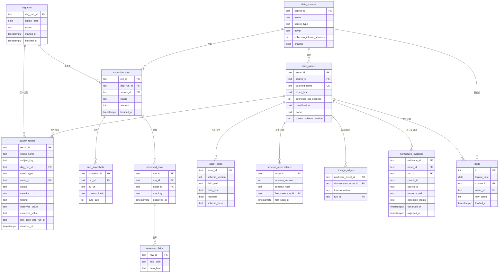
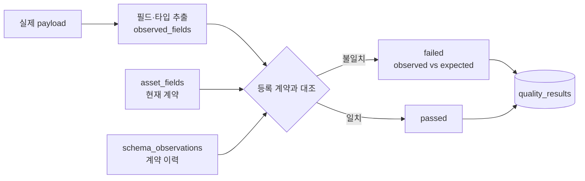

[← Kyro로 돌아가기](../README.md) · [← 03](config-reference-api.md)

# 메타데이터 카탈로그와 정합성 검증

> **⑥ 자료 목록 관리** · 프로젝트 종료 후 개인 작업

수집 코드가 오류 없이 끝나도 데이터는 어긋납니다. **실행이 실패하지 않으므로 알림이 울리지 않습니다.**

---

## 문제

Kyro는 **수집하는 순간**의 완전성을 다뤘습니다. [수집 완전성 계약](collection-contract.md)과 [수집 한도](collection-limits.md)가 그것입니다.

프로젝트를 마치고 보니 **수집이 성공한 뒤**가 비어 있었습니다.

| 어긋남 | 왜 안 잡히나 |
|---|---|
| 원천의 필드 타입이 바뀜 | 수집은 계속 성공합니다. 파싱이 관대하면 조용히 통과한다 |
| 수집은 성공했는데 새 데이터가 없음 | 실행 이력만 보면 정상이다 |
| 더는 수집되지 않는 자산이 목록에만 남음 | 아무도 조회하지 않으면 발견되지 않는다 |
| 필수 메타데이터가 빠진 행이 적재됨 | 개별 행 단위로는 유효해 보인다 |
| 같은 대상·시점이 중복 적재됨 | 재시도 후에 생긴다 |
| 정규화 행에서 원본으로 못 돌아감 | 필요해질 때까지 아무도 모른다 |

공통점은 **실행이 실패하지 않는다는 것**입니다. 사람이 알아차릴 때는 이미 그 데이터를 쓴 결과가 나간 뒤입니다.

연구에서 겪은 것과 같은 구조입니다. 분석이 돌아갔다는 것과 그 결과를 믿을 수 있다는 것은 다른 문제입니다.

## 판단

### 카탈로그는 문서가 아니라 대조 대상이다

"이 자산에는 이런 필드가 있다"를 적어 두는 것만으로는 아무것도 못 잡습니다. **등록 정보와 실제 데이터를 기계가 비교할 수 있어야** 의미가 있습니다.

그래서 필드 계약을 자유 텍스트가 아니라 `(field_path, data_type, required)` 행으로 저장했습니다.

### 계약 이력이 없으면 "바뀌었다"를 판정할 수 없다

처음에는 `asset_fields` 하나에 현재 계약과 해시를 함께 두고, 같은 버전에 해시가 둘이면 미등록 변경으로 보려 했습니다.

**작동하지 않습니다.** 적재가 `ON CONFLICT DO UPDATE`라서 이전 세대 해시가 제자리에서 덮입니다. 갱신이 끝나면 해시는 항상 하나입니다. 이 검사는 적재가 도중에 끊긴 경우에만 우연히 발화합니다.

그래서 `schema_observations`를 append-only로 분리했습니다. `(asset_id, schema_version, schema_hash)`가 유일 키입니다. 같은 계약이 반복 관측되면 행이 늘지 않고, **계약이 바뀌면 행이 하나 생깁니다.** 판정 기준점이 여기서 생깁니다.

`asset_fields`는 현재 계약, `schema_observations`는 계약이 언제 무엇으로 바뀌었는지의 이력입니다.

계약을 payload에서 뽑아내고 해시를 계산하고 두 계약을 비교하는 부분은 여기 있습니다.

→ [`src/domains/datacatalog/schema_contract.py`](../src/domains/datacatalog/schema_contract.py)

### 실행 단위와 상태

실시간 경로는 3-state였습니다. 배치에는 부족했습니다. 배치는 "정상 실행인데 데이터가 없음"과 "실패"를 반드시 나눠야 **재처리 대상이 정해집니다.**

그런데 상태를 나누기 전에 **실행 단위**를 먼저 정해야 했습니다. 처음에는 DAG 실행 하나에 `collection_runs` 행 하나를 두고 거기에 `source_id`를 달았습니다. 그러면 소스가 넷인데 행이 하나라 **어느 소스가 실패했는지 기록할 자리가 없습니다.** 부분 실패 보존이 스키마에서 표현 불가능해집니다.

단위를 둘로 나눴습니다. 자세한 이유는 [Airflow 문서](airflow-pipeline.md#실행-단위를-먼저-정해야-했다)에 있습니다.

| 테이블 | 단위 | 상태 |
|---|---|---|
| `dag_runs` | DAG 실행 하나 | `SUCCESS` · `PARTIAL` · `FAILED` · `INCOMPLETE` |
| `collection_runs` | 소스별 수집 하나 | `SUCCESS` · `NO_DATA` · `TRUNCATED` · `FAILED` |

**한 소스가 "부분 실패"할 수는 없습니다. 부분 실패는 여러 소스를 가진 실행의 성질입니다.**

`NO_DATA`와 `FAILED`를 합치면 재처리가 매일 전량을 다시 긁습니다. 나누면 실패한 소스만 다시 돌립니다.

실시간 계층의 3-state와 대응은 이렇습니다.

| 배치 | 실시간 (`coverage.availability`) |
|---|---|
| `SUCCESS` · `NO_DATA` | `completed` |
| `PARTIAL` · `TRUNCATED` | `partial` |
| `FAILED` · `INCOMPLETE` | `unavailable` |
| 미실행 | `unavailable` (`NEVER_RUN`) |

실시간 계층을 3-state로 유지한 이유는, 화면을 그릴 때 필요한 구분은 셋이고 재처리 판단에 필요한 구분은 그보다 많기 때문입니다. **한쪽 어휘를 다른 쪽에 강요하지 않고 매핑을 문서화하는 쪽을 택했습니다.**

## 데이터 모델

이 다이어그램이 **유일한 정의\*\*입니다. 다른 문서는 여기를 참조합니다.



→ 위 13개 테이블의 실제 정의: [`src/domains/datacatalog/models.py`](../src/domains/datacatalog/models.py)

### 유일 제약

멱등성은 제약이 있어야 성립합니다. 문서에 "upsert한다"고 적어도 유일 제약이 없으면 `ON CONFLICT`가 실행되지 않습니다.

| 테이블 | 유일 제약 | 없으면 |
|---|---|---|
| `collection_runs` | `(dag_run_id, source_id)` | 재시도마다 소스별 행이 복제된다 |
| `asset_fields` | `(asset_id, schema_version, field_path)` | 계약 행이 실행마다 늘고, 필수 필드 위반 건수가 **DAG를 몇 번 돌렸는지의 함수**가 된다 |
| `schema_observations` | `(asset_id, schema_version, schema_hash)` | 계약 이력이 중복돼 미등록 변경 판정이 무의미해진다 |
| `raw_snapshots` | `(run_id, content_hash)` | 같은 원본이 실행마다 중복 저장된다 |
| `lineage_edges` | `(upstream_asset_id, downstream_asset_id, run_id)` | 같은 간선이 여러 행이 되고 리니지 조회가 비결정적이 된다 |
| `normalized_evidence` | `(cluster_id, source_id, resource_uid, observed_at)` | backfill이 같은 관측을 다시 넣는다 |
| `observed_rows` | `(run_id, asset_id, row_key)` | 재시도 시 관측 행이 복제된다 |
| `observed_fields` | `(row_id, field_path)` | 필드가 중복된다 |

`quality_results.severity`와 `first_seen_dag_run_id`도 컬럼으로 둡니다. 심각도를 저장하지 않으면 [실행 정합성 검사](sql-quality-checks.md#07-실행-정합성)가 warning까지 위반으로 승격시켜 모든 실행이 붉어집니다. `first_seen_dag_run_id`가 없으면 한 번 발생한 영구 위반이 이후 모든 실행을 오염시킵니다.

### 검사 대상과 카탈로그

`observed_rows`·`observed_fields`·`normalized_evidence`는 배치가 매 실행마다 채우는 **관측 데이터**입니다. 나머지는 등록 정보와 이력입니다. 카탈로그는 앞쪽을 읽어 뒤쪽과 대조합니다.

`normalized_evidence`를 별도로 둔 이유는 자산 유형이 다르기 때문입니다. 원천 자산의 행은 `observed_rows`에, 정규화·파생 자산의 행은 `normalized_evidence`에 들어갑니다. **최신성 검사가 한쪽만 보면 정규화 자산이 영구히 미관측으로 남습니다.**

### 왜 이 크기인가

`owners`, `classifications`, `check_definitions`를 별도 테이블로 뽑는 설계도 검토했습니다.

붙이지 않았습니다. **자산이 6종이고 소유자가 한 팀입니다.** 정규화 이득보다 조인 비용과 이해 비용이 컸습니다. 소유자와 분류는 `data_assets`의 컬럼으로 두었습니다.

검사 정의는 코드에 두었습니다. DB에 두면 검사 로직 변경과 정의 변경이 따로 배포돼 어긋납니다. 자산이 수백 개가 되고 팀이 나뉘면 그때 분리하는 게 맞습니다. 그 이관을 염두에 두고 `qualified_name`을 유일 키로 잡았습니다.

인덱스는 이후 추가했습니다(`models.py` 에 9개). 그래도 08번 중복 검사는 정확성 때문에 전량을 읽습니다. [SQL 문서의 남은 것](sql-quality-checks.md#남은-것) 참고.

## 정합성 검사



검사는 8종입니다. 각각 SQL 파일과 1:1로 대응합니다.

| 검사 | 무엇을 잡나 | SQL | 심각도 |
|---|---|---|---|
| `SOURCE_COVERAGE` | 활성인데 침묵하는 소스, 비활성인데 도는 소스, 미등록 소스, 성공률 저하 | [`01`](sql-quality-checks.md#01-소스-커버리지) | error |
| `REQUIRED_FIELD` | 필수 필드가 빠진 행 | [`02`](sql-quality-checks.md#02-필수-필드-누락) | error |
| `SCHEMA_DRIFT` | 필드 누락·추가, 타입 변경, 버전 미갱신 변경 | [`03`](sql-quality-checks.md#03-스키마-드리프트) · [`04`](sql-quality-checks.md#04-버전을-올리지-않은-변경) | error |
| `FRESHNESS` | 자산 단위 최신성 SLA 초과, 한 번도 관측 안 됨 | [`05`](sql-quality-checks.md#05-최신성-위반) | warning |
| `LINEAGE_BREAK` | upstream 없는 정규화 자산, dangling 간선, 오래된 간선 | [`06`](sql-quality-checks.md#06-리니지-단절) | error |
| `RUN_CONSISTENCY` | 실패 검사가 있는데 SUCCESS로 기록된 실행, 중복 적재 | [`07`](sql-quality-checks.md#07-실행-정합성) · [`08`](sql-quality-checks.md#08-중복-적재-후보) | error |

검사 결과는 **통과·실패 모두 저장합니다.** 실패만 저장하면 "검사를 안 한 것"과 "검사했는데 통과한 것"을 구분할 수 없습니다. 01번 문서의 빈 목록 문제와 같은 구조입니다.

→ SQL 파일을 읽어 실행하고 결과를 적재하는 코드: [`src/domains/datacatalog/checks.py`](../src/domains/datacatalog/checks.py)
→ 적재·정규화·상태 판정: [`src/domains/datacatalog/pipeline.py`](../src/domains/datacatalog/pipeline.py)

## 리니지

```
prometheus.metric_series          (raw)
        │ normalize_metrics · run_id=...
        ▼
ops.normalized_evidence           (normalized)
        │ quality_check · run_id=...
        ▼
ops.quality_report                (derived)
```

간선에 `run_id`를 저장하고, **조회할 때 `collection_runs`에 조인해 확인 시각을 함께 반환합니다.** 저장만 하고 조인하지 않으면 "이 관계가 언제 확인된 것인지"에 답할 수 없습니다. 7일이 지난 간선은 `STALE_EDGE`로 잡습니다.

`raw_snapshots.s3_uri`가 있으므로 정규화 행 → 실행 → 원본 객체까지 역추적됩니다.

**단, `content_hash`로 원본을 중복 제거하면 이 경로가 끊깁니다.** 이틀 연속 같은 내용이면 둘째 날 객체가 없습니다. 그래서 `raw_snapshots`는 `(run_id, content_hash)`를 함께 키로 두고, 내용이 같으면 S3 객체는 하나만 두되 **행은 실행마다 남깁니다.** 저장 비용은 아끼고 추적 경로는 유지합니다.

## 검증

| 막으려는 사고 | 검증 |
|---|---|
| 등록 스키마와 실제가 달라도 통과 | fixture 필드 타입 변경 → `SCHEMA_DRIFT` |
| 버전 안 올린 변경이 통과 | 같은 버전에 다른 해시 → `schema_observations`에 2행 → 검출 |
| 통과와 미검사가 구분 안 됨 | 통과 결과도 `quality_results`에 적재 |
| 리니지 간선 누락이 방치됨 | upstream 없는 정규화 자산 → `LINEAGE_BREAK` |
| 오래된 리니지가 최신으로 오인 | 간선 `run_id` 조인 → `STALE_EDGE` |
| 검사가 항상 통과를 반환 | 음성 fixture에서 0행 확인 |

```bash
make catalog-verify
```

→ 검증 스크립트 15개 항목: [`scripts/catalog_verify.py`](../scripts/catalog_verify.py)
→ 계약 추출·해시·비교 단위 테스트: [`tests/catalog/test_schema_contract.py`](../tests/catalog/test_schema_contract.py)

## 결과

- 실행 실패 없이 어긋나던 6가지 유형이 배치에서 자동 검출된다
- 버전을 올리지 않은 스키마 변경이 계약 이력 비교로 잡힌다
- 정규화 결과에서 S3 원본 객체까지 역추적 경로가 생겼다
- [관련 문서](collection-contract.md)에서 남겨 뒀던 스키마 버전·원본 추적 구멍이 메워졌다

## 이 작업이 증명하는 것

- 데이터 자산·필드 계약·변경 이력·리니지·품질 결과를 다루는 **메타데이터 저장소 설계**
- 등록된 정보와 실제 데이터를 **기계가 대조할 수 있는 형태로 모델링**
- 규칙을 지키지 않은 스키마 변경까지 잡기 위한 **계약 이력 분리**
- 멱등성을 성립시키는 **유일 제약 설계**와 그것이 없을 때 무엇이 깨지는지에 대한 이해

## 남은 것

- 대상은 이 프로젝트가 만드는 운영 데이터 6종입니다. 외부 SaaS·업무 시스템 연동은 [리서치](tech-research.md)에서 설계까지만 다뤘습니다
- 소유자·분류가 컬럼이므로 자산이 늘고 팀이 나뉘면 테이블 분리가 필요하다
- 검사 정의가 코드에 있어 비개발자가 검사를 추가할 수 없다
- `classification`은 조회 필터로만 쓰입니다. 접근 제어 입력으로는 쓰지 않습니다. [관련 문서](catalog-api-mcp.md#분류는-권한이-아니다) 참고

---

[다음: Airflow 파이프라인 →](airflow-pipeline.md)
