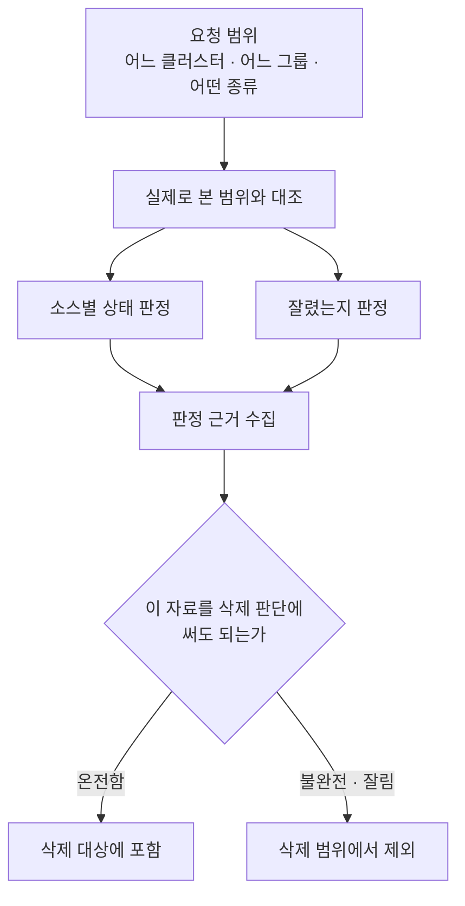

[← Kyro로 돌아가기](../../README.md)

# 01. 빈 결과와 실패를 구분하기

> **① 자료 모으기** · 5인 팀 프로젝트 · 담당: 이민정

빈 목록이 문제가 아니라, **비어 있는 이유를 버린 것**이 문제였습니다.

---

## 30초 — 무슨 일이 있었나

장애 원인을 찾으려면 네 곳에서 자료를 모아야 합니다. 서버 상태, 성능 수치, 로그, 요청 기록입니다. 네 곳은 **자료 형식도 다르고, 시간을 세는 기준도 다르고, 실패하는 방식도 다릅니다.**

수집 기능을 만들고 나서 문제를 발견했습니다. 자료가 비어 있을 때 그 이유를 알 수가 없었습니다.

| 실제로 벌어진 일 | 응답 | 받은 쪽이 해야 할 일 |
|---|---|---|
| 정말 그 자료가 없다 | 빈 목록 | 없음 |
| 볼 권한이 없다 | 빈 목록 | 권한 요청 |
| 시간 초과로 못 가져왔다 | 빈 목록 | 다시 시도 |
| 너무 많아서 잘랐다 | 일부 목록 | 범위를 좁혀 재조회 |
| 네 곳 중 한 곳만 실패했다 | 일부 목록 | 실패한 곳만 재수집 |

**해야 할 일이 다섯 가지인데 응답은 두 가지였습니다.**

여기서 세 가지 사고가 났습니다.

**멀쩡한 설정이 삭제된 것으로 처리됐습니다.** 목록을 받은 저장소가 "여기 없으니 삭제된 것"이라고 판단했는데, 그 목록은 너무 길어서 잘린 것이었습니다.

**화면이 "없다"고 잘못 표시했습니다.** 권한이 없어 못 본 것과 정말 없는 것이 같은 화면으로 나왔습니다.

**한 곳만 실패했는데 전체가 성공으로 기록됐습니다.** 어느 자료를 믿어도 되는지 알 방법이 없었습니다.

---

## 3분 — 어떻게 풀었나

### 상태를 응답에 실었습니다

로그에만 남기면 받는 쪽이 쓸 수 없습니다. 응답 본문에 함께 넣었습니다.

```
completed     요청한 범위를 전부 봤습니다
partial       일부만 봤습니다
unavailable   보지 못했습니다
```

셋으로 나눈 이유는, **화면을 그릴 때 필요한 구분이 셋이기 때문**입니다. 배치 처리는 재실행 대상을 정해야 해서 더 잘게 나눕니다. 두 어휘가 어떻게 대응하는지는 [04번 문서](04-metadata-catalog.md#실행-단위와-상태)에 표로 정리했습니다.

### 상태만으로는 부족했습니다

`partial`이라고만 하면 무엇을 해야 할지 모릅니다. 권한 때문인지, 너무 많아서 잘렸는지, 상대 시스템이 죽었는지에 따라 대응이 다릅니다.

**그렇게 판정한 이유를 코드로 함께 보냈습니다.**

### 이유 목록도 무한정 늘어나면 안 됐습니다

이유가 계속 쌓이면 그것대로 응답을 밀어냅니다. 개수 상한을 계약에 넣었습니다.

```python
CONFIG_REFERENCE_REASON_CODE_MAX_COUNT = 16
```

그리고 **이유 목록이 잘린 경우도 따로 표시**했습니다. 잘린 걸 숨기지 않겠다면서, 잘렸다고 알려주는 필드 자체를 조용히 자르면 앞뒤가 맞지 않습니다.

### 가장 중요한 결정 — 받는 쪽이 무시해도 사고가 안 나게

상태를 아무리 잘 나눠도 **받는 쪽이 안 읽으면 소용없습니다.**

그래서 판정을 데이터 계층에 넣었습니다. 되돌릴 수 없는 판단, 즉 **삭제**만큼은 코드가 막습니다.

---

## 10분 — 코드와 검증



→ [`src/domains/inventory/coverage.py`](../../src/domains/inventory/coverage.py)

이 파일의 `_delete_authoritative_entry` 함수가 결론입니다. 이름 그대로 **"이 자료를 삭제 판단의 근거로 삼아도 되는가"** 를 결정합니다. 불완전하거나 잘렸으면 삭제 범위에서 뺍니다.

계약을 문서로 지키는 대신 **코드로 지켰습니다.**

### 무엇을 시험했나

→ [`tests/test_inventory_coverage.py`](../../tests/test_inventory_coverage.py)

기능이 되는지가 아니라 **어떤 사고를 막았는지**로 시험을 짰습니다.

| 막으려는 사고 | 시험 내용 |
|---|---|
| 일부만 본 자료가 전부로 처리됨 | 부분 관측 시 `partial` 판정 |
| 잘렸는데 온전한 것으로 표시됨 | 상한 도달 시 잘림 표시 부착 |
| 안 잘렸는데 잘림으로 표시됨 | 미도달 시 표시 없음 |
| 이유 목록이 응답을 밀어냄 | 상한 초과 시 절단 |
| 이유 목록이 잘린 게 숨음 | 절단 표시 부착 |
| 불완전한 자료가 삭제 근거로 쓰임 | 삭제 범위에서 제외 |

### 솔직한 한계

**이 보호는 삭제 경로 하나에만 걸려 있습니다.** 운영 화면과 원인 판정은 여전히 `partial`을 무시할 수 있습니다. 되돌릴 수 없는 판단부터 막은 것이지 모든 소비자를 강제한 것은 아닙니다.

---

## 이 작업이 증명하는 것

- 여러 시스템에서 자료를 받아 **하나의 응답 규격으로 통일**한 경험
- 실패·부분 실패·권한 거부를 구분하는 **API 응답 계약 설계**
- 문서가 아니라 **코드로 계약을 강제**하는 방법
- 기능이 아니라 **막으려는 사고**를 기준으로 시험을 설계하는 방법

---

## 아직 못 한 것

- 응답 규격 자체에 버전이 없습니다. 구조가 바뀌면 받는 쪽이 호환 여부를 판단할 방법이 없습니다 → [07번 문서](07-catalog-api-mcp.md#api)에서 경로 버전으로 해결했습니다
- 정리된 자료에서 원본으로 되돌아가는 참조가 명시적이지 않습니다 → [04번 문서](04-metadata-catalog.md#리니지)에서 채웠습니다
- 삭제 외의 경로는 계약을 강제하지 않습니다

---

[← Kyro로 돌아가기](../../README.md) · [다음: 잘라도 되지만 숨기면 안 됩니다 →](02-collection-limits.md)
