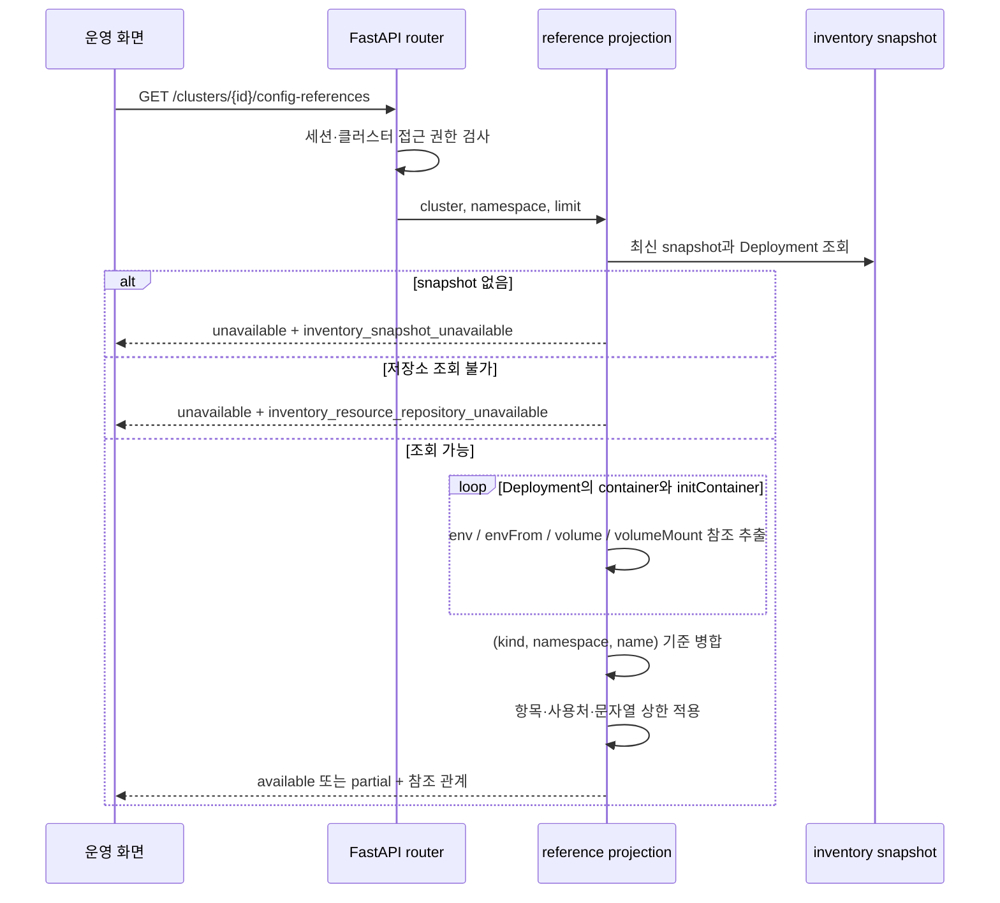

[← Kyro로 돌아가기](../../README.md) · [← 02](02-collection-limits.md)

# 03. Secret 값 대신 참조 관계만 반환하기

> **소비 경계** · 5인 팀 프로젝트 · 담당: ConfigMap·Secret 참조 API

설정 장애를 조사하려면 어느 Deployment가 어떤 ConfigMap과 Secret을 사용하는지 알아야 합니다. 그러나 저장된 Kubernetes manifest 전체를 API로 반환하면 조사에 필요하지 않은 평문 환경변수와 Secret 원문까지 함께 노출될 수 있습니다.

## 문제를 둘로 나눴습니다

장애 조사에 필요한 정보와 필요하지 않은 정보를 먼저 나눴습니다.

| 필요한 정보 | 반환하지 않을 정보 |
|---|---|
| 참조 종류: ConfigMap 또는 Secret | `Secret.data`, `stringData` |
| namespace와 이름 | 평문 `env[].value` |
| 어느 Deployment가 참조하는지 | command, args, annotations |
| env·envFrom·volume·volumeMount 중 어디서 쓰는지 | 저장된 raw manifest 전체 |
| optional·readOnly 등 사용 맥락 | 실제 설정 값 |

핵심 판단은 **원본에서 위험 필드를 지우는 것이 아니라, 빈 응답 모델에 허용한 참조 필드만 채우는 것**입니다. 원본 스키마에 새 필드가 추가돼도 API 응답에 자동으로 포함되지 않습니다.

## 데이터 흐름



API는 기존 gateway에 연결되어 있고 세션 인증과 inventory 접근 검사를 거칩니다.

- router: [`src/domains/inventory/router.py`](../../src/domains/inventory/router.py)
- projection: [`src/domains/inventory/config_references.py`](../../src/domains/inventory/config_references.py)
- response contract: [`src/packages/contracts/gateway/responses.py`](../../src/packages/contracts/gateway/responses.py)

## 실제 응답 계약

현재 코드 기준의 축약 예시입니다.

```json
{
  "cluster_id": "cluster-a",
  "namespace": "apps",
  "items": [
    {
      "kind": "Secret",
      "namespace": "apps",
      "name": "app-secret",
      "referenced_by": [
        {
          "workload": {
            "kind": "Deployment",
            "namespace": "apps",
            "name": "api",
            "uid": "deployment-uid"
          },
          "source": "env",
          "container_name": "web",
          "env_name": "TOKEN",
          "key": "token",
          "optional": false
        }
      ]
    }
  ],
  "coverage": {
    "availability": "available",
    "snapshot_id": "snapshot-a",
    "observed_at": "2026-07-23T05:00:00+00:00",
    "workload_count": 1,
    "projected_reference_count": 1,
    "reason_codes": []
  }
}
```

`available`과 빈 `items`는 “조회했지만 참조가 없음”입니다. `unavailable`과 빈 `items`는 “조회하지 못함”입니다. 빈 배열만 보면 같은 결과지만 후속 조치는 다릅니다.

`partial`은 workload coverage가 불완전하거나 응답 상한에 도달했을 때 사용합니다. 받는 쪽이 목록을 전체로 오해하지 않도록 수집 신뢰 범위를 함께 전달합니다.

## 중복과 상한

같은 Secret을 여러 컨테이너가 사용해도 항목은 `(kind, namespace, name)` 기준으로 하나만 반환하고 사용 위치를 `referenced_by`에 모읍니다.

다음 입력에는 상한이 있습니다.

- 조회할 Deployment 수
- 반환할 참조 항목 수
- 반환할 사용 위치 수
- Kubernetes 이름·경로 문자열 길이
- coverage reason code 수

상한에 도달하면 `partial`과 사유 코드를 남깁니다. 현재 API에는 페이지네이션이 없습니다. 최대치 너머 항목에 도달할 수 없다는 점은 남은 한계입니다.

## 16개 테스트가 막는 사고

→ [`tests/test_config_references.py`](../../tests/test_config_references.py)

| 막으려는 사고 | 검증 |
|---|---|
| raw manifest 값이 응답에 섞임 | 평문 env, `data`, `stringData` 문자열 부재 확인 |
| 저장 형식이 달라 참조를 놓침 | full object와 persisted summary 형식 모두 검증 |
| initContainer 참조 누락 | initContainer fixture에서 참조 추출 |
| 항목이 무한히 커짐 | 참조 수 상한과 `partial` 확인 |
| 임의 문자열이 계약 상한을 넘김 | name·key·mount path 경계 확인 |
| snapshot 없음과 참조 없음이 합쳐짐 | `unavailable` 사유 확인 |
| 일부 namespace만 관측했는데 전체로 판단 | coverage 사유와 `partial` 확인 |
| reason code가 응답을 밀어냄 | 코드 개수 상한 확인 |

대표 구현 커밋은 [`05c60fdd9`](https://github.com/minmings111/Kyro-jungle-final/commit/05c60fdd9bfd4a6c42f59cbcb33b22d037dd5577), 경계 보강은 [`6c082d12a`](https://github.com/minmings111/Kyro-jungle-final/commit/6c082d12af40bc4c97bb08df503434b17d4fb860)입니다.

## 정확한 주장 범위

말할 수 있는 것:

- FastAPI 조회 API와 Pydantic 응답 계약을 구현했습니다.
- ConfigMap·Secret의 원문 값 대신 참조 관계만 투영했습니다.
- 부분 관측·저장소 부재·응답 상한을 구분했습니다.
- 비정상적으로 큰 입력을 포함한 경계 테스트를 작성했습니다.

말하면 안 되는 것:

- Secret이 시스템 어디에도 저장되지 않습니다.
- Secret과 관련된 이름을 전혀 노출하지 않습니다.
- 모든 Kubernetes workload 종류를 지원합니다.
- 상한 너머 결과도 페이지네이션으로 조회할 수 있습니다.

현재 projection은 `secretKeyRef.key`와 `env_name` 같은 참조 맥락을 반환합니다. 값은 아니지만 이름 자체가 민감할 수 있습니다. 또한 읽기 API가 값을 반환하지 않을 뿐, upstream snapshot 저장소에는 원본이 남아 있습니다. 수집 시점 최소화와 저장 암호화는 이 작업의 범위 밖입니다.

initContainer 참조를 수집하지만 응답에는 app container와 구분하는 `container_type`이 없습니다. 이 역시 현재 계약의 한계입니다.

## 이 작업이 증명하는 것

- 필요한 정보와 불필요한 정보를 분리한 API 계약 설계
- 원본을 수정해 반환하지 않고 새 모델로 투영하는 안전한 기본값
- 빈 결과·조회 실패·부분 관측을 구분하는 데이터 품질 관점
- 기능 성공뿐 아니라 입력 크기와 응답 한도를 다룬 테스트 설계

---

[← Kyro로 돌아가기](../../README.md) · [다음: 메타데이터 카탈로그 →](04-metadata-catalog.md)
