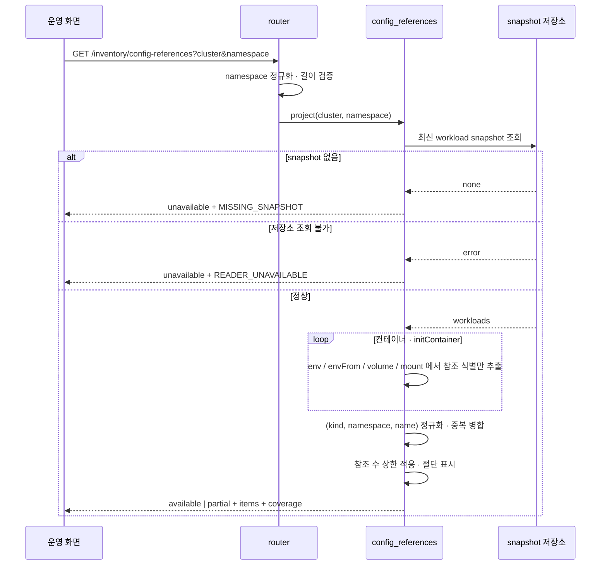

[← Kyro로 돌아가기](../../README.md) · [← 02](02-collection-limits.md)

# 03. 설정 참조 조회 API

> **① 자료 모으기** · 5인 팀 프로젝트 · 담당: 이민정

비밀키 값을 보여주지 않고도 참조 관계는 알려줄 수 있습니다.

---

## 문제

배포 설정 때문에 생긴 장애를 조사하려면 각 워크로드가 어떤 ConfigMap과 Secret을 참조하는지 알아야 합니다.

가장 단순한 방법은 저장된 배포 정보를 그대로 반환하는 것입니다. 그러면 **`Secret.data`가 그대로 나갑니다.** 이 응답은 운영 화면에도 가고 원인 판정에도 갑니다. 한 번 나가면 어디까지 남는지 통제할 수 없습니다.

반대로 아무것도 주지 않으면 설정 장애를 조사할 수 없습니다.

## 판단

**참조 관계와 참조 대상의 값은 다른 정보입니다.** 어떤 워크로드가 어떤 Secret을 쓰는지는 구조 정보고, 그 Secret의 내용은 별개입니다. 조사에 필요한 건 앞쪽입니다.

### 지우는 대신 새로 만듭니다

처음 구현은 저장된 manifest를 복사하고 `data`·`stringData`를 지우는 방식이었습니다. **이건 denylist다.** 지울 목록을 내가 다 아는 만큼만 안전합니다.

문제는 내가 다 알지 못한다는 것입니다. 실제로 놓친 곳들이 있었다.

| 놓쳤던 곳 | 왜 위험한가 |
|---|---|
| `env[].value` | `DATABASE_URL=postgres://user:pw@host` 같은 평문이 흔하다 |
| `command` / `args` | `--token=...` 이 그대로 들어간다 |
| `metadata.annotations` 의 `last-applied-configuration` | **이전 manifest 전체**가 평문 env 포함해 들어 있다 |
| `imagePullSecrets` | 레지스트리 자격증명 참조 |
| `secretKeyRef.key` | 값은 아니지만 `STRIPE_LIVE_KEY` 같은 키 이름 자체가 정보다 |

그래서 방식을 뒤집었다. **원본을 지우는 게 아니라, 빈 응답 객체를 만들고 허용된 필드만 채운다.**

```python
# denylist — 지울 것을 내가 다 알아야 안전하다
payload = deepcopy(snapshot)
del payload["data"]           # ← 놓친 경로는 그대로 나간다

# allowlist — 채울 것만 채운다
ref = ConfigReference(
    kind=source.kind,
    name=source.name,
    optional=source.optional,
    used_by=[...],            # ← 여기 없는 것은 구조적으로 나갈 수 없다
)
```

응답 모델은 Pydantic 타입이고 원본 dict를 참조하지 않습니다. **새 필드가 원천에 생겨도 응답에 자동으로 실리지 않습니다.**

`secretKeyRef.key`는 반환하지 않기로 했습니다. 키 이름만으로 무엇이 들어 있는지 짐작할 수 있고, 장애 조사에는 "이 Secret을 참조한다"까지면 충분했습니다.

### 참조는 정규화하고 사용 위치만 모은다

같은 설정을 여러 컨테이너가 참조하면 **하나로 합치고 사용 위치만 목록으로 남겼다.** 컨테이너 수만큼 중복 반환하면 소비자가 다시 집계해야 합니다.

식별은 `(kind, namespace, name)`입니다.

## 구현

→ [`src/domains/inventory/config_references.py`](../../src/domains/inventory/config_references.py)



### 응답

```jsonc
{
  "cluster_id": "...",
  "namespace": "...",
  "items": [
    {
      "ref_id": "Secret/prod/db-credentials",
      "kind": "Secret",
      "name": "db-credentials",
      "optional": false,
      "used_by": [
        { "workload": "api-server", "container": "app",  "container_type": "app",  "via": "envFrom" },
        { "workload": "api-server", "container": "init", "container_type": "init", "via": "volume"  }
      ]
    }
  ],
  "coverage": {
    "availability": "partial",
    "snapshot_id": "...",
    "observed_at": "...",
    "workload_count": 12,
    "workload_count_observed": 9,
    "reference_count_total": 47,
    "reference_count_returned": 31,
    "references_truncated": true,
    "reason_codes": [
      { "code": "PARTIAL_WORKLOAD_COVERAGE" },
      { "code": "REFERENCE_CAP_REACHED" }
    ],
    "reason_codes_truncated": false
  },
  "page": { "limit": 50, "next_cursor": "eyJvIjo1MH0=" }
}
```

세 가지가 초기 버전에서 바뀌었다.

**`container_type`을 추가했습니다.** init 컨테이너 참조를 수집한다고 써 놓고 응답에서 구분할 방법이 없었습니다. 조사하는 사람은 그 참조가 기동 경로인지 실행 중인 컨테이너인지 알아야 합니다. **수집했는데 계약으로 드러나지 않으면 없는 기능이다.**

**절단을 커버리지에 반영했습니다.** 참조 수 상한에 걸려도 `availability`가 `available`로 나갔다. [02번 문서](02-collection-limits.md)에서 잘림을 숨기지 않기로 해 놓고 여기서 숨기고 있었다. `reference_count_total`·`reference_count_returned`·`references_truncated`를 분리했고, 사유 코드 자체가 잘린 경우도 `reason_codes_truncated`로 표시합니다.

**페이지네이션을 넣었다.** 상한만 두면 상한 너머 참조에 도달할 방법이 없습니다.

| `availability` | 조건 |
|---|---|
| `available` | 요청 범위의 워크로드를 전부 관측했고 절단이 없다 |
| `partial` | 일부 워크로드만 관측했거나 참조가 절단됐다 |
| `unavailable` | 원본 스냅샷이 없거나 저장소를 조회할 수 없다 |

핵심은 **참조가 0건인 상태와 조회하지 못한 상태를 나눈 것**입니다. 앞쪽은 `available` + 빈 목록, 뒤쪽은 `unavailable`입니다.

→ [`router.py`](../../src/domains/inventory/router.py) · [`responses.py`](../../src/packages/contracts/gateway/responses.py)

## 값은 여전히 저장돼 있다

**이 API가 값을 반환하지 않는 것과 값이 어디에도 없는 것은 다릅니다.**

정직하게 적으면 이렇다. 이 projection은 **저장된 스냅샷을 읽습니다.** 그 스냅샷은 수집 시점에 Secret 값을 포함한 채로 전송되고 저장됐다. 읽기 시점 필터링이지 수집 시점 최소화가 아닙니다.

값이 남아 있는 곳과 현재 보호 수단은 이렇다.

| 위치 | 보호 |
|---|---|
| 스냅샷 저장소 (PostgreSQL) | 네트워크 격리, DB 계정 분리. **컬럼 단위 암호화 없음** |
| S3 원본 아카이브 | 버킷 정책, SSE-S3. **보관 기간 정책 없음** |
| 07-06 이전 수집분 | 원본 payload를 계약에 실어 보내던 시기. **소급 정리 안 함** |

수집 단계에서 Secret 값을 아예 저장하지 않는 것이 옳다. 원인 판정에 값이 필요한 경로가 없기 때문입니다. 하지 못한 이유는 팀 프로젝트 후반에 이 문제를 인식했고, 수집 계약을 바꾸면 다른 팀원 코드에 영향이 갔기 때문입니다.

`raw_snapshots.content_hash`도 값을 포함한 payload 위에서 계산되므로, 해시를 아는 사람은 후보를 대입해 내용을 확인할 수 있습니다. **다음에 고칠 것 중 이게 가장 위에 있습니다.**

## 참조 그래프 자체가 민감하다

값을 지웠다고 이 응답이 무해한 것은 아닙니다.

namespace 전체의 워크로드 → Secret 인접 목록은 **표적 문서입니다.** 어떤 pod를 장악하면 `prod-db-credentials`에 닿는지, 애초에 어떤 이름의 Secret이 존재하는지를 알려줍니다.

그래서 이 엔드포인트는 게이트웨이의 인증·인가를 반드시 통과합니다. 다만 **그 계층은 내가 만들지 않았습니다.** 팀의 Gateway/Auth 담당 범위다. 이 문서가 보장하는 것은 "값이 응답에 실리지 않는다"까지고, "권한 없는 사람이 이 응답을 못 받는다"는 다른 사람의 코드에 달려 있습니다.

## 검증

→ [`tests/test_config_references.py`](../../tests/test_config_references.py)

### 카나리 테스트

기능 테스트가 아무리 많아도 **"내가 생각한 경로에서 새지 않는다"까지만 증명합니다.** 생각하지 못한 경로는 그대로다.

그래서 음성 공간을 검증합니다.

```python
def test_projection_leaks_no_canary_from_any_source_field():
    # 원본 스냅샷의 모든 문자열 필드에 고유 토큰을 심는다
    snapshot, canaries = seed_every_string_field_with_canary(workload_fixture())

    response = project_config_references(snapshot)
    serialized = response.model_dump_json()

    allowed = {c for c in canaries if c.path in ALLOWLISTED_IDENTITY_PATHS}
    for canary in canaries - allowed:
        assert canary.token not in serialized, f"leaked from {canary.path}"
```

`seed_every_string_field_with_canary`는 manifest를 재귀 순회하며 모든 문자열 자리에 고유 토큰을 넣습니다. **응답을 직렬화해서 허용 경로 밖의 토큰이 하나라도 있으면 실패합니다.**

이 테스트는 내가 몰랐던 필드에서도 실패합니다. `last-applied-configuration`을 놓쳤던 것도 이걸 붙이고 나서 잡혔다.

워크로드 형태는 hypothesis로 생성해 고정 fixture 하나에 의존하지 않게 했습니다.

### 경계 조건

| 막으려는 사고 | 테스트 |
|---|---|
| 허용 경로 밖 문자열 유출 | `leaks_no_canary_from_any_source_field` |
| Secret 값이 응답에 섞임 | `projection_extracts_only_reference_identities` |
| 신뢰할 수 없는 긴 문자열이 그대로 나감 | `projection_bounds_untrusted_raw_strings` |
| 참조 폭증으로 응답이 밀려남 | `projection_caps_excessive_reference_count` |
| 절단됐는데 available로 표시 | `projection_marks_partial_when_references_truncated` |
| init 컨테이너 참조 누락 | `projection_reads_init_container_references` |
| init·app 컨테이너 구분 불가 | `projection_labels_container_type` |
| 저장된 워크로드 형태를 잘못 읽음 | `projection_reads_persisted_workload_template_shape` |
| 스냅샷 없음이 빈 목록으로 숨음 | `projection_reports_missing_snapshot` |
| 저장소 조회 실패가 빈 목록으로 숨음 | `projection_reports_missing_resource_reader` |
| 부분 수집 사유가 소실됨 | `projection_preserves_partial_source_reason` |
| 커버리지 우선순위 오판 | `projection_prefers_workload_coverage` |
| 한 워크로드가 불완전한데 전체가 완전 | `projection_marks_all_namespace_partial_when_any_workload_scope_incomplete` |
| 빈 namespace 입력이 다르게 해석됨 | `projection_normalizes_blank_namespace_to_all_namespaces` |
| 과도하게 긴 namespace 필터 통과 | `projection_rejects_oversized_namespace_filter` |
| 미관측 namespace가 완전으로 표시 | `projection_marks_uncovered_namespace_partial` |
| 사유 없는 불완전 커버리지 | `projection_marks_incomplete_workload_coverage_without_reason` |
| 사유 코드 무한 증가 | `projection_bounds_reason_code_count` |
| 사유 코드 절단이 숨음 | `projection_flags_reason_code_truncation` |
| 커서로 다음 페이지 도달 불가 | `projection_pagination_reaches_all_references` |

## 결과

- 허용 목록 방식이라 원천에 새 필드가 생겨도 응답에 자동으로 실리지 않는다
- 카나리 테스트가 내가 열거하지 못한 경로에서도 실패한다
- 조회 실패가 빈 목록으로 숨는 경로가 없어졌다
- 절단된 참조가 완전한 목록으로 읽히지 않고, 커서로 나머지에 도달할 수 있다
- 이 API를 운영 화면의 설정 참조 패널에 연결해 사용자가 확인하는 지점까지 이어졌다

## 코드 리뷰 반영

최초 구현 이후 리뷰에서 경계 조건 지적을 받았다. 40분 뒤 참조 수 상한, 문자열 길이 제한, 사유 코드 상한과 테스트를 추가했습니다. 상세는 [엔지니어링 로그](10-engineering-log.md#4-리뷰-40분-뒤)에 있습니다.

## 이 작업이 증명하는 것

- 민감 정보를 제외하고 **필요한 구조 정보만 노출하는 API 설계**
- 제외 목록 방식(denylist)의 한계를 발견하고 **허용 목록 방식(allowlist)으로 전환**한 판단
- 열거로 못 찾는 유출 경로를 잡기 위한 **카나리 기반 음성 검증** 설계
- 코드 리뷰 지적을 받아 **경계 조건을 보강**한 협업 경험

## 남은 것

- **수집 단계에서 Secret 값을 저장하지 않도록 바꾸지 못했습니다.** 위의 「값은 여전히 저장돼 있다」 참고
- `content_hash`가 값 포함 payload 위에서 계산된다
- 참조 대상이 실제로 존재하는지 확인하지 않습니다. 이름만 참조하고 실물이 없는 경우를 표시하지 못한다
- 인가는 팀의 게이트웨이에 의존합니다. 이 문서가 보장하는 범위 밖이다

---

[다음: 메타데이터 카탈로그 →](04-metadata-catalog.md)
