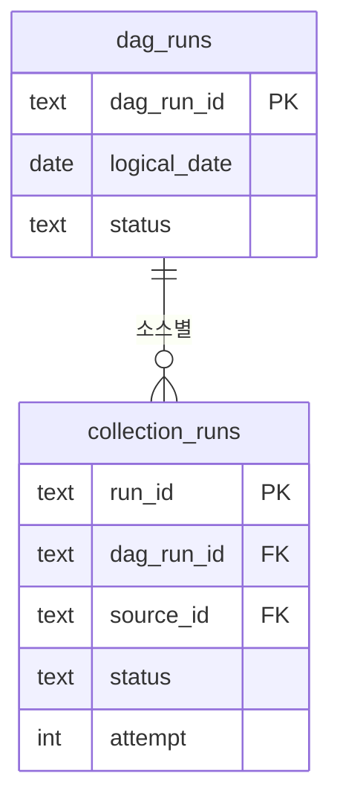
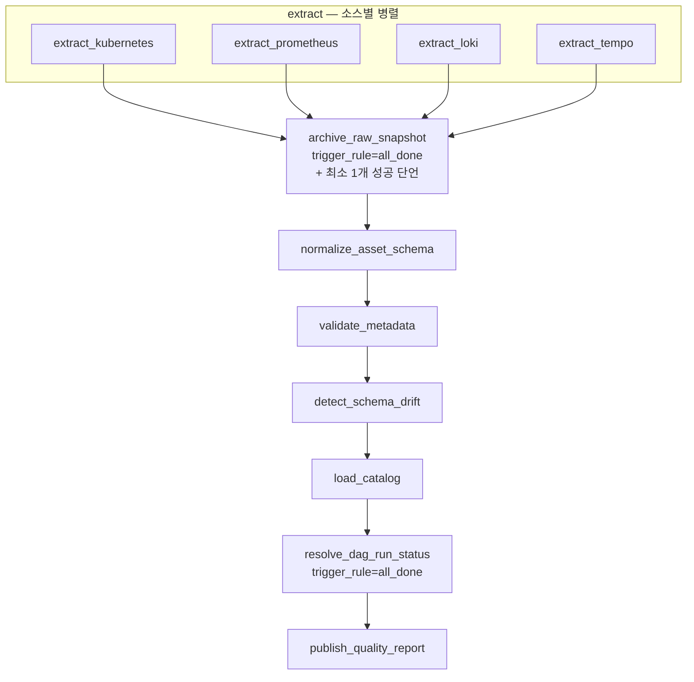
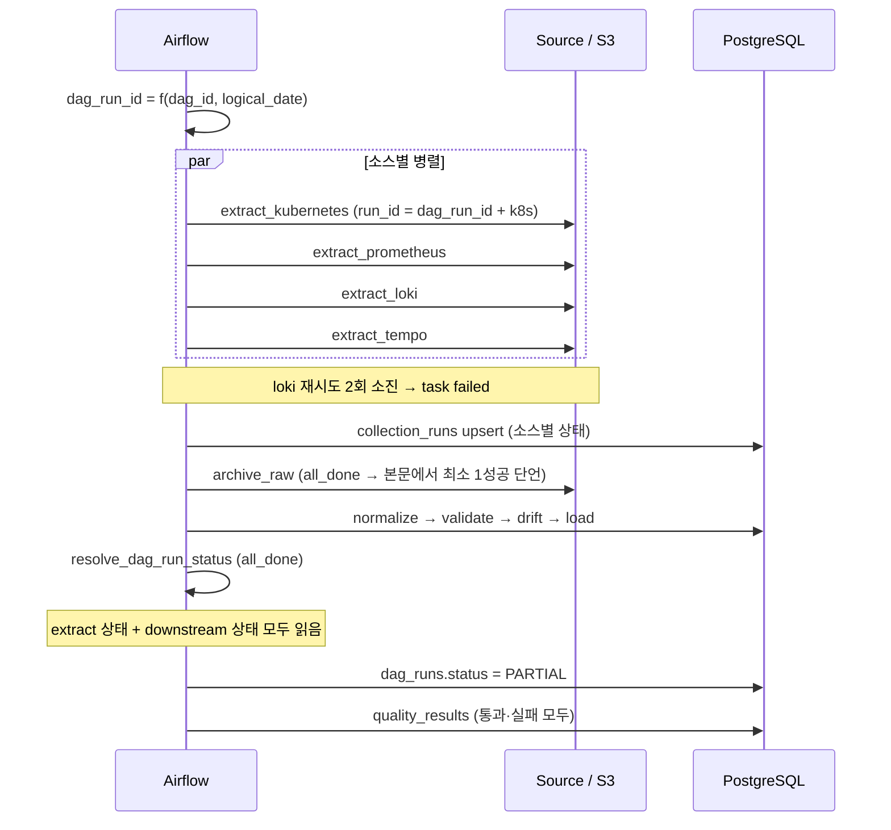

[← Kyro로 돌아가기](../../README.md) · [← 04](04-metadata-catalog.md)

# 05. Airflow 파이프라인

> **⑤ 매일 재검사** · 프로젝트 종료 후 개인 작업

Airflow를 설치한 것은 경험이 아닙니다. **재시도·부분 실패·멱등성·재처리를 설명할 수 있어야** 경험입니다.

---

## 문제

[카탈로그 검사](04-metadata-catalog.md)를 어디서 돌릴지 정해야 했습니다. 실시간 수집 경로에 넣는 게 가장 쉬웠지만 성격이 맞지 않았습니다.

| 실시간 수집 | 카탈로그 검사 |
|---|---|
| 장애 발생 즉시 실행 | 하루 한 번이면 충분 |
| 지연이 곧 품질 저하 | 수분 지연 허용 |
| 실패하면 다음 주기에 자연 복구 | 실패한 **날짜를 특정해** 다시 돌려야 함 |
| 실행 이력이 짧게 남아도 됨 | 언제 무엇이 어긋났는지 오래 남아야 함 |

**과거 구간을 지정해 다시 돌리는 요구**가 결정적이었습니다. 기존 스케줄러는 "다음 실행 시각"만 관리하고 논리 날짜 개념이 없었습니다.

실시간 경로는 Airflow로 바꾸지 않았습니다. 예약 지연이 짧은 주기 수집에 그대로 얹히고, 매분 task를 만들면 메타데이터 DB가 폭증하고, worker가 원천에 직접 붙으면 읽기 전용 agent보다 넓은 자격증명이 필요해진다. 무엇보다 Airflow의 task 실패와 제품의 `NO_DATA`·`PARTIAL`·`TRUNCATED`는 의미가 다릅니다.

도구 비교는 [기술 리서치](08-tech-research.md)에 있습니다.

---

## 실행 단위를 먼저 정해야 했다

처음에 `run_id = f(dag_id, logical_date, attempt)`로 두고 `collection_runs`에 `source_id` 컬럼을 뒀다. **작동하지 않습니다.**

DAG 실행 하나에 `run_id`가 하나면 `collection_runs` 행도 하나다. 소스가 넷인데 행이 하나면 **어느 소스가 실패했는지 기록할 자리가 없습니다.** 부분 실패를 보존하겠다는 설계가 스키마에서 표현 불가능해진다.

그리고 Airflow의 재시도 횟수는 **DAG 실행이 아니라 task 단위**다. `extract_loki`가 2회차이고 `extract_kubernetes`가 1회차이면 두 task가 같은 DAG 실행 안에서 서로 다른 `run_id`를 계산합니다. 이후 모든 `run_id` 조인이 어긋납니다.

실행 단위를 둘로 나눴습니다.

```
dag_run_id   = f(dag_id, logical_date)              DAG 실행 하나
run_id       = f(dag_run_id, source_id)             소스별 수집 하나
```

`attempt`는 `run_id`에 넣지 않습니다. 재시도는 같은 `run_id` 행을 갱신하고 `attempt` 컬럼만 올린다. 재시도할 때마다 새 행이 생기면 성공률 집계가 재시도 횟수에 오염됩니다.



`PARTIAL`은 `dag_runs.status`에 있습니다. 개별 `collection_runs.status`는 `SUCCESS` / `NO_DATA` / `TRUNCATED` / `FAILED` 넷입니다. **한 소스가 "부분 실패"할 수는 없습니다. 부분 실패는 여러 소스를 가진 실행의 성질입니다.**

| `dag_runs.status` | 조건 |
|---|---|
| `SUCCESS` | 모든 소스가 `SUCCESS` 또는 `NO_DATA` |
| `PARTIAL` | 일부 소스가 `FAILED` 또는 `TRUNCATED`, 나머지는 정상 |
| `FAILED` | 모든 소스가 `FAILED` |
| `INCOMPLETE` | 수집은 끝났으나 downstream이 완료되지 않음 |

마지막 값이 필요한 이유는 아래 (c) 시나리오에 있습니다.

---

## DAG



→ [`dags/catalog_reconciliation_daily.py`](../../dags/catalog_reconciliation_daily.py)

### trigger_rule을 두 번 고쳤다

처음에는 `archive_raw_snapshot`에 `none_failed_min_one_success`를 걸었다. 이름만 보고 "하나라도 성공하면 진행"으로 읽었다. **틀렸다.**

Airflow 소스를 열어 보면 이 규칙은 `none_failed`에 "전부 skip은 아님" 조건을 더한 것입니다. **upstream에 실패가 하나라도 있으면 `UPSTREAM_FAILED`로 건너뛴다.**

```python
# airflow/ti_deps/deps/trigger_rule_dep.py
elif trigger_rule == TR.NONE_FAILED_MIN_ONE_SUCCESS:
    if upstream_failed or failed:
        new_state = TaskInstanceState.UPSTREAM_FAILED
```

즉 Loki 하나가 실패하면 archive 이하 전부가 건너뛰어진다. "나머지 3소스는 적재된다"는 도달 불가능한 상태였습니다.

`one_success`도 답이 아닙니다. 이 규칙은 upstream 완료를 기다리지 않습니다. 첫 extract가 성공하는 순간 archive가 시작되고, 그때 Loki는 아직 재시도 중이고 Tempo는 끝나지도 않았습니다. **막 성공하려던 소스가 빠진 스냅샷을 저장하게 됩니다.**

`all_done`으로 바꾸고 "최소 하나는 성공했는가"를 task 본문에서 단언합니다.

```python
@task(trigger_rule=TriggerRule.ALL_DONE)
def archive_raw_snapshot(**context):
    outcomes = read_extract_outcomes(context)          # 소스별 최종 상태
    succeeded = [o for o in outcomes if o.ok]
    if not succeeded:
        raise AirflowFailException("no source produced output")
    ...
```

규칙 이름에 조건을 맡기지 않고 코드에 적었다. **trigger_rule은 실행 여부만 정하고, 진행 조건은 task가 판단합니다.**

| task | trigger_rule | 이유 |
|---|---|---|
| `extract_*` | 기본 | 각자 재시도. 실패는 실패로 남긴다 |
| `archive_raw_snapshot` | `all_done` | 전부 끝난 뒤 판단. 진행 조건은 본문에서 |
| `normalize` ~ `load_catalog` | 기본 | 앞 단계가 성공했을 때만 |
| `resolve_dag_run_status` | `all_done` | **성공·실패·건너뜀 무관하게 항상 실행** |
| `publish_quality_report` | 기본 | 상태가 확정된 뒤 |

extract task는 예외를 삼키지 않습니다. 실패하면 실패합니다. 그래야 Airflow 재시도가 동작합니다. 상태 확정은 재시도가 모두 소진된 뒤 `resolve_dag_run_status`가 합니다.

### 실패 시나리오

| 시나리오 | 결과 |
|---|---|
| **(a) Loki만 실패** | 3소스 archive → normalize → load 진행. `collection_runs`: k8s/prom/tempo `SUCCESS`, loki `FAILED`. `dag_runs.status = PARTIAL` |
| **(b) 전 소스 실패** | archive가 단언에서 실패 → downstream 건너뜀. `resolve`는 실행. `dag_runs.status = FAILED` |
| **(c) downstream 실패** | extract는 전부 성공했는데 `validate`가 실패. `resolve`가 실행되지만 **extract 상태만 보면 `SUCCESS`가 됩니다.** 그래서 `resolve`는 downstream task 상태도 읽어 `INCOMPLETE`로 기록합니다. 적재가 0건인데 성공으로 남는 것이 이 프로젝트가 없애려는 바로 그 상태다 |
| **(d) 3일 backfill** | 아래 별도 |

(c)를 위해 `resolve_dag_run_status`는 extract와 downstream 양쪽 상태를 읽습니다. **extract만 읽으면 아무것도 적재하지 않은 실행이 초록색으로 남습니다.**

### backfill은 extract를 다시 하면 안 된다

`catchup=True`가 도입 이유인데, 여기 함정이 있습니다.

extract task는 살아 있는 Kubernetes·Prometheus·Loki·Tempo를 조회합니다. 7월 3일 구간을 7월 30일에 backfill하면 **현재 상태를 가져와서 과거 날짜 도장을 찍는다.** 원천은 과거 상태를 갖고 있지 않다. 원본을 먼저 S3에 넣은 이유가 이건데, 정작 backfill이 원본을 안 쓰면 소용이 없습니다.

extract를 조건부로 바꿨다.

```python
@task
def extract_source(source_id: str, **context):
    logical_date = context["logical_date"]
    existing = find_archived_snapshot(source_id, logical_date)
    if existing and logical_date.date() < date.today():
        return existing.s3_uri          # 과거 구간은 원본에서 재생
    return fetch_from_source(source_id, logical_date)
```

**과거 날짜에 원본이 있으면 원천을 건드리지 않고 S3에서 읽습니다.** 원본이 없는 과거 날짜는 재생할 수 없으므로 `NO_SOURCE_DATA`로 기록하고 넘어갑니다. 없는 데이터를 현재 값으로 채우는 것보다 없다고 남기는 편이 낫습니다.

### 스케줄

```python
DAG(
    dag_id="catalog_reconciliation_daily",
    schedule="0 3 * * *",
    start_date=datetime(2026, 7, 1),
    catchup=True,
    max_active_runs=1,
    default_args={
        "retries": 2,
        "retry_delay": timedelta(minutes=2),
    },
)
```

재시도를 3회 지수 백오프에서 2회 고정 2분으로 줄였습니다. 소스 넷이 각각 3회 지수 백오프면 실패 시 상태 확정까지 30분 넘게 걸리고, `max_active_runs=1`이라 backfill이 그만큼 직렬로 밀린다.

### task 사이 데이터 전달

XCom으로 payload를 넘기지 않습니다. Airflow 메타데이터 DB에 들어가고 크기 제한이 있습니다. **XCom에는 S3 URI와 `run_id`만 넘긴다.**

---

## 멱등성

**테이블마다 재실행 시 동작이 다릅니다.** 하나로 뭉뚱그리면 상태 테이블이 부풀거나 이력이 사라집니다.

| 테이블 | 제약 | 재실행 시 |
|---|---|---|
| `dag_runs` | `PK(dag_run_id)` | 행 수 불변. 상태만 갱신 |
| `collection_runs` | `PK(run_id)`, `UK(dag_run_id, source_id)` | 행 수 불변. 상태·attempt 갱신 |
| `data_assets` | `PK(asset_id)`, `UK(qualified_name)` | 행 수 불변. upsert |
| `asset_fields` | `UK(asset_id, schema_version, field_path)` | 행 수 불변. upsert |
| `schema_observations` | `UK(asset_id, schema_version, schema_hash)` | 계약이 바뀐 경우에만 1행 증가 |
| `raw_snapshots` | `UK(run_id, content_hash)` | 실행마다 1행. S3 객체는 해시로 중복 제거 |
| `quality_results` | `UK(run_id, check_type, asset_id)` | 검사당 1행. 재실행 시 갱신 |
| `lineage_edges` | `UK(upstream_asset_id, downstream_asset_id, run_id)` | 실행마다 증가 |
| `normalized_evidence` | `UK(cluster_id, source_id, resource_uid, observed_at)` | **행 수 불변.** 같은 관측은 한 번만 |
| `observed_rows` | `UK(run_id, asset_id, row_key)` | 실행마다 증가 |
| `observed_fields` | `UK(row_id, field_path)` | 행 수 불변 |

**앞의 다섯은 상태 테이블이라 불변이어야 하고, 뒤는 이력 테이블이라 늘어나는 게 맞습니다.**

`asset_fields`에 유일 제약이 없으면 `ON CONFLICT`가 아예 실행되지 않습니다. 제약 없이 그냥 insert하면 계약 행이 실행마다 복제되고, 필수 필드 검사의 위반 건수가 **데이터가 아니라 DAG를 몇 번 돌렸는지의 함수**가 됩니다.

`normalized_evidence`에 유일 제약을 건 것이 backfill 대응입니다. 3일 재처리가 같은 관측을 다시 넣어도 행이 늘지 않습니다.



---

## 모니터링

| 지표 | 왜 |
|---|---|
| 소스별 성공률 | 특정 소스가 조용히 나빠지는 것을 잡는다 |
| 수집 지연 | 배치가 밀리기 시작하는 시점 |
| 부분 실패 실행 비율 | `PARTIAL`이 상시화되면 정상이 아니다 |
| 재시도 횟수 | `collection_runs.attempt` 누적 |
| 드리프트 검출 건수 | 계약 관리가 필요해지는 시점 |

`quality_results`와 `collection_runs`에서 집계합니다. 별도 지표 저장소를 두지 않았습니다. 실행 이력이 이미 지표의 원천입니다.

**알림은 붙이지 않았습니다.** 지표는 조회만 가능합니다. 임계를 넘었을 때 사람을 부르는 경로가 없으므로 이 상태를 "모니터링을 구현했다"고 쓰지 않습니다. 정확히는 **모니터링에 필요한 지표를 남기고 조회 경로를 만든 것**입니다.

---

## 검증

```bash
make catalog-verify
```

| 검증 | 방법 | 기대 |
|---|---|---|
| 상태 테이블 멱등성 | 같은 논리 날짜 3회 재실행 | 상태 테이블 행 수 불변 |
| 이력 테이블 | 같은 조건 | `quality_results` 갱신, `lineage_edges` 증가 |
| 부분 실패 | Loki extract 강제 실패 | `dag_runs=PARTIAL`, loki `FAILED`, **나머지 3소스 적재 완료** |
| 전 소스 실패 | 4개 전부 강제 실패 | archive 단언 실패, `dag_runs=FAILED` |
| downstream 실패 | `validate` 강제 실패 | `dag_runs=INCOMPLETE`, 적재 0건 |
| backfill 재생 | 과거 3일, 원본 존재 | 원천 호출 0회, S3에서 재생 |
| backfill 독립성 | 같은 구간을 다른 날 재실행 | 날짜별 결과 동일 |
| 중복 방지 | backfill 후 중복 검사 | `normalized_evidence` 행 수 불변 |
| 드리프트 | fixture 타입 변경 | `SCHEMA_DRIFT` 검출 |
| 리니지 | 정규화 행 → run_id → S3 | 역추적 성공 |
| 검사 음성 | 정상 fixture | 각 검사 0행 |

세 번째 줄이 처음 구현에서 통과하지 못했던 항목입니다. `trigger_rule`을 고치기 전까지 downstream이 통째로 건너뛰어졌습니다.

---

## 결과

- 소스 하나가 실패해도 나머지가 적재되고, `dag_runs`에 `PARTIAL`이 남는다
- 적재가 0건인 실행이 성공으로 기록되지 않는다
- 과거 구간 재처리가 원천을 다시 조회하지 않고 S3 원본에서 재생된다
- 같은 backfill을 다른 날 돌려도 같은 결과가 나온다

## 이 작업이 증명하는 것

- 여러 시스템에서 자료를 추출·적재하는 **배치 파이프라인 구현**
- 소스별 독립 재시도, 부분 실패 보존, 과거 구간 재처리를 다루는 **오케스트레이션 설계**
- 상태 테이블과 이력 테이블을 구분한 **멱등성 설계**
- 클라우드 객체 저장소를 원본 보관에 사용하고 **로컬에서 전체를 재현**하도록 구성
- 도구의 동작을 **문서가 아니라 소스코드로 확인**하고 잘못 이해한 부분을 고친 경험

## 남은 것

- 단일 스케줄러 노드다. 고가용성 구성은 하지 않았다
- 알림 연동이 없다
- downstream이 소스별로 분기되지 않아 재처리 시 전 소스를 재계산합니다. 적재가 멱등이라 결과는 같지만 비용은 듭니다
- `normalized_evidence`·`observed_rows`에 파티셔닝이 없습니다. 이력이 쌓이면 검사 질의가 전체 스캔합니다. [SQL 문서](06-sql-quality-checks.md#남은-것) 참고
- 원본 보관 기간 정책이 없다

---

[다음: SQL 정합성 질의 →](06-sql-quality-checks.md)
