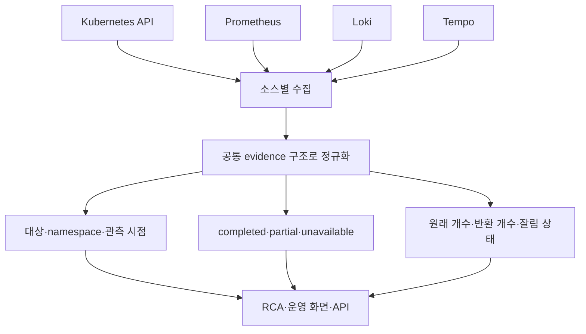

[← Kyro로 돌아가기](../../README.md)

# Data Foundation 연결

이 프로젝트에서 Data Foundation에 가장 가까운 일은 데이터를 많이 모은 것이 아니다. **소비자가 불완전한 데이터를 완전한 데이터로 오해하지 않도록 수집 범위와 실패 상태를 계약으로 만든 것**이다.

## 팀 프로젝트에서 직접 구현한 흐름



네 소스는 형식과 시간 개념이 다르다. Prometheus는 시계열 수치, Loki는 stream과 log line, Tempo는 trace와 span, Kubernetes API는 현재 리소스 상태를 반환한다. 이를 같은 JSON 모양으로 억지로 평탄화한 것이 아니라, provider별 payload를 유지하면서 모든 결과에 공통 수집 맥락과 신뢰 범위를 붙였다.

이 판단이 필요한 이유는 소비자 때문이다. `partial`을 모르면 RCA는 일부 근거만으로 결론을 내리고, inventory 저장소는 잘린 목록을 실제 삭제로 해석할 수 있다.

## JD 대조

평가는 적지 않습니다. 요건별로 무엇이 어디 있고 어떻게 확인하는지만 놓습니다.

### 필수 요건

| JD | 근거 | 확인 | 범위 |
|---|---|---|---|
| Python 데이터 처리·스크립트 | `cluster-agent/providers/`, `datacatalog/pipeline.py` | `make catalog-run` | 팀·개인 |
| SQL 조회·조인·집계 | `sql/quality/01~08, 90, 91` — 재귀 CTE, 윈도 함수, FULL OUTER JOIN | `make catalog-sql` | 개인 |
| FastAPI·Flask API | `inventory/config_references.py`, `datacatalog/router.py` (7개 엔드포인트) | `pytest tests/test_config_references.py` | 팀·개인 |
| LLM·AI Agent 개념 | `ai/agent/pipeline/evidence_bundle.py`, `services/catalog_mcp/` | `make catalog-mcp` | 팀·개인 |
| Git 협업·리뷰 | 리뷰 지적 39분 뒤 경계 조건 보강 커밋 | [엔지니어링 로그](10-engineering-log.md#4-리뷰-40분-뒤) | 팀 |
| 진행 공유·문서화 | 계약 변경과 문서를 같은 커밋에서 갱신 | [엔지니어링 로그](10-engineering-log.md) | 팀 |

### 우대 요건

| JD | 근거 | 확인 | 범위 |
|---|---|---|---|
| 파이프라인·수집·API 프로젝트 | 수집기 4종 + 배치 + 조회 API | `make catalog-verify` → 15/15 | 팀·개인 |
| Airflow | `dags/catalog_reconciliation_daily.py` — 부분 실패 보존, 멱등 재실행 | `make demo-fail-source` | 개인 |
| 메타데이터·데이터 카탈로그 설계 | `datacatalog/models.py` 13개 테이블, 계약 이력 분리 | `make demo-drift` | 개인 |
| MCP 서버 개발 | `services/catalog_mcp/server.py` — 읽기 전용 도구 6종, 응답 경계 | `pytest tests/catalog/test_mcp_boundary.py` | 개인 |
| Docker·컨테이너 | `docker-compose.catalog.yml` — PostgreSQL·MinIO·Airflow | `make catalog-up` | 개인 |
| AWS·클라우드 | EKS 배포와 담당 수집 경로 설정, 청구 원장 분석 | [비용 회고](13-architecture-cost-postmortem.md) | 팀 |

### 범위에 대한 주석

Airflow·카탈로그·MCP는 **팀 프로젝트 기간이 아니라 종료 후 개인 작업**으로 구현했습니다. 팀 협업 맥락에서 운영해 본 경험은 아닙니다. 그 대신 로컬에서 전부 재현되도록 만들었고, 확인 명령을 위 표에 적었습니다.

무엇을 만들었고 무엇이 남았는지는 [카탈로그 구현 계획과 진행 상태](12a-catalog-implementation-plan.md)에 있습니다.

## 정식 카탈로그와 다른 점

팀 프로젝트에서 다룬 메타데이터는 개별 evidence를 설명한다.

- 어느 source에서 왔는가
- 어느 cluster·namespace·resource인가
- 언제 관측했고 어느 구간을 조회했는가
- 수집이 완전한가, 일부인가, 실패했는가
- 응답이 상한 때문에 잘렸는가

정식 데이터 카탈로그는 조직의 데이터 자산을 관리한다.

- 데이터베이스·테이블·컬럼 목록
- 자산 설명·소유자·민감도
- schema version과 변경 이력
- upstream·downstream lineage
- freshness와 품질검사 결과
- 검색·탐색 API

따라서 현재 팀 프로젝트 경험을 “데이터 카탈로그 구축”으로 바꾸어 부르지 않는다. **운영 evidence metadata 계약을 구현했으며, 그 경험을 카탈로그의 schema·lineage·quality 영역으로 확장하고 있다**고 말한다.

## Airflow를 기존 실시간 수집기와 바꾸지 않는 이유

기존 프로젝트에는 이미 실시간 장애 분석용 스케줄러와 agent poll 경로가 있다. Airflow로 이를 교체하면 같은 실행 책임이 두 곳에 생기고, 짧은 주기의 DAG 이력·권한·watermark·중복 구간을 새로 해결해야 한다.

Airflow의 자연스러운 역할은 다음 후속 작업이다.

```text
보관된 원본 snapshot
        ↓
논리 날짜별 재처리·backfill
        ↓
등록 schema와 실제 관측 schema 대조
        ↓
freshness·lineage·부분 실패 검사
        ↓
품질 결과 발행
```

이건 실시간 장애 수집을 대체하지 않는다. 이미 수집된 데이터를 일정에 따라 재검사하고, 실패 task만 재시도하고, 과거 구간을 backfill하는 역할이다. 그래서 적용 자체는 억지스럽지 않다.

초기 DAG는 mapped extract task의 결과를 downstream에서 사용하지 않고 source를 다시 읽었습니다. 지금은 extract가 보관한 URI·hash·status를 `dag_run_id`로 다시 읽도록 고쳤고 정상 Airflow 실행을 통과했습니다. 실패 task 재시도·MinIO 저장과 지원자의 직접 재현은 아직 남아 있으므로 개인 Airflow 성과로 승격하지 않습니다.

## 이력서에 바로 쓸 프로젝트 문장

> Kubernetes API·Prometheus·Loki·Tempo의 운영 데이터를 공통 evidence 계약으로 정규화하고, 수집 범위·부분 실패·응답 잘림을 함께 전달했습니다. 불완전한 inventory snapshot이 삭제 근거로 쓰이지 않도록 데이터의 관측 범위와 삭제 권위를 분리했으며, Deployment의 ConfigMap·Secret 참조 관계만 반환하는 FastAPI와 16개 경계 테스트를 구현했습니다.

이 문장은 문제, 판단, 구현, 검증이 모두 원본 코드와 Git 이력으로 연결된다.

## 후속 확장을 이력서에 올리는 완료 조건

1. PostgreSQL과 Airflow를 직접 기동한다.
2. 정상·한 소스 실패·전 소스 실패·downstream 실패를 각각 재현한다.
3. DAG의 source 중복 조회를 제거한다.
4. 같은 논리 날짜를 세 번 실행해 상태 행이 늘지 않는 이유를 설명한다.
5. schema drift SQL의 `FULL OUTER JOIN`과 `IS DISTINCT FROM` 선택을 설명한다.
6. catalog FastAPI router를 실행 앱에 연결하고 HTTP 테스트를 남긴다.
7. 실행자 본인의 커밋으로 수정과 검증 과정을 남깁니다.

이 조건을 통과한 뒤에야 “Airflow로 운영 데이터 카탈로그 정합성 재검사 파이프라인을 구현했다”는 문장을 추가한다.

---

[← Kyro](../../README.md)
