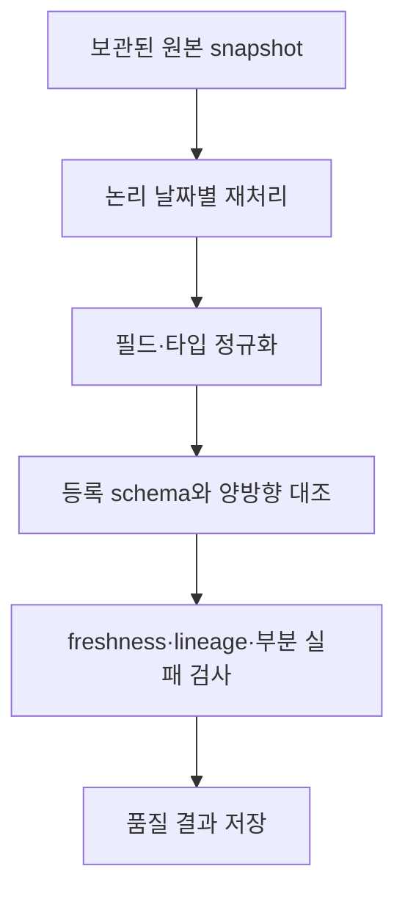

[← Kyro로 돌아가기](../../README.md) · [← 04](metadata-catalog.md)

# Airflow를 어디에 쓰고, 어디에 쓰지 않을 것인가

> **⑤ 매일 재검사** · 프로젝트 종료 후 검증 · 개인 성과와 분리

## 결론

Airflow는 기존 실시간 장애 수집기를 대체하지 않습니다. 이미 수집된 snapshot을 논리 날짜별로 재처리하고, 등록 스키마와 실제 관측 스키마를 대조하고, 품질 결과를 발행하는 배치에 사용합니다.

처음에는 mapped extract와 downstream이 source를 각각 읽었고, Airflow 2.10의 SQLAlchemy 1.4와 카탈로그의 SQLAlchemy 2.x가 충돌해 DAG import도 실패했다. extract가 보관한 snapshot을 downstream이 다시 읽도록 고쳤고, 카탈로그 task를 별도 Python 환경으로 격리해 `dags test`를 통과했다. 종료 후 검증은 원본 팀 프로젝트의 개인 구현 성과와 분리합니다.

## 실시간 수집기를 바꾸지 않는 이유

팀 프로젝트에는 이미 장애 분석을 위한 실행 경로가 있습니다.

```text
provider별 실행 주기
        ↓
수집 작업 등록
        ↓
cluster agent가 작업 poll
        ↓
Kubernetes·Prometheus·Loki·Tempo 조회
        ↓
evidence 보고
```

이를 Airflow로 교체하면 다음 책임을 다시 정해야 합니다.

- 기존 scheduler와 Airflow 중 누가 실행 주기의 기준인가
- 이전 실행과 다음 실행의 시간 구간이 겹치면 어떻게 중복을 막는가
- Airflow worker에 네 source의 접근 권한을 어떻게 부여하는가
- task 실패, 데이터 없음, 일부 반환을 기존 evidence 상태로 어떻게 변환하는가
- Airflow metadata DB 장애가 실시간 장애 분석 경로를 막아도 되는가

Airflow를 쓸 수 없는 것이 아니라, 이 프로젝트의 실시간 경로를 교체할 이유보다 비용이 큽니다.

## 자연스러운 배치 범위



이 흐름은 다음 Airflow 특성과 맞습니다.

- 논리 날짜별 실행
- 실패 task 재시도
- 과거 구간 backfill
- task 의존성 관찰
- 실행 이력 보존

## 현재 DAG의 구조

→ [`dags/catalog_reconciliation_daily.py`](../../dags/catalog_reconciliation_daily.py)

```text
extract.expand(kubernetes, prometheus, loki, tempo)
        ↓
archive_and_load
        ↓
resolve_status
        ↓
publish_quality_report
```

설정은 다음과 같습니다.

- 매일 03:00 UTC 실행
- `catchup=True`
- `max_active_runs=1`
- source별 2회 재시도
- payload는 XCom에 넣지 않고 source와 status만 반환

`resolve_status`는 upstream 성공 여부와 상관없이 실행되도록 `ALL_DONE`을 사용합니다. 수집은 끝났지만 downstream 적재가 실패한 실행을 `SUCCESS`로 남기지 않기 위해 `INCOMPLETE` 상태를 별도로 둡니다.

## 실제 실행에서 발견하고 고친 결함

### source를 두 번 읽고 있었습니다

mapped `extract` task가 각 source를 읽고 상태를 DB에 기록합니다. 그러나 downstream `archive_and_load`는 그 결과를 사용하지 않고 `pipeline.extract_source()`를 네 번 다시 호출합니다.

```text
extract task: source 읽기 1회
        ↓
archive_and_load: 같은 source 다시 읽기 1회
```

fixture에서는 같은 값이 돌아와 문제가 가려집니다. 실제 API라면 두 조회 사이에 값이 바뀌거나 호출 비용이 두 배가 될 수 있습니다. 부분 실패를 재현해도 첫 조회와 둘째 조회의 결과가 다르면 DAG 상태가 어느 실행을 뜻하는지 모호해집니다.

현재 extract task가 원본을 archive하고 XCom에는 source·status만 반환합니다. downstream은 `dag_run_id`로 collection run과 raw snapshot을 조인해 정확히 그 snapshot을 읽습니다. 지원하지 않는 `s3://` URI를 조용히 파일처럼 다루지 않고 실패시키는 테스트도 추가했습니다.

### Airflow와 도메인 ORM의 SQLAlchemy가 충돌했습니다

첫 실제 실행은 DAG import에서 실패했습니다.

```text
Airflow 2.10.5 runtime  → SQLAlchemy 1.4.54
catalog domain          → SQLAlchemy 2.x mapped_column
result                  → ImportError during DagBag parse
```

Airflow 내부 의존성을 SQLAlchemy 2로 강제 업그레이드하면 scheduler 자체를 깨뜨릴 수 있습니다. custom image 안에 `/opt/catalog-venv`를 만들고 `ExternalPythonOperator`로 카탈로그 task만 SQLAlchemy 2 환경에서 실행했습니다. 오케스트레이터와 업무 코드의 의존성 그래프를 분리한 것입니다.

### 검증 스크립트가 실행 중인 bind mount를 끊었습니다

`catalog_verify.py`가 원본 archive를 초기화하면서 `.catalog-archive` 디렉터리 자체를 삭제했습니다. Airflow container는 이 경로를 bind mount하고 있어서, 호스트가 같은 이름의 디렉터리를 다시 만들어도 container는 삭제된 inode를 계속 보았습니다. 결과는 네 extract task 모두의 `FileNotFoundError`와 `up_for_retry`였습니다.

초기화를 “mount root 삭제”에서 “root는 유지하고 날짜별 산출물만 삭제”로 바꾸었습니다. 이후 PostgreSQL 15/15 검증이 archive를 초기화한 상태에서 Airflow 7개 task가 모두 성공했고, 같은 논리 날짜를 다시 실행해도 `catalog_loads` 5행이 5행으로 유지됐습니다. 실패 상태와 수정 후 실행 결과를 함께 보존해, 단순히 `dags test`가 한 번 통과했다는 주장보다 실행 경계를 설명할 수 있게 했습니다.

### 객체 저장소가 연결되지 않았습니다

현재 `archive_raw_snapshot()`은 `.catalog-archive/{date}/{source}.json` 로컬 파일에 씁니다. `s3_uri` 컬럼에도 실제 값은 `file://...`입니다.

`docker-compose.catalog.yml`에 MinIO가 있지만 pipeline은 MinIO client를 사용하지 않습니다. 따라서 현재 상태를 “S3/MinIO 원본 보관을 구현했다”고 말할 수 없습니다. 객체 저장소는 목표 구조일 뿐입니다.

### sequential runner와 DAG가 같은 의미가 아닙니다

[`scripts/catalog_run.py`](../../scripts/catalog_run.py)는 source를 한 번만 읽고 `archive → normalize → load → lineage → check` 순서로 실행합니다. 로직 함수를 Airflow 밖에서 시험할 수 있다는 장점은 있지만, 현재 DAG의 중복 조회와 task 재시도 의미까지 검증하지는 않습니다.

## 상태 모델

source별 상태와 DAG 전체 상태를 분리합니다.

| 단위 | 상태 | 의미 |
|---|---|---|
| source | `SUCCESS` | 데이터 수집 성공 |
| source | `NO_DATA` | 정상 실행했지만 신규 데이터 없음 |
| source | `TRUNCATED` | 상한 때문에 일부만 수집 |
| source | `FAILED` | 수집 실패 |
| source | `NO_SOURCE_DATA` | 과거 원본이 없어 재생 불가 |
| DAG | `SUCCESS` | source와 downstream 모두 완료 |
| DAG | `PARTIAL` | 일부 source 실패·잘림 |
| DAG | `FAILED` | 모든 source 실패 |
| DAG | `INCOMPLETE` | 수집 후 downstream 미완료 |

`NO_DATA`와 `FAILED`를 합치지 않는 이유는 재시도 대상이 다르기 때문입니다. `TRUNCATED`도 조용한 성공으로 합치면 상한이 상시 발동하는 source를 찾을 수 없습니다.

## 멱등성과 backfill에서 답해야 할 질문

- 같은 논리 날짜를 세 번 실행해도 상태 테이블의 행 수가 늘지 않는가
- 실패 task만 재시도할 때 이미 성공한 source가 중복 적재되지 않는가
- schema observation처럼 이력을 남겨야 하는 테이블은 반대로 이력이 보존되는가
- 과거 원본이 없을 때 현재 값을 과거 날짜로 저장하지 않는가
- 한 source 실패를 전체 성공으로 기록하지 않는가
- downstream이 실패했는데 적재 0건인 실행이 성공으로 남지 않는가

이 질문을 [`scripts/catalog_verify.py`](../../scripts/catalog_verify.py)에 15개 검증 항목으로 작성했고 PostgreSQL에서 15/15 통과했습니다. Airflow에서는 import error 0건, 정상 실행 7개 task instance 전부 성공, 품질 위반 0건을 확인했습니다.

## 완료 조건

다음이 끝나기 전에는 Airflow 경험으로 이력서에 쓰지 않습니다.

동일 논리 날짜 Airflow 재실행은 `catalog_loads 5행 → 5행`, 상태 `SUCCESS`로 확인했습니다. 남은 조건은 다음과 같습니다.

1. 한 source 실패·전 source 실패·downstream 실패를 실제 Airflow DAG run으로 재현합니다.
2. task 재시도 후 `attempt`, run status, 적재 행 수를 SQL로 확인합니다.
3. 로컬 파일 보관을 그대로 명시하거나 실제 MinIO client를 연결합니다.
4. 개인 성과로 사용하려면 수정 이유와 실패 시나리오를 재현하고 변경 이력을 남긴다.

완료 후 사용할 수 있는 문장은 다음입니다.

> 실시간 수집 경로는 유지하고, 보관된 운영 snapshot의 backfill·schema drift·freshness·lineage 검사를 Airflow DAG로 분리했습니다. source 부분 실패와 downstream 실패를 별도 상태로 기록하고, 같은 논리 날짜 재실행의 멱등성을 검증했습니다.

---

[← Kyro로 돌아가기](../../README.md) · [다음: SQL 품질검사 →](sql-quality-checks.md)
